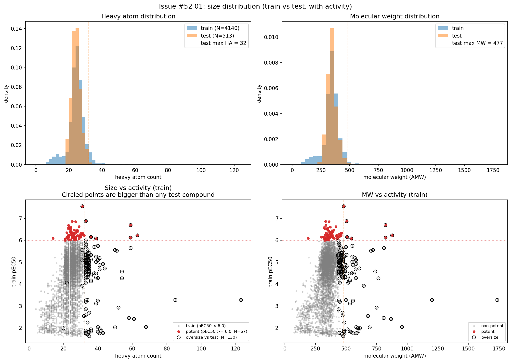
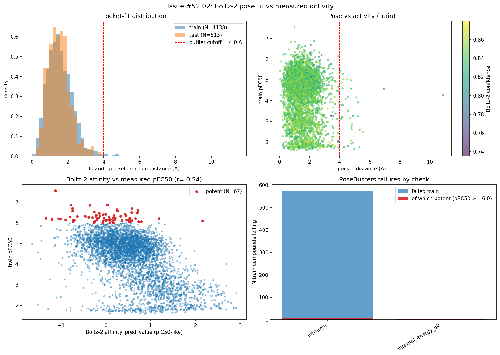
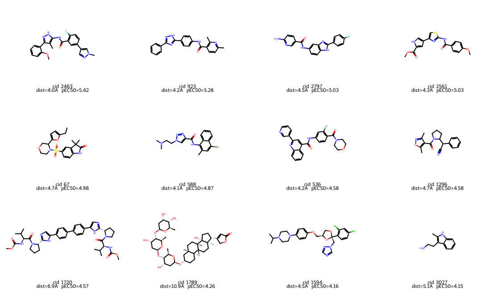
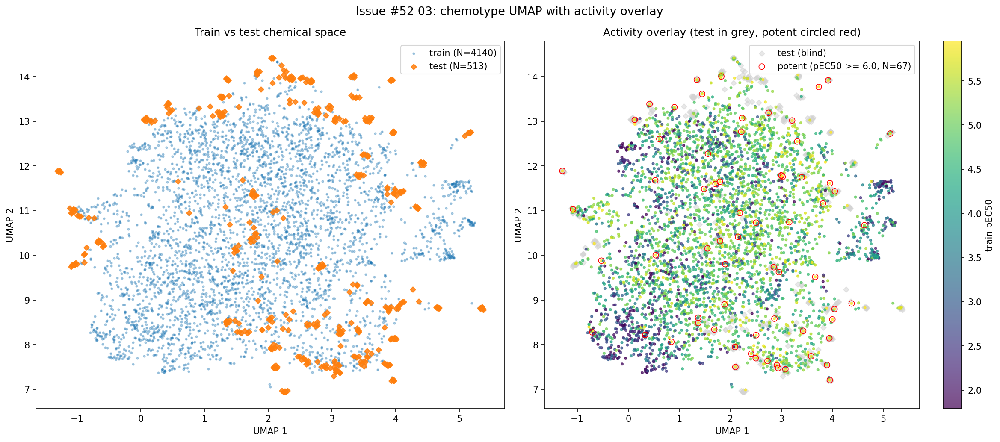
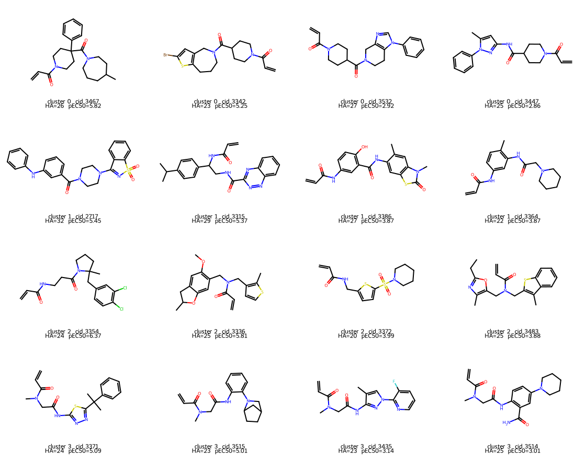
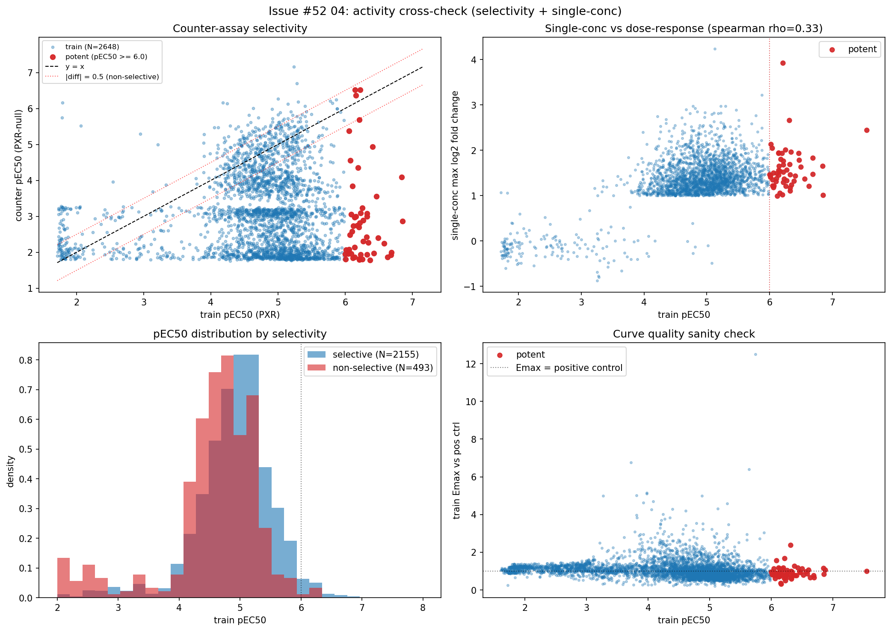
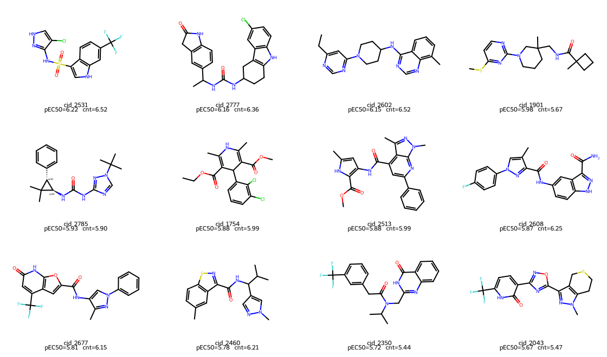
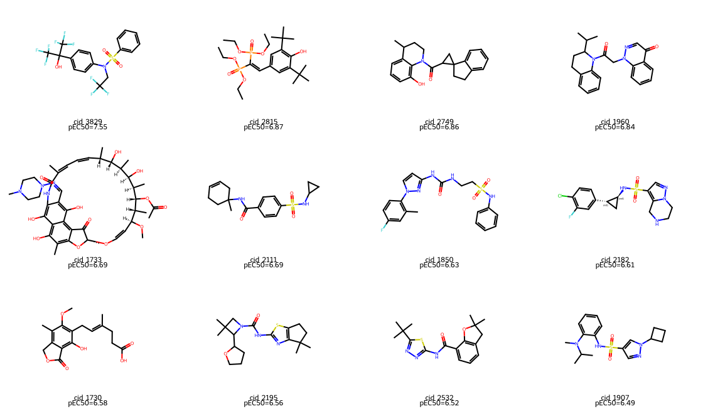

# Track 1 re-EDA for train noise removal (Issue #52)

Date: 2026-04-15
Branch: `research/issue-52-eda-redo`

This note analyses the training set as a collection of chemical objects rather
than as activity distributions. Every structural view is joined to the
measured pEC50 / Emax so that outliers are never judged on structure alone.
The goal is to understand *what kind* of noise sits in the training set before
deciding what (if anything) to drop.

All data joins come from `data/eda_redo/master.parquet` produced by
`track1_activity/scripts/eda_redo_00_build_master.py`.

## TL;DR

| Noise category                    | N (train) | Potent (pEC50 ≥ 6) | Most are... |
|---------------------------------- |----------:|-------------------:|-------------|
| Size outliers (HA > 32 or MW > 477) | 130       | 7                  | low activity, but 7 genuine potent hits – do not drop blindly |
| Pose outliers (pocket dist > 4 Å)  | 36        | 0                  | low pEC50, safe candidates to down-weight |
| HDBSCAN train-only clusters       | 176       | 1                  | niche chemotypes with no test neighbors |
| Non-selective (|counter − train| < 0.5) | 493 | 12                 | **largest single noise source**; 122 are pEC50 ≥ 5 reporter artifacts |
| Single-conc disagreement          | 15        | 15                 | small number, worth manual review |

**Headline:** counter-assay selectivity is a far bigger cleanup lever than any
structural filter. 493 / 2,648 compounds with counter data (19 %) give the same
pEC50 in the PXR-null control as in the PXR assay – they are not real PXR hits.

## Test set is drug-like and narrow

| Metric           | Train range          | Test range |
|------------------|----------------------|------------|
| Heavy atom count | 4 – 123 (median 24)  | 18 – 32 (median 24) |
| Molecular weight | 61 – 1736            | 240 – 477 |
| Rings            | 0 – 14               | 1 – 6 |
| logP             | -5.4 – 10.8          | -1.6 – 5.4 |

Test compounds are drug-like small molecules sourced from Enamine DD10 + FDA
approved drugs. Every structural train outlier has no test analog and, if
learned as signal, will pull the model away from drug-like space.

*Circled points in panels C/D are the 130 train compounds larger than any
test compound. Seven of them are genuinely potent (red dots inside circles),
including compounds 1607 (pEC50=6.22), 2814 (6.12), 1733 (6.69).*

## Boltz-2 pose fit catches pure noise, but misses most of the issue

- Test compounds *all* fit the PXR pocket (max pocket distance = 3.72 Å).
- 36 train compounds sit > 4 Å from the pocket centroid. **None are potent.**
- 23 / 36 have pEC50 < 4; pose is a clean noise signal for those.
- Only PoseBusters check that fails meaningfully: `intramol_passed` (574
  compounds, median pEC50 = 4.57 – noisy but not a noise oracle).
- **Boltz-2 affinity head vs measured pEC50: Pearson r = -0.54** (sign is
  convention; the head is a useful signal and will feed Track 1 as a feature
  in the next ensemble PR).

Pose outliers by pEC50 (top 12):

*The two obvious cardenolide / Daclatasvir-like outliers (1789, 1720) sit at
pEC50 ~ 4.3 – not noise in activity, just unusual in geometry. These are the
compounds Issue #51 flagged; dropping them is safe for Track 1 but keep them
in mind for Track 2.*

## Chemotype clustering surfaces four train-only islands

Morgan r=2, fp=2048 → UMAP (jaccard, n_neighbors=30) → HDBSCAN
(min_cluster_size=20) on 4,653 train + test compounds.

- 7 clusters + 506 noise points.
- One dominant "drug-like core" (cluster 5, N=3,816, covers 94 % of test).
- **Four train-only clusters** (N=61 + 55 + 32 + 28 = 176 train compounds),
  none of them with test neighbors. One compound in cluster 2 is potent
  (pEC50 = 6.32, cid 3007) – do not drop the whole cluster blindly.

Representatives per train-only cluster (top 4 per cluster, sorted by pEC50):

Visually:
- Cluster 0 (pEC50 median 2.92): long alkyl surfactants / steroid-glycosides.
- Cluster 1 (pEC50 median 3.87): sugar-derived conjugates.
- Cluster 2 (pEC50 median 4.04): small heterocycles (includes the one potent).
- Cluster 3 (pEC50 median 3.25): ring-opened / flexible actinomycin-like.

## Counter-assay is the biggest noise source

`counter_assay` runs the same reporter in a PXR-null background. If a compound
activates both equally, the response is not PXR-specific.

| Subset                                             | N     | Median train pEC50 |
|----------------------------------------------------|------:|-------------------:|
| Selective (counter − train ≤ -0.5)                 | 2,155 | 4.27 |
| Non-selective (\|counter − train\| < 0.5)          | 493   | 4.14 |
|  → non-selective AND pEC50 ≥ 5 (reporter artifacts) | 122   | 5.28 |

122 compounds look like reasonable PXR hits (pEC50 ≥ 5) but respond just as
strongly in the null control. These are the most dangerous label-noise in
training, and they are invisible to any structural filter.

Non-selective hi-activity compounds (top 12 by pEC50):

*Most are reactive aromatics, nitro groups, or fused polycycles – classic
promiscuous reporter hits, not real PXR binders.*

## What the potent training compounds look like

For reference – the 67 compounds with pEC50 ≥ 6, top 12 by pEC50:

*Mostly drug-sized lipophilic scaffolds (biaryl-amides, extended ureas,
kinase-inhibitor-like cores). These are the chemotype the model must learn
to mimic on the blinded test compounds.*

## Tiered noise-reduction options

Nothing is dropped as part of this note. What we now have is a *menu* with
measured consequences, to feed into the next ensemble iteration.

| Tier | Filter                                                           | Drops | Potent lost |
|------|------------------------------------------------------------------|------:|------------:|
| T1   | `b2_preprocessing_failed = True`                                 | 2     | 0  (#50 book-keeping) |
| T1   | `pocket_distance > 4 Å AND pEC50 < 5`                            | 32    | 0  (safe) |
| T2   | Non-selective AND \|counter - train\| < 0.3 AND pEC50 ≥ 5        | ~80   | small – manual review |
| T2   | Train-only HDBSCAN clusters, excluding any potent member         | 175   | 0  (by construction) |
| T3   | Oversize (HA > 32) AND non-potent AND pocket > 3 Å               | ~20   | 0  (size + pose agreeing) |

The obvious first pass is T1 + the "safe" slice of T2 – around 200 - 250
compounds total. Model retraining lives in a follow-up PR (`ensemble v10`).

## Next actions

- [x] Script 00-05 + this note.
- [ ] Counter-assay audit: use `pec50_std_error` to separate "really
      non-selective" from "noisy counter measurement".
- [ ] Feed Boltz-2 affinity (r = -0.54 with pEC50) and pose distance into
      the Track 1 ensemble as new learners. Tracked separately from this note.
- [ ] marimo explorer notebook reading the five parquets under
      `data/eda_redo/` for interactive drill-down.

Generated by `track1_activity/scripts/eda_redo_*.py`. All numbers are
reproducible from `master.parquet`; re-run `eda_redo_00_build_master.py`
whenever the DB changes.
