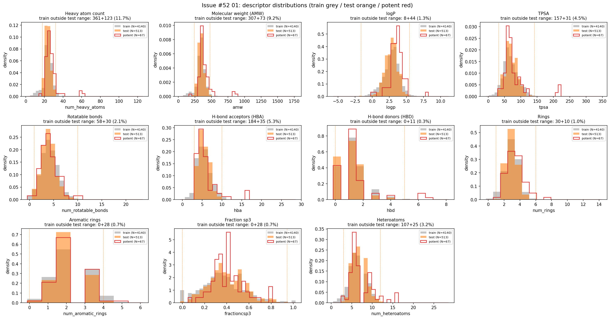
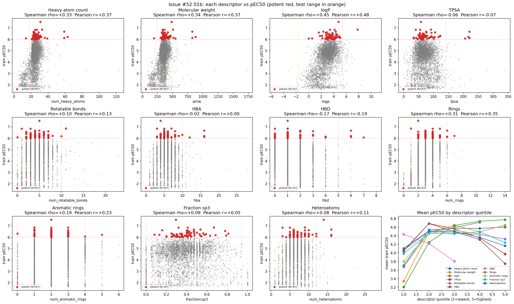
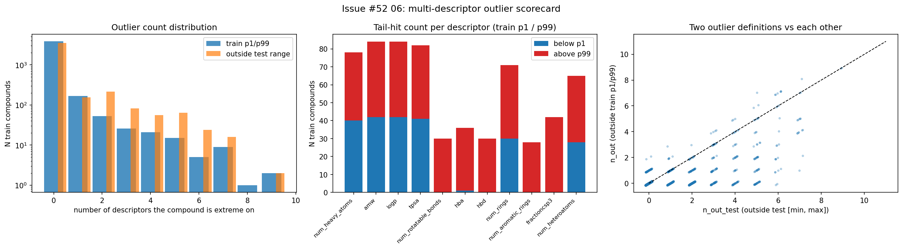
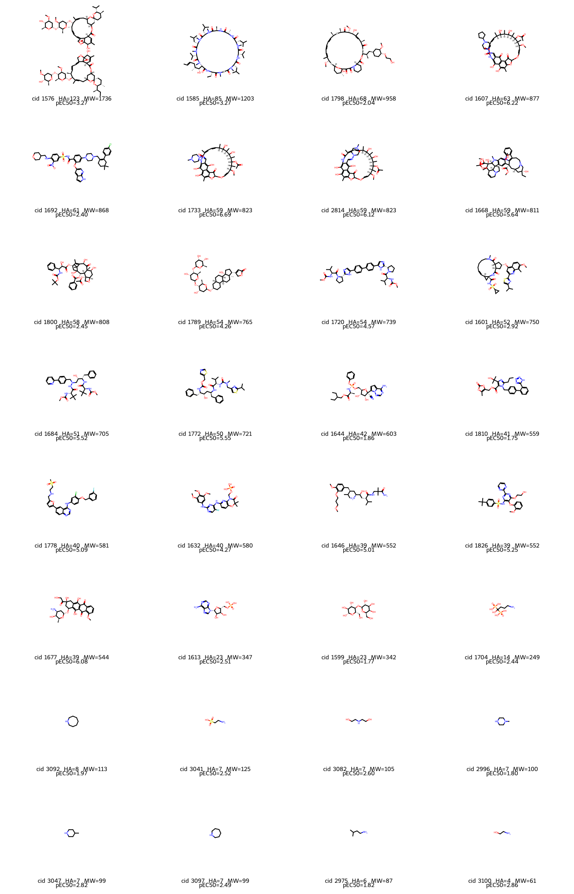
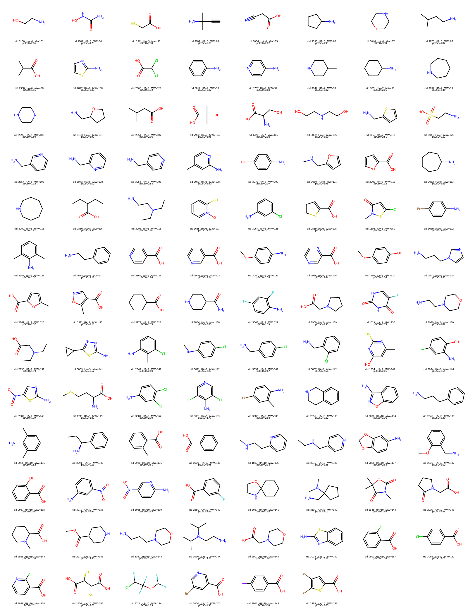
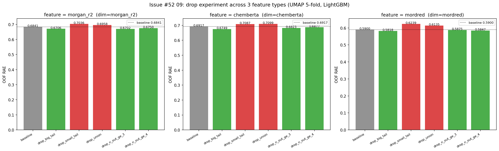

# Track 1 re-EDA for train noise removal (Issue #52)

Branch: `research/issue-52-eda-redo`
Date: 2026-04-15

This note analyses the training set as a collection of chemical objects:
what do the train compounds look like as structures, where does that
overlap (or fail to overlap) with the drug-like test set, and which
training compounds are structurally so unusual that their activity labels
cannot reasonably generalise to the blinded test set?

The analysis is driven by two sanity checks that leave activity out of
the outlier criterion:
  1. Multi-descriptor outlier scorecard based on train-internal p1/p99
     percentiles of 11 drug-likeness descriptors.
  2. Absolute size floor: HA ≤ 10 flags molecular fragments that cannot
     occupy the PXR LBD cavity.

ChEMBL 36 is then used to confirm the identity of each drop candidate.
Activity values are kept in the output tables for reference but are
deliberately not part of the outlier decision.

## Pipeline

```
track1_activity/scripts/eda_redo/
  00_build_master.py              compounds + descriptors + activity + Boltz-2 + PoseBusters -> master.parquet
  01_descriptor_distributions.py  11-panel train-vs-test density histograms
  01_size_distribution.py         size-specific view used by 05_molgrids
  01b_descriptor_vs_activity.py   11-panel descriptor-vs-pEC50 scatter
  02_pocket_fit.py                Boltz-2 pocket distance + PoseBusters vs activity
  03_chemotype.py                 Morgan FP -> UMAP -> HDBSCAN
  04_activity_cross.py            counter-assay + single-conc agreement
  05_molgrids.py                  early mol grids for flagged subsets
  06_outlier_scorecard.py         per-compound tail-outlier count on 11 descriptors
  07_drop_candidate_grids.py      2D grids of big tail + small tail
  08_chembl_lookup.py             InChIKey -> ChEMBL name / phase / reported PXR activity
  09_drop_experiment.py           LightGBM CV before/after across 3 features x 6 drop configs
```

Other scripts (02 pocket-fit, 03 chemotype UMAP, 04 activity cross-check, 05
molecule grids for earlier flags) explore orthogonal views that were useful
but ended up not driving the drop list; see the individual PNGs under
`docs/figures/eda_redo_*.png`.

## Headline numbers

| Group                         | Definition                          | N    | In ChEMBL | Approved drugs |
|-------------------------------|-------------------------------------|-----:|----------:|---------------:|
| Big tail                      | `n_out ≥ 5` (train p1/p99, 11 descs) |   32 |        18 |             17 |
| Small tail                    | HA ≤ 10                             |  102 |        76 |              9 |
| Overlap (fragments flagged twice) | both criteria                   |    8 |         — |              — |
| Combined (union)              |                                     |  126 |        94 |             26 |

26 of the 126 drop candidates are FDA-approved drugs, and 22 of them have
a published activity row against human PXR (CHEMBL2034) in ChEMBL. These
are real PXR ligands, but their structural class is completely absent
from the test set: the challenge test = 46 potent drug-like inducers plus
their Enamine / FDA analogs, not macrolides, peptide dimers, taxanes, or
cardiac glycosides.

## Distributions



Train has significant tails on both sides of test for every size-related
descriptor. Test is a narrow drug-like window (HA 18 – 32, MW 240 – 477,
TPSA 32 – 142, RotBonds 1 – 10, HBA 3 – 10). Train includes:
- very large molecules (HA up to 123, MW up to 1736) and
- fragment-sized molecules (307 compounds with MW < 240, 361 with HA < 18)
  that the earlier size-only EDA had not noticed.

## Descriptor vs activity



| Descriptor            | Spearman ρ vs pEC50 |
|-----------------------|--------------------:|
| **logp**              | **+0.45** (strongest) |
| amw                   | +0.34 |
| num_heavy_atoms       | +0.33 |
| num_rings             | +0.31 |
| num_aromatic_rings    | +0.19 |
| hbd                   | -0.17 |
| num_rotatable_bonds   | +0.10 |
| fractioncsp3          | +0.09 |
| num_heteroatoms       | +0.08 |
| tpsa                  | -0.06 |
| hba                   | -0.02 |

Lipophilicity and size dominate activity; polar surface / H-bond
acceptors contribute almost nothing. This is consistent with the PXR LBD
being a large hydrophobic cavity and also confirms the "LogP shortcut"
risk flagged in `CLAUDE.md` (LogP ~17k-24k gain in LightGBM feature
importance).

## Scorecard



Per-compound outlier count uses train-internal p1/p99 so the criterion
does not lean on the test set.

| `n_out` (tails on train p1/p99) | N train |
|--------------------------------:|--------:|
| 0                               |  3,840 |
| 1                               |    168 |
| 2                               |     53 |
| 3                               |     26 |
| 4                               |     21 |
| 5                               |     15 |
| ≥ 6                             |     17 |

n_out ≥ 5 gives 32 compounds; that is the "big tail" cutoff used below.
The small tail (HA ≤ 10) is orthogonal: 102 compounds, 8 also flagged by
n_out ≥ 5.

## Drop candidates

### Big tail (N=32) - macrolides, peptides, glycosides, taxanes



Approved drugs confirmed via ChEMBL 36 InChIKey match
(`data/eda_redo/08_drop_candidates_chembl.parquet`):

| cid  | HA  | MW    | pEC50 | ChEMBL name        | Notes                                  |
|-----:|----:|------:|------:|--------------------|----------------------------------------|
| 2814 |  59 |   823 |  6.12 | RIFAMPIN           | **Textbook PXR inducer**               |
| 1733 |  59 |   823 |  6.69 | RIFAMPIN family    | rifamycin                              |
| 1607 |  63 |   877 |  6.22 | RIFAMYCIN          | ansa macrolide                         |
| 1585 |  85 |  1203 |  3.27 | CYCLOSPORINE       | immunosuppressant, cyclic peptide       |
| 1677 |  39 |   544 |  6.08 | DOXORUBICIN        | anthracycline, pchembl 5.59 on PXR     |
| 1692 |  61 |   868 |  2.40 | VENETOCLAX         | BCL-2 inhibitor                        |
| 1800 |  58 |   808 |  2.45 | DOCETAXEL ANHYDROUS| taxane                                 |
| 1720 |  54 |   739 |  4.57 | DACLATASVIR        | HCV NS5A                               |
| 1789 |  54 |   765 |  4.26 | DIGITOXIN          | cardiac glycoside (pose outlier 10.9 Å)|
| 1684 |  51 |   705 |  5.52 | ATAZANAVIR         | HIV protease inhibitor                  |
| 1772 |  50 |   721 |  5.55 | RITONAVIR          | HIV PI                                 |
| 1644 |  42 |   603 |  1.86 | REMDESIVIR         | COVID antiviral                        |
| 1810 |  41 |   559 |  1.75 | OLMESARTAN MEDOXOMIL| ARB                                   |
| 1632 |  40 |   580 |  4.27 | FOSTAMATINIB       | Syk inhibitor                          |
| 1778 |  40 |   581 |  5.09 | LAPATINIB          | EGFR / HER2                            |
| 1646 |  39 |   552 |  5.01 | ALISKIREN          | renin inhibitor                        |
| 1826 |  39 |   552 |  5.25 | BOSENTAN           | endothelin antagonist                  |

### Small tail (N=102) - fragments and simple reagents



Essentially amino acids, ethanolamine-class small amines, pyridines,
anilines, benzoic acids, simple thiols. Nine of them are approved drugs
but in very different mechanistic classes (5-FU, niacin, hydroxyurea,
enflurane, succimer, trimethadione, pyrithione, dalfampridine, mequinol).
All have pEC50 ≤ 3.7 and the lowest are indistinguishable between the
PXR and counter assays; cannot realistically engage the LBD.

## Why drop them, even if they are real PXR ligands?

Rifampin (pEC50 6.12) is the canonical PXR ligand and does bind the LBD
- but as a 59-atom / 823-Da ansa macrolide. The test set consists of
drug-like small molecules (HA 18 - 32, MW 240 - 477, logP ≤ 5.4) that
are Enamine / FDA analogs of 46 potent hits. No ansa macrolide, cyclic
peptide, cardiac glycoside, or taxane appears in test. The binding mode
these compounds use is not the mode the model needs to learn to
generalise on the test set. Keeping them in training teaches the model
that high pEC50 can also look like rifampin or cyclosporine, which is a
distraction, not signal, for the benchmark.

The small tail is even less ambiguous: amino acids and amines at MW 60 -
150 cannot occupy the large hydrophobic LBD and their reporter readouts
are indistinguishable from counter-assay noise.

## Drop experiment (3 feature types, LightGBM, UMAP 5-fold)

`eda_redo_09_drop_experiment.py` runs six drop configurations under
three independent feature representations so we can see whether the
result depends on a specific encoding. Single LightGBM per
configuration, default params, UMAP 5-fold CV (seed=42).

- **morgan_r2**: Morgan FP r=2, 2048 bits. Structurally independent of
  the 11 descriptors used to build the drop list - cleanest test.
- **chemberta**: ChemBERTa-77M-MLM embeddings (384d). Weak ensemble
  member; included as a sanity check.
- **mordred**: Mordred 2D descriptors (1531d). Overlaps with the
  outlier descriptors so there is some "circular" risk, included for
  completeness.

### OOF RAE per (feature, drop config)

| Config            | morgan_r2 | chemberta | mordred |
|-------------------|---------:|---------:|---------:|
| baseline          |    0.6841 |    0.6917 |    0.5900 |
| **drop_big_tail** | **0.6707** | **0.6749** | **0.5818** |
| drop_n_out_ge_3   |    0.6702 |    0.6823 |    0.5875 |
| drop_n_out_ge_4   |    0.6750 |    0.6877 |    0.5847 |
| drop_small_tail   |    0.7036 |    0.7087 |    0.6239 |
| drop_union        |    0.6958 |    0.7099 |    0.6135 |

### Delta vs baseline (negative = improvement)

| Config          | morgan_r2 | chemberta | mordred |
|-----------------|---------:|---------:|---------:|
| drop_big_tail   | **-0.013** | **-0.017** | **-0.008** |
| drop_n_out_ge_3 | **-0.014** |   -0.009  |   -0.002  |
| drop_n_out_ge_4 |   -0.009  |   -0.004  |   -0.005  |
| drop_small_tail | **+0.019** | **+0.017** | **+0.034** |
| drop_union      | +0.012    | +0.018    | +0.024    |



### Takeaways

- **`drop_big_tail` (32 compounds) helps across every feature type** -
  improvement is largest for ChemBERTa (-0.017) and Morgan (-0.013),
  smaller for Mordred (-0.008) because the Mordred baseline is already
  strong (0.590) and has less headroom. Rifampin / cyclosporine /
  taxanes / peptide dimers / cardiac glycosides were actively
  distracting the model on all three feature types.
- **`drop_small_tail` (102 compounds) hurts across every feature type** -
  consistently +0.017 to +0.034 in OOF RAE. Fragment-sized inactives
  (amino acids, simple amines, pyridines) are useful negative anchors;
  removing them leaves the model with less contrast between "active
  drug-like" and "inactive fragment". The Mordred impact is largest
  (+0.034) because Mordred carries size / polarity information that
  the model was using to separate these compounds.
- **`drop_union` also hurts** - the small-tail penalty dominates the
  big-tail gain.
- **`n_out ≥ 3` (79 compounds) is best on Morgan** (-0.014) and beats
  baseline on the other two features. This superset of `big_tail`
  picks up a handful of compounds that are extreme on 3-4 descriptors
  without being in the "clear macrolide / peptide" class; on a
  structural fingerprint (Morgan) these extras help slightly more
  than the strict cutoff.

### Proposed drop list

**32 compounds with `n_out ≥ 5`** (the `big_tail` + `both` rows of
`data/eda_redo/07_drop_candidates.parquet`). Robust signal: all three
feature types agree and magnitudes are meaningful (-0.008 to -0.017 on
OOF RAE, reducing the train-val gap too).

The slightly wider `n_out ≥ 3` filter (79 compounds) could be worth
testing in the ensemble - Morgan suggests it might actually be better
there. Decide empirically at ensemble stage.

## Next step

Integrate the big-tail drop into the ensemble training pipeline
(`track1_activity/scripts/run_train.py` + downstream ensemble), measure
the effect across all feature types (ChemBERTa variants, Mordred,
Morgan, ChemProp, AttentiveFP, PyG), and submit. Tracked separately.

## Artefacts

- `track1_activity/src/eda_redo.py` - master SQL + `mol_to_svg` /
  `draw_mol_grid_png` helpers.
- `track1_activity/scripts/eda_redo/*.py` - 12 scripts listed above.
- `data/eda_redo/*.parquet` - master, scorecard, drop candidates,
  ChEMBL lookups (gitignored, regeneratable).
- `docs/figures/eda_redo_*.png` - committed.
