# Track 1 dataset and split strategy report

確認日: 2026-05-18 JST

このreportは、Track 1 Activityで使ったdatasetの構造と、
cross-validation splitをどう考えたかを説明するためのもの。
modelそのものの説明ではなく、「なぜこのデータでは普通のrandom CVだけでは危ないか」
「なぜ最終的にはUMAP splitを無難なcanonical splitとして採用したか」をまとめる。

## 1. 公式dataset設計

OpenADMETの公式説明では、このPXR activity datasetは、
単純なrandom train/test splitではなく、薬剤探索の流れに近い
multi-stage assay flowとして作られている。

公式announcementでは、まずprimary screenで11,362化合物をsingle concentrationで評価し、
その後4,779化合物を8-point dose-responseへ進め、
EC50 <= 1 uM の高活性化合物からcounter-screenで63化合物を選び、
その類縁体検索から513化合物のtest setを作った、と説明されている。

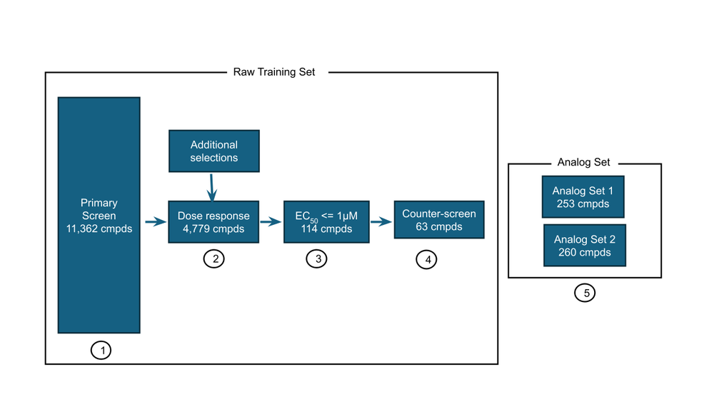

出典: [Announcing the next OpenADMET Blind Challenge: Predicting PXR Induction](https://openadmet.ghost.io/announcing-the-next-openadmet-blind-challenge-predicting-pxr-induction/)

challenge launch時点のSankeyでは、QC後の実データに近い流れも示されている。
ここではsingle-concentration screen 10,870化合物、direct-to-DRC追加1,395化合物、
train dose-response 4,139化合物、test blinded 513化合物、という形で整理されている。

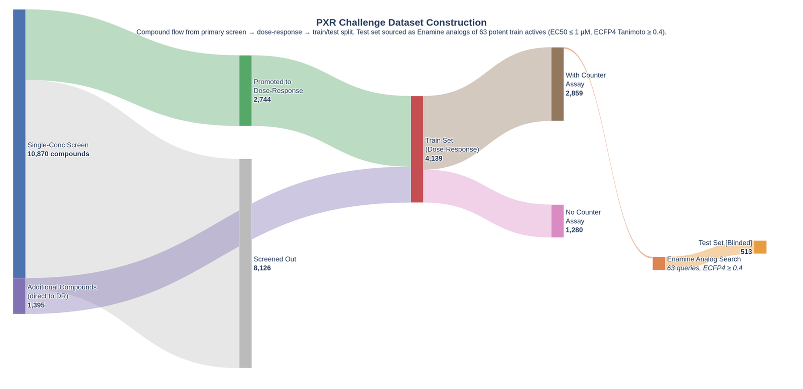

出典: [Predicting PXR Induction - We have liftoff](https://openadmet.ghost.io/predicting-pxr-induction-we-have-liftoff/)

重要なのは、test setが「train全体から均等に切り出された化学空間」ではないこと。
testは、potent/selectiveなtrain activesから類縁体を探して作られたAnalog Setであり、
lead optimizationに近い評価になっている。
したがって、local CVもこのanalog性を完全には再現できない。

## 2. 測定値とtargetの読み方

このreportで出てくる主要な測定値を先に整理しておく。

| term | 意味 | このrepoでの扱い |
|---|---|---|
| `pEC50` | `-log10(EC50 [M])`。大きいほど低濃度で効く。`pEC50 = 6` は EC50 = 1 uM に相当 | Track 1のsupervised target |
| `Emax` / `emax_vs_pos_ctrl` | dose-responseでの最大反応。効き方の上限やpartial agonismに近い情報 | 診断・補助情報。主targetではない |
| `counter_pEC50` | PXR-null counter assayでのpEC50 | 非特異的反応やselectivityを見る補助情報 |
| `train pEC50 - counter pEC50` | PXR assayとcounter assayの差 | potent/selective hitのlocal定義に使用 |
| `log2_fc` | single-concentration screenのlog2 fold-change | low-fidelity signal。testには実測値がない |

train targetである `pEC50` は、4,140化合物にだけ存在する。
test 513化合物は完全blindであり、`pEC50`、`counter_assay`、`single_concentration` の実測値はない。
つまり、submission時に使えるtest情報は基本的に化学構造と、そこから計算・予測した特徴量だけである。

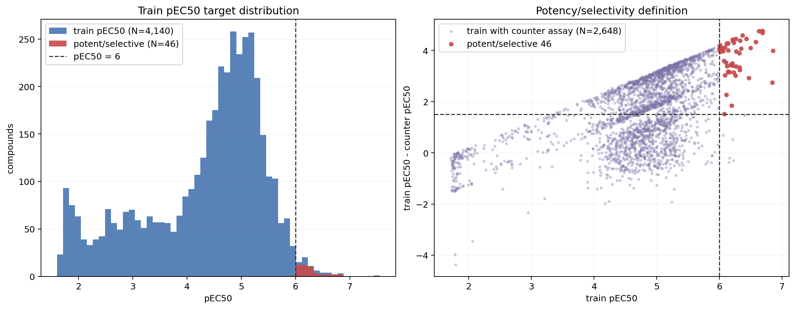

`potent/selective 46` は、local DB上で
`pEC50 >= 6.0` かつ `train pEC50 - counter pEC50 >= 1.5`
を満たすtrain化合物として定義した集合である。
公式記事の「63 potent/selective hits」と完全に同じ集合ではないが、
QC後のlocal DBでtest Analog Setの起点に近い化合物群を説明するための operational definition として使っている。

## 3. local DBで実際に使った件数

公式Sankeyではtrain dose-responseが4,139と表示されているが、
このrepoのlocal PostgreSQLでは `train_activity` は4,140 rowsある。
以降のmodeling, OOF, ensembleはこのlocal DB上の4,140 train rowsを基準にしている。

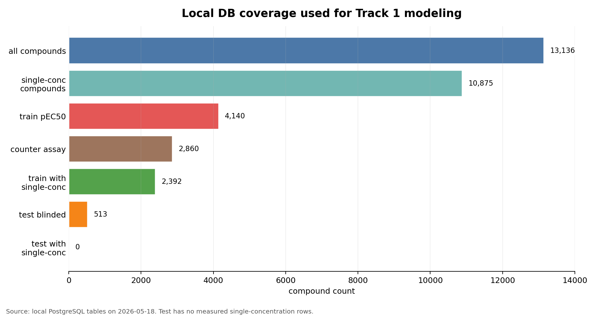

| table / subset | local count | 説明 |
|---|---:|---|
| `compounds` | 13,136 | train/test/auxiliaryを含む全化合物 |
| `single_concentration` compounds | 10,875 | `log2_fc` low-fidelity signalの主な供給源 |
| `train_activity` | 4,140 | pEC50 supervised target |
| `test_activity` | 513 | blinded Analog Set |
| `counter_assay` compounds | 2,860 | PXR-null counter assay |
| train compounds with `single_concentration` | 2,392 | train内で実測single-concがある化合物 |
| test compounds with `single_concentration` | 0 | blind testには実測single-conc行がない |
| train/test compound overlap | 0 | compound_id overlapなし |
| train/test standardized SMILES overlap | 0 | exact standardized SMILES overlapなし |
| potent/selective train compounds | 46 | `pEC50 >= 6` and `pEC50 - counter_pEC50 >= 1.5` |

この「testにsingle-concentration実測がない」点が重要。
最終modelで効いた `log2_fc` は、testへ直接存在する実測値ではなく、
train/auxiliaryで学習した予測値やfrozen embeddingとして使っている。

## 4. 化合物標準化と重複

このrepoでは、ほぼすべての分子特徴量とmodel入力に `compounds.std_smiles` を使っている。
`std_smiles` は [db/standardize_compounds.py](../../db/standardize_compounds.py) で作成しており、
ChEMBL structure pipelineの `standardize_mol()` と `get_parent_mol()` を使って、
電荷・官能基表現の正規化、salt/solvent除去、parent molecule化を行っている。

重要なのは、raw SMILESとstandardized SMILESでは重複の意味が違うこと。
`compounds.smiles` はDB上でuniqueだが、標準化後の `std_smiles` はunique制約を置いていない。
実際、local DBではraw SMILESの重複は0だが、`std_smiles` では351 groups / 702 rowsの重複があった。
各groupは最大2 rowsだった。

| check | result | 解釈 |
|---|---:|---|
| total compounds | 13,136 | train/test/auxiliaryを含む全化合物 |
| `smiles != std_smiles` | 12,715 | canonical化・parent化により文字列としては多くが変わる |
| raw `smiles` duplicate groups | 0 | input SMILESはunique |
| `std_smiles` duplicate groups | 351 | 標準化後に同一parentへ潰れるペアがある |
| duplicate rows by `std_smiles` | 702 | 351 groups × 2 rows |
| train-internal duplicate groups | 0 | train内で同一standardized構造の重複なし |
| test-internal duplicate groups | 0 | test内で同一standardized構造の重複なし |
| train/test overlap by `std_smiles` | 0 | blind testとのexact standardized overlapなし |
| train/single-only duplicate groups | 351 | 重複は主にtrainと補助single-only側の対応 |

このため、train/test leakageという意味では、標準化後のexact overlapは見つからなかった。
一方で、補助データ側にはtrainと同じparent構造を持つ行がある。
これはsingle-concentration screenとdose-response trainが同じmulti-stage assay flowに属するため自然であり、
`log2_fc` pretrainや `log2_fc_pred` の有用性を考えるうえで重要な点である。

ただし、実測 `single_concentration` をtest featureとして直接入れられないことは変わらない。
testには実測single-concentration行も、`std_smiles` 重複による補助データ対応もなかった。

## 5. train/test以外の補助データ

このchallengeで重要だったのは、supervised targetである `train_activity.pEC50` だけではない。
`single_concentration` と `counter_assay` が、PXR誘導の別の側面を持っていた。

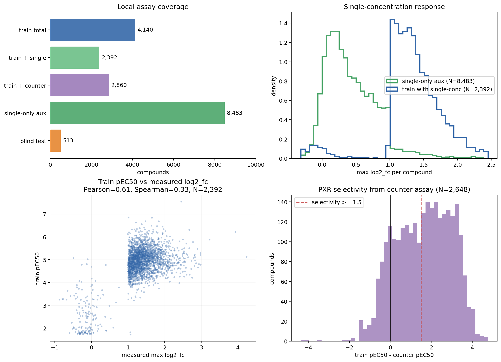

### single-concentration

`single_concentration` は、primary screen由来のlow-fidelity signalである。
local DBでは10,875化合物に存在し、そのうち8,483化合物はtrain/testのdose-response targetを持たない
`single_only` な補助データである。

重要な点:

- train内では2,392/4,140化合物に実測single-concentrationがある。
- test内には実測single-concentrationがない。
- trainで見ると、実測 `max log2_fc` と `pEC50` はPearson 0.61、Spearman 0.33程度で相関する。
- ただしsingle-only補助データの `log2_fc` 分布はtrain-with-singleより明らかに低い側に寄る。

このため、`log2_fc` 実測値をtestへ直接入れることはできない。
一方で、single-concentration dataを使ってencoderを事前学習し、
そのfrozen representationや `log2_fc_pred` を使う戦略は非常に強かった。
ここはmodel strategy reportで述べたButerez et al.型のmulti-fidelity transferに近い。

### counter assay

`counter_assay` はPXR-null assayであり、
PXRそのものではない系での反応を見ている。
local DBでは2,860 train化合物にcounter assay行がある。
数値pEC50として使える行は2,648で、`train pEC50 - counter pEC50` を見ると、
PXR選択性が高い化合物と、非選択的に反応していそうな化合物を分ける補助情報になる。

最終modelではcounter assayを直接の主軸にはしなかった。
理由は、testにcounter assay実測がなく、counter由来の値を直接featureとして入れると
train/testで利用可能情報がずれるためである。
一方で、test setがpotent/selective seedから作られているため、
counter assayはdatasetを理解するうえでは重要な背景情報だった。

## 6. test setの性質

公式説明では、test setは63個のpotent/selective hitをqueryにしたEnamine analog searchから作られた。
一方、local DBで同じようなpotent/selective条件をかけると46化合物になる。
これはlaunch記事でも、最終datasetでは高活性化合物数が63から46に変わって見えること、
ただしtest set生成に使われたchemically similar compounds自体は変わらないことが説明されている。

local診断では、test 513化合物のtrainへの最近傍Morgan Tanimotoは平均0.532。
potent-46だけに対する最近傍は平均0.395、non-potent trainに対する最近傍は平均0.464だった。
つまり、testはpotent seedに由来するAnalog Setではあるが、
全test化合物がpotent-46だけに近いわけではない。

local DB上でのpotent/selective train 46化合物を以下に示す。
条件は `pEC50 >= 6.0` かつ `train pEC50 - counter pEC50 >= 1.5` とした。
公式記事で説明されているAnalog Set queryの完全な再現ではないが、
このrepo内で「test作成の起点に近い化合物群」として解釈していた集合である。

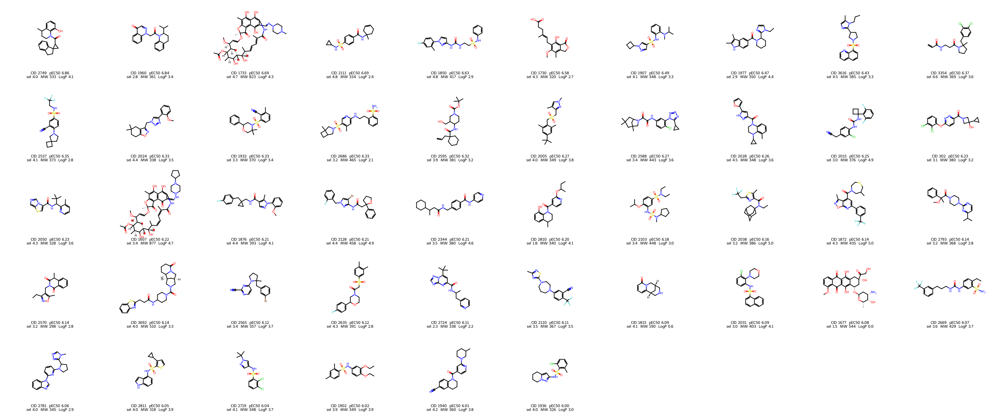

| comparison | n | mean NN Tanimoto | median | p75 |
|---|---:|---:|---:|---:|
| test vs all train | 513 | 0.532 | 0.523 | 0.571 |
| test vs potent-46 | 513 | 0.395 | 0.438 | 0.521 |
| test vs non-potent train | 513 | 0.464 | 0.472 | 0.535 |

このため、split戦略としては2つの要求がぶつかる。

- Analog Setらしさを反映したい。
- しかし、valが小さすぎたり、potent周辺だけに狭まりすぎるとOOFが不安定になる。

## 7. 化合物空間としてのMorgan UMAP

UMAP splitの説明では、単に「UMAPを使った」と言うよりも、
「Morgan fingerprintで見た化合物空間を粗く分割した」と説明する方がわかりやすい。

下図は、train/test/single-only補助データをすべて含めた13,136化合物を
Morgan fingerprint radius 2, 2048 bitsから2次元UMAPへ写したもの。
実際のcanonical CV splitは10次元UMAP + KMeansで作っているので、
この2次元図は説明用の可視化である。

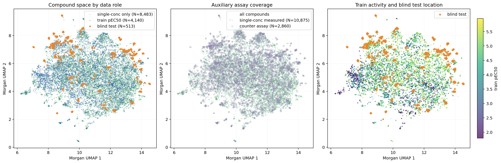

読み取り:

- single-only補助データは、train/testを含む化合物空間を広く覆っている。
- blind testは一様randomではなく、いくつかの局所領域に寄っている。
- counter assayはtrain化合物上の補助測定であり、testには存在しない。
- train pEC50の高低は、化合物空間上で完全には分離しない。

したがって、このdatasetは「小さなtrain/test二分割」ではなく、
広いsingle-concentration screen、dose-response train、counter assay、
analog search testが重なったmulti-stage datasetとして見るべきだった。

## 8. canonical split: Morgan UMAP

最終的に、repo全体のcanonical CVは以下に固定した。

| item | setting |
|---|---|
| split name | `umap` |
| implementation | `track1_activity/src/splits.py::umap_split_indices` |
| molecular representation | Morgan fingerprint radius 2, 2048 bits |
| UMAP metric | Jaccard |
| UMAP components | 10 |
| UMAP neighbors | 30 |
| clustering | KMeans |
| clusters | 50 |
| CV folds | 5 |
| seed | 42 |

考え方としては、Practical Cheminformaticsのblogで紹介されていた
「Morgan fingerprintをUMAPへ写し、化学空間上のclusterをfoldへ割り当てる」
という方向性を参考にした。
同blogでは、random splitよりもscaffold/Butina/UMAP splitの方が
train/test類似性が低くなり、特にUMAP splitは難しい評価になりやすいことが示されている。
同時に、UMAP projectionが距離を完全に保存しないことや、
cluster sizeの偏りがmetric分散を増やし得る、という注意点も挙げられている。

このrepoでは、UMAP splitを「完璧なprospective simulation」とは見なしていない。
ただし、以下の理由で最も無難な共通CVとして採用した。

- full OOF coverageが得られる。
- scaffold splitよりval-to-train Morgan NNが低く、化学的にやや厳しい。
- analog-aware splitほどvalが小さくならない。
- 多数のmodel familyを同じ土俵で比較できる。
- public LBへの小さなOOF gainの転移が不安定だったので、split自体は保守的に固定する方がよかった。

## 9. split診断

過去のsplit診断は `data/eda_cv_prep/` に残っている。
代表的なsummaryは以下。

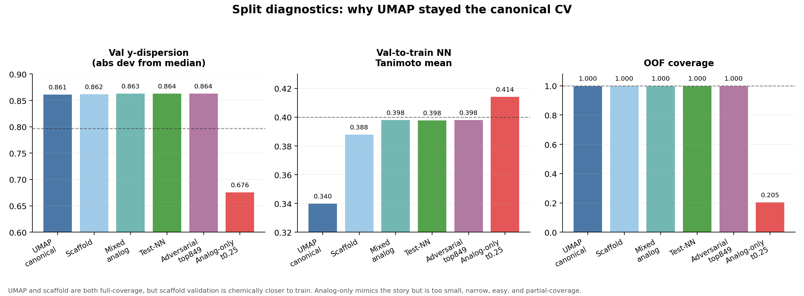

| split | val size mean | val y-dispersion | val-to-train NN Tanimoto | coverage | 解釈 |
|---|---:|---:|---:|---:|---|
| UMAP canonical | 828 | 0.861 | 0.340 | 1.000 | 採用。full coverageで最も化学的に遠い |
| Scaffold | 828 | 0.862 | 0.388 | 1.000 | full coverageだがUMAPよりtrainに近い |
| Mixed analog | 828 | 0.863 | 0.398 | 1.000 | analog性を少し入れるが明確な優位は薄い |
| Test-NN | 828 | 0.864 | 0.398 | 1.000 | test SMILESを使うが、LB転移の決定打ではない |
| Adversarial top849 | 828 | 0.864 | 0.398 | 1.000 | 診断用。production canonicalにはしない |
| Analog-only t0.25 | 170 | 0.676 | 0.414 | 0.205 | 小さく、狭く、easyで、partial OOFになる |

Analog-only splitは、公式test生成の物語には近い。
しかし、validationが約170化合物/ foldしかなく、
y分散も狭く、trainへのNN Tanimotoも高い。
さらにcoverageが20.5%なので、ensemble用OOFとして使いにくい。
このため、方向性としては面白いがcanonical splitにはしなかった。

## 10. Morgan UMAPを使った理由

UMAP splitでも、どのfeature spaceでUMAPするかは選べる。
Mordred spaceやMorgan+Mordred spaceも検討したが、
Morgan UMAPの方がval-to-train Morgan NNが低く、化学構造上はより保守的だった。

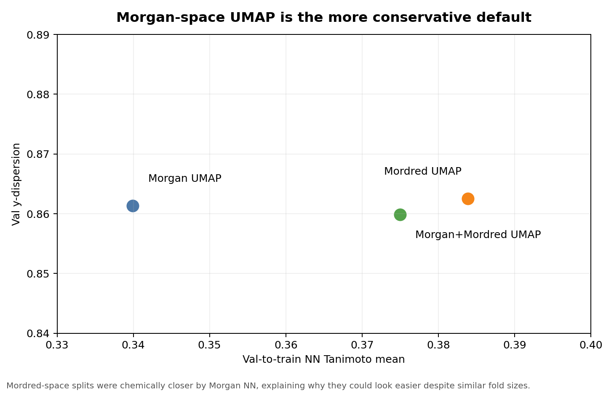

| UMAP space | val y-dispersion | val-to-train NN Tanimoto mean | 解釈 |
|---|---:|---:|---|
| Morgan | 0.861 | 0.340 | 採用。構造類似性で最も遠い |
| Mordred | 0.862 | 0.384 | descriptor空間では分かれるが、Morgan NNではtrainに近い |
| Morgan+Mordred | 0.860 | 0.375 | 中間的 |

この結果から、`mordred` 系のsplitでOOFが良く見えても、
それは「validationがtrainに化学的に近い」ために楽になっている可能性がある。
したがって、汎用のmodel comparisonにはMorgan UMAPを使い続けた。

## 11. Ro5周辺の典型的な物性分布

補助データやtest setが特殊でも、化合物自体は極端にdrug-like spaceから外れているわけではない。
RDKit descriptorから、Ro5に近い典型的な物性をtrain/test/single-onlyで比較した。

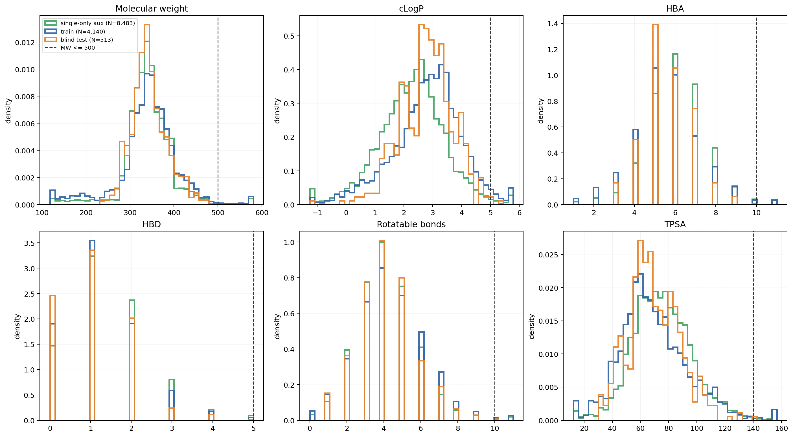

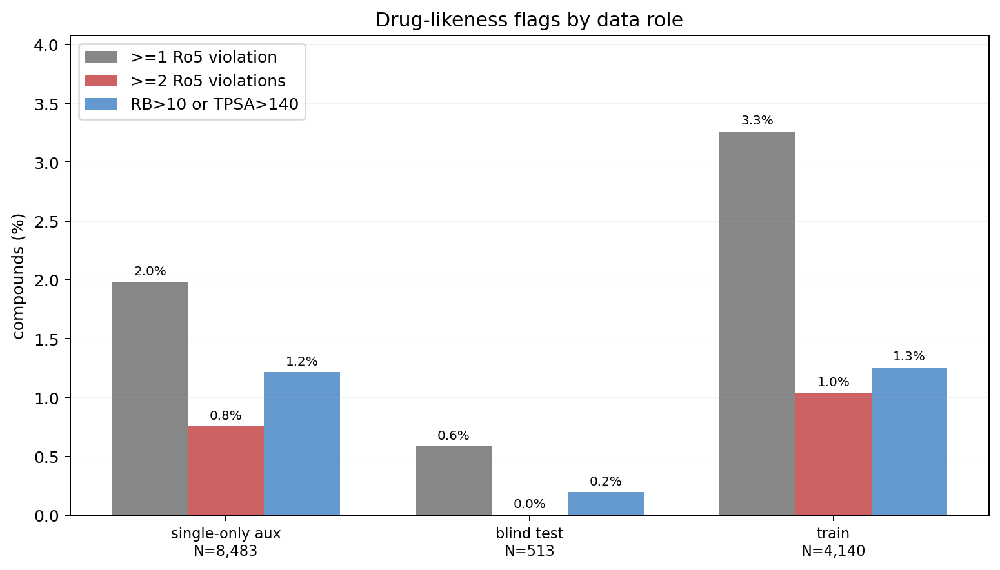

まとめ:

| subset | n | >=1 Ro5 violation | >=2 Ro5 violations | RB>10 or TPSA>140 |
|---|---:|---:|---:|---:|
| single-only aux | 8,483 | 2.0% | 0.8% | 1.2% |
| train | 4,140 | 3.3% | 1.0% | 1.3% |
| blind test | 513 | 0.6% | 0.0% | 0.2% |

train/test/single-onlyの分布はおおむね似ている。
特にtestはRo5外れが少なく、典型的なsmall molecule lead-like spaceに収まっている。
したがって、難しさの主因は「物性分布が大きく外れている」ことではなく、
Analog Set設計、PXR誘導のactivity landscape、補助assayとの関係にあると見た方がよい。

## 12. 代表構造で見たdatasetの質感

分布だけだと直感的に伝わりにくいので、
train/testから代表化合物を抜き出して構造も確認した。
以下は全化合物ではなく、傾向を説明するための例である。

まずtrainには、典型的なdrug-like small moleculeが多く含まれる。
活性が低いものから高いものまで、同じようなdrug-like範囲の構造の中に混ざっている。

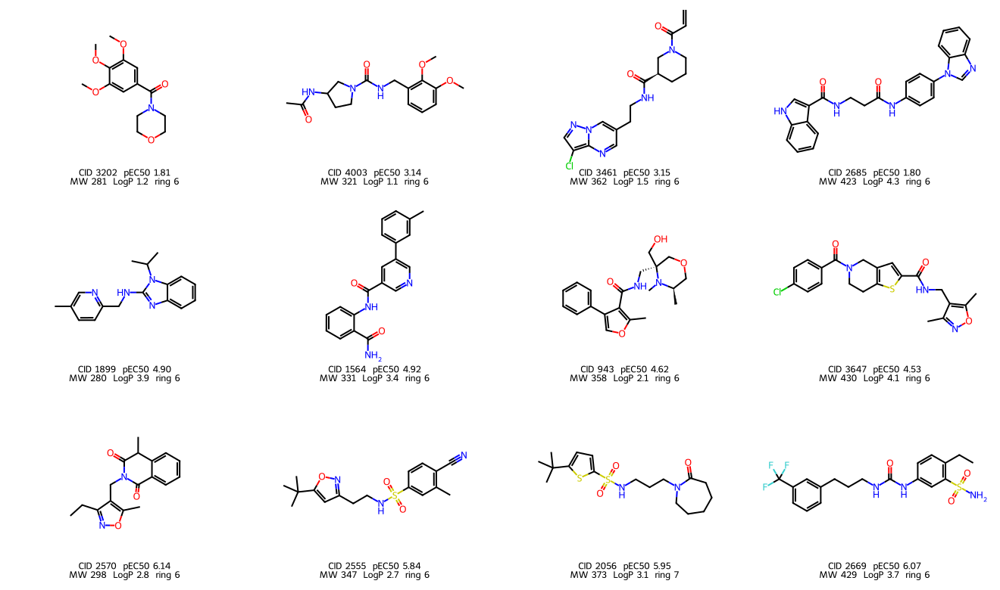

一方で、trainには少数ながらかなり特殊な構造も含まれていた。
たとえばfragment-likeな小分子、MW>500の大きな化合物、macrocycle、
rotatable bondやTPSAが大きい化合物などである。

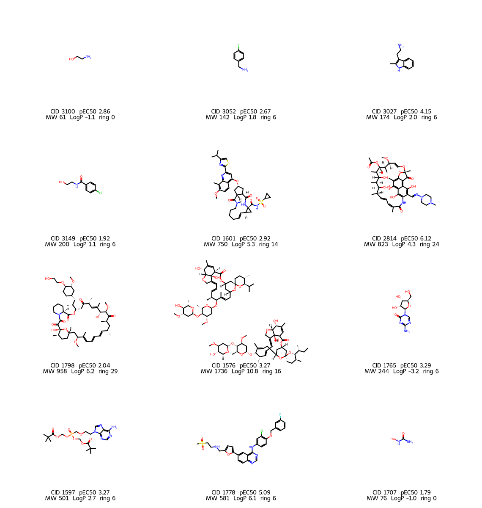

件数としては、train 4,140化合物のうち、
MW<250が345件、MW>500が51件、ring size >= 12のmacrocycle相当が7件、
Ro5違反ありが135件だった。
このような化合物をdropする案も考えたが、
数がそこまで多くないこと、PXR ligandとして完全に不自然とも言い切れないこと、
そしてdropによってtrain分布を恣意的に狭めるリスクがあることから、
最終的には機械的な除外は主軸にしなかった。

test 513化合物は、かなり典型的なdrug-like compoundに寄っている。
local descriptor上ではMW>500が0件、ring size >= 12が0件、Ro5違反ありが3件だけだった。

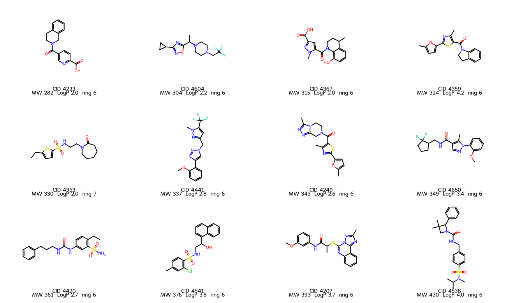

したがって、testが難しい理由は「巨大分子や特殊構造が多いから」ではない。
むしろ、test自体はdrug-likeだが、Analog Setとして局所的に選ばれており、
train中の少数の特殊構造や補助assayの情報をどう扱うかがmodeling上のノイズ源になり得た、
という理解が近い。

## 13. ChEMBL照合で見た著名化合物

この「trainには特殊構造も混ざる」という話は、
単なるdescriptor外れ値ではなく、ChEMBL照合でも確認していた。
記録はclosed issue [#182](https://github.com/N283T/pxr-iduction-challenge/issues/182)
に残っている。これはTrack 1 re-EDAの記録であり、Track 2 structure predictionの話ではない。

照合は [track1_activity/scripts/eda_redo/08_chembl_lookup.py](../../track1_activity/scripts/eda_redo/08_chembl_lookup.py)
で行い、drop候補をChEMBL 36のInChIKeyに対して引いた。
元データは `data/eda_redo/08_drop_candidates_chembl.parquet` と
`data/eda_redo/08_pxr_activities.parquet` に残っている。

| group | definition | n | in ChEMBL | approved drugs |
|---|---|---:|---:|---:|
| big tail | train p1/p99 descriptor tailで `n_out >= 5` | 24 | 18 | 17 |
| small tail | HA <= 10 のfragment-like compounds | 94 | 76 | 9 |
| both | big tailかつsmall tail | 8 | 8 | 0 |
| combined | union | 126 | 94 | 26 |

big tail側には、RIFAMPIN、CYCLOSPORINE、RIFAMYCIN系、VENETOCLAX、
DOCETAXEL、DIGITOXIN、DACLATASVIR、ATAZANAVIR、RITONAVIR、
REMDESIVIR、FOSTAMATINIB、LAPATINIB、DOXORUBICIN、BOSENTANなど、
著名な承認薬や既知薬物が含まれていた。
このうちRIFAMPINは典型的なPXR inducerであり、
ChEMBL上でもhuman PXR/NR1I2 activityが多数記録されていた。

| compound | local cid | train pEC50 | comment |
|---|---:|---:|---|
| RIFAMPIN | 2814 | 6.12 | textbook PXR inducer, ansa macrolide |
| RIFAMYCIN family | 1607 / 1733 | 6.22 / 6.69 | large ansa macrolide-like compounds |
| CYCLOSPORINE | 1585 | 3.27 | cyclic peptide, very large |
| DOXORUBICIN | 1677 | 6.08 | anthracycline, ChEMBL PXR rowあり |
| DIGITOXIN | 1789 | 4.26 | cardiac glycoside |
| RITONAVIR | 1772 | 5.55 | HIV protease inhibitor, ChEMBL PXR rowあり |
| BOSENTAN | 1826 | 5.25 | endothelin antagonist, ChEMBL PXR rowあり |

この確認から分かったことは、これらが「単なるデータエラー」ではないという点。
Rifampinのように本当にPXR ligandとして意味がある化合物も含まれていた。
一方で、challenge testはdrug-like analog setであり、
macrolide、cyclic peptide、cardiac glycoside、taxaneのような構造クラスはほぼ出てこない。
そのため、これらをdropまたはdownweightする案も検討したが、
実在するPXR関連化合物を恣意的に消すリスクもある。
最終的には、datasetの質感を説明する重要な背景として残しつつ、
production modelでは機械的な大規模dropを主軸にはしなかった。

small tail側にも、5-FU、niacin、hydroxyurea、enflurane、succimer、
trimethadione、pyrithione、dalfampridine、mequinolなどの承認薬が含まれていた。
ただしこれらはfragment-likeで、PXR LBDを占有するligandとしては解釈しにくく、
むしろinactive/weak negative anchorとして残す意味があった。

## 14. 外部データとの境界

このreportで扱っているChEMBL照合は、あくまで「challenge dataset内の化合物が、
既知薬や既知PXR ligandとしてどう見えるか」を確認するためのもの。
外部ChEMBL PXR activityを追加教師データとして使う話や、
外部データをsubmission candidateのjudgeに使う話とは分けて考える。

外部データは assay 条件、endpoint、target construct、標準化、重複排除の扱いが別問題になるため、
dataset説明では混ぜない。
このrepoでは、外部ChEMBL judgeや外部pretrain corpusは別reportで整理する方針にする。

## 15. 3D構造生成とBoltz-2の例外

Track 1の主戦場は2D/embedding特徴量だったが、
Boltz-2や3D descriptorを作る段階では、構造生成できない化合物も少数あった。
詳細はclosed issue [#50](https://github.com/N283T/pxr-iduction-challenge/issues/50)
と [#65](https://github.com/N283T/pxr-iduction-challenge/issues/65) に残っている。
issue #100ではなく、Boltz-2 preprocessing failureの別記録である。

full Boltz-2 runで問題になったtrain化合物は3件だった。

| compound_id | 内容 | 最終扱い |
|---:|---|---|
| 1576 | 2-fragmentの巨大macrolide/co-crystal。ChEMBL parent選択で単一parentに潰れなかった | largest fragmentを選んでBoltz再実行成功。ただし62 heavy atomsでoversize warningあり |
| 3840 | bridged bicyclic amineのstereo制約でRDKit ETKDGv3が3D conformer生成に失敗 | 後続のstereo repairで回復。現在DBではBoltz predictionあり |
| 1657 | Auranofin。Au(I)を含むorganometallic compound | Boltzでは不採用。Au metal complexはBoltz/ChEMBL standardizeの想定外で、無理にAuを外すと化学的に別物になる |

さらに、`db/fix_bridged_stereo.py` で全compoundをscanし、
ETKDGで実現できないstereoを最小CIP変更のembeddable stereoisomerへ修正した。
auditは [db/bridged_stereo_fixes.csv](../../db/bridged_stereo_fixes.csv) に残っており、
修正対象はcompound 3840と13023の2件だった。

重要なのは、これらはdataset全体からの削除ではないこと。
1657もtrain label自体は残っており、2D descriptorや一部の分子embeddingでは使われる。
ただしBoltz-2由来特徴量については、Au-containing metal complexである1657だけは
production featureとして使わない、という境界を置いた。
test set側には同様のAu metal complexやBoltz preprocessing failureはなかったため、
submission上の直接欠損にはならない。

## 16. 結論

datasetの本質は、`train pEC50` と `test pEC50` だけではなく、
single-concentration `log2_fc`、counter assay、Analog Set設計が重なった
multi-stage assay datasetであること。

splitについては、Analog Setを完全に再現するlocal CVは作れなかった。
Analog-aware splitは発想としては自然だが、val size、y分散、coverageの問題が大きい。
scaffold splitや別feature-space UMAPも試したが、決定的に優位な証拠はなく、
結果的にMorgan UMAPが一番無難だった。

したがって、このrepoでは以下を基本方針にした。

- model比較のcanonical CVは Morgan UMAP split。
- scaffold splitは補助診断。
- Analog/test-like splitは、LB方向やPhase 2 calibrationの診断には使うが、production OOFの主軸にはしない。
- `log2_fc` 実測はtestにないので、予測値またはpretrained representationとして使う。

## 再現性

主要な再現ポイント:

```bash
pixi run python track1_activity/scripts/eda_cv_prep/01_test_analog_distance.py
pixi run python track1_activity/scripts/eda_cv_prep/04_split_space_compare.py
pixi run python track1_activity/scripts/eda_cv_prep/05_split_diagnostic.py
pixi run python track1_activity/analysis/dataset_report/build_dataset_report_assets.py
```

関連ファイル:

- `db/standardize_compounds.py`
- `db/add_std_columns.sql`
- `db/fix_bridged_stereo.py`
- `db/bridged_stereo_fixes.csv`
- `track1_activity/src/splits.py`
- `track1_activity/analysis/dataset_report/build_dataset_report_assets.py`
- `track1_activity/scripts/eda_redo/08_chembl_lookup.py`
- `data/eda_cv_prep/test_analog_distance_summary.csv`
- `data/eda_cv_prep/split_diagnostic_summary.csv`
- `data/eda_cv_prep/split_space_compare.csv`
- `data/track1_explain/dataset_report/all_compound_morgan_umap.parquet`
- `docs/track1_explain/assets/dataset/`

## 参照

- [Announcing the next OpenADMET Blind Challenge: Predicting PXR Induction](https://openadmet.ghost.io/announcing-the-next-openadmet-blind-challenge-predicting-pxr-induction/)
- [Predicting PXR Induction - We have liftoff](https://openadmet.ghost.io/predicting-pxr-induction-we-have-liftoff/)
- [Some Thoughts on Splitting Chemical Datasets](https://practicalcheminformatics.blogspot.com/2024/11/some-thoughts-on-splitting-chemical.html)
