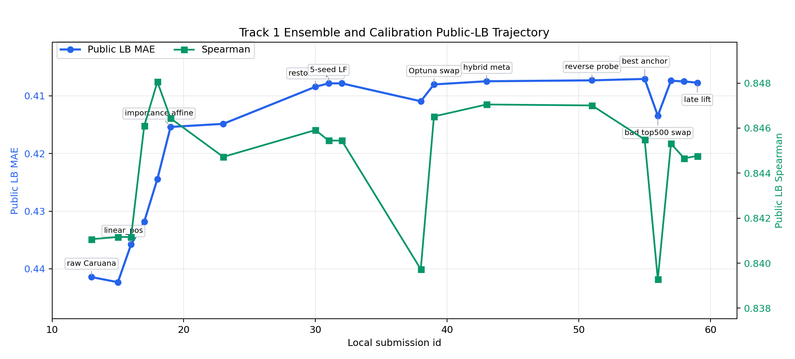
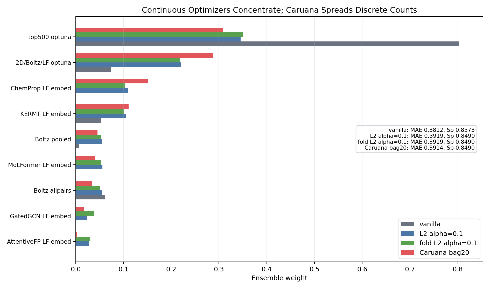
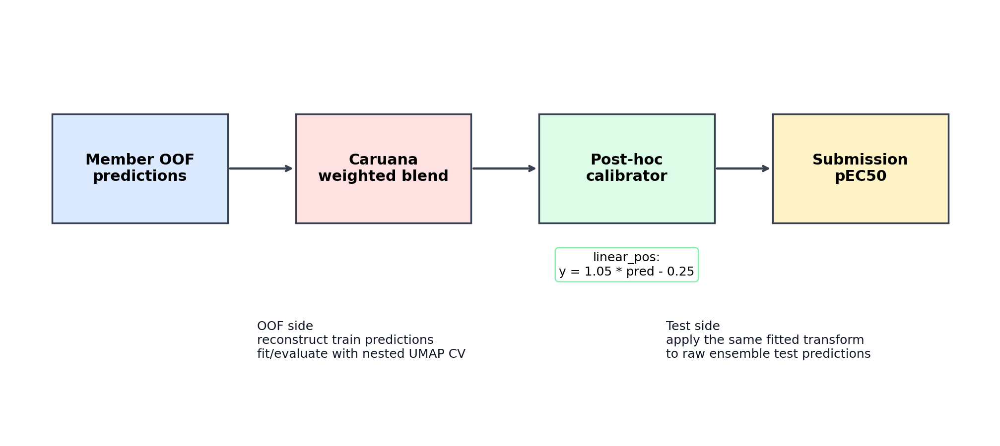
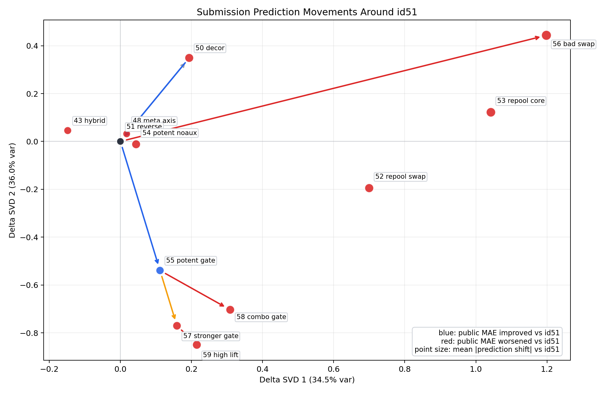
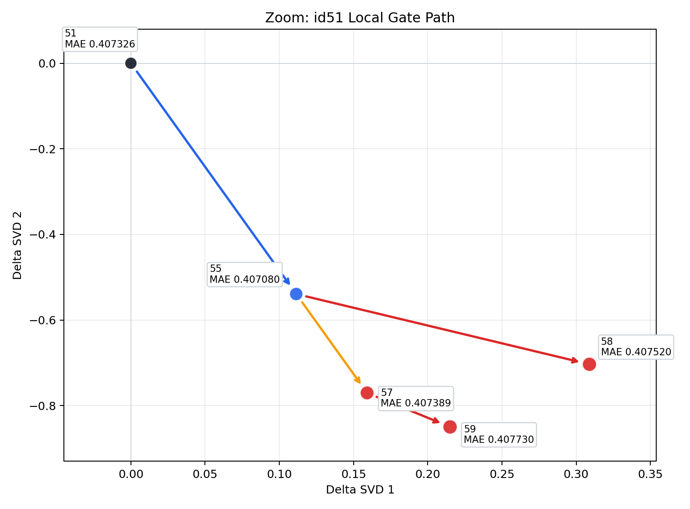

# Track 1 ensemble and calibration report

確認日: 2026-05-18 JST

このreportは、Track 1で使ったensembleとcalibrationを、
人に説明できるように整理したもの。
個々のmodelの詳細は `models/` 側に分け、ここでは
「modelをどう混ぜたか」「なぜL2最適化からCaruanaへ寄ったか」
「calibrationは何を狙って、どこで効き、どこから危なくなったか」を扱う。

## 1. ざっくり結論

はい、流れとしては **L2 / vanilla の連続重み最適化から、
bagged Caruana ensemble selection へ移行した** と説明してよい。

初期の `ens_l2_*` や `ens_vanilla` は、OOF上では強い重みを見つけられるが、
相関の高い強modelへ重みが寄りやすかった。
Track 1ではこの「局所OOFで強い方向」がpublic LBで逆に悪化することが何度もあったため、
最終的には discrete count ベースで重みを広げやすい `caruana_bag20` を
canonical ensemble recipe にした。

calibrationは別レイヤーで、ensemble後の予測値に対して
`y_cal = slope * y_pred + intercept` のようなpost-hoc変換をかける。
2026-04-21の `linear_pos` calibration はpublic LBを大きく改善したが、
その後はより複雑なcalibration/gatingがlocal OOFほどにはLBへ移らず、
Phase 1末期には「小さなcalibration改善は追いすぎない」という判断になった。



## 2. Ensembleの入力

ensembleの入力は、各single modelのOOF predictionとtest predictionである。
`track1_activity/scripts/run_ensemble.py` は明示的な `ENSEMBLE_MODELS`
allow-listを持っており、DBから勝手に拾うのではなく、
採用するmodelを1行ずつ監査できる形にしている。

この設計にした理由:

- 古い実験やscaffold split modelが混ざる事故を避ける。
- model追加・削除の履歴がgit diffとして残る。
- Caruana weightが0でも、frameworkやsingle model実験自体はDBに残せる。

重要な注意として、`ens_caruana_bag20` は安定名でDBに上書き保存される。
したがって「latest DB row」は最後に試した候補を表すことがあり、
必ずしもpublic LB bestのid55そのものではない。
public LB best anchorはCSV-only perturbationを含むため、
説明では `run_ensemble.py` のcanonical recipeと、id55/id57などのLB anchorを分けて話す。

## 3. 連続重み最適化で起きたこと

`run_ensemble.py` では、Caruanaだけでなく複数のweighting strategyを比較している。

| strategy | 何をするか | 長所 | 問題 |
|---|---|---|---|
| `simple_avg` | 全modelを同じ重みで平均 | 安定、解釈しやすい | 弱いmodelにも同じ重みが入る |
| `vanilla` | OOF RAEを直接最小化する連続重み最適化 | OOFは非常に強くなりやすい | 1つの強い/過学習気味の方向へ重みが集中する |
| `l2` | 連続重みに均等重みからのL2 penaltyを足す | vanillaよりは分散する | penaltyを入れても相関familyへの寄りは残る |
| `fold_l2` | foldごとに重みを最適化して平均 | fold差を少し見る | fold構造のnoiseを拾う可能性がある |
| `caruana_bag20` | random subset上でforward selectionを20回行い、選ばれた回数を重みにする | discreteで分散しやすい。相関modelに対して保守的 | OOF最小値だけならvanillaに負けることがある |

下図はlatest DB row上のstrategy比較で、図の目的はbest LB構成そのものではなく、
optimizerの性格を見ることにある。
`vanilla` はtop500方向に約80%を置き、OOF MAEは最も低い。
一方、`caruana_bag20` はOOF MAEでは少し負けるが、
2D/Boltz/log2fc、ChemProp/KERMT、Boltz trunkなどへ重みを残す。



この差が、このprojectでCaruanaを好んだ理由である。
Track 1ではlocal OOFとpublic analog setの分布が完全には一致しないため、
OOF最適化を強くしすぎるとpublic LBで逆方向に増幅することがあった。

## 4. Caruana ensemble selectionとは

Caruana et al. 2004 の "Ensemble Selection from Libraries of Models" は、
多数の学習済みmodel libraryから、validation set上でensemble性能が最も良くなるmodelを
貪欲に追加していく方法を提案している。

基本形は単純:

1. 空のensemble、または強いmodelを少し入れた初期ensembleから始める。
2. library内の各modelを1つ追加した場合のvalidation性能を見る。
3. 最も性能が良くなるmodelを追加する。
4. これを繰り返す。
5. 追加された回数をweightとして、最終的な平均predictionを作る。

この論文で大事なのは、単なるforward selectionだけではなく、
過学習を減らすための3つの工夫である。

| 工夫 | 意味 | このrepoでの対応 |
|---|---|---|
| selection with replacement | 同じmodelを何度も追加できる。追加回数がweightになる | `bag_counts[best] += 1` で同じmemberを繰り返し選ぶ |
| sorted initialization | 最初に良いmodelを何個か入れて、小さいensemble初期の過学習を抑える | 各bag内でsingle OOF MAE上位 `init_top_n=3` から開始 |
| bagged ensemble selection | libraryのrandom subsetごとにselectionし、最後に平均する | `bag_frac=0.5`, `n_bags=20` |

このprojectでの設定:

| parameter | value |
|---|---:|
| objective inside Caruana | MAE on OOF predictions |
| `n_iter` | 100 |
| `init_top_n` | 3 |
| `bag_frac` | 0.5 |
| `n_bags` | 20 |
| seed | 42 |

Caruana論文では数千modelのlibraryを想定しているが、
このrepoでは9-20前後の強い候補modelに対して使っている。
つまり、目的は「大量modelから宝探し」ではなく、
相関した強model群のweightを過度に連続最適化しないための
structural regularization としての役割が大きい。

## 5. なぜCaruanaがこのtaskに合っていたか

Track 1の候補modelは、完全に独立ではない。
特に `log2_fc` pretrain/predictionを共有するmodel群は相関が高い。
連続optimizerは、その中でOOFが少し良いものへ大きな重みを寄せる。
しかしpublic LBはAnalog Setであり、local OOFの小差がそのまま出るとは限らない。

Caruanaは以下の点でこの状況に合っていた。

- weightが「選ばれた回数」なので、連続optimizerより急激なweight移動が起きにくい。
- random library subsetのbaggingで、特定memberだけに依存しにくい。
- 新modelの採用可否を `caruana weight > 0` や `weight >= 0.01` として説明しやすい。
- single modelが弱くても、既存poolとdecorrelateしていればweightがつく可能性がある。

ただし、Caruanaは魔法ではない。
高相関modelを追加したとき、OOF上ではweightがついてもpublic LBでは悪化することがあった。
そのため後半は、単にCaruana weightを見るだけではなく、
相関、family share、id55/id56方向へのprediction shiftも見るようになった。

## 6. Calibrationの発端

calibrationの発端は、2026-04-20時点で
「順位付けは強いが、絶対値スケールが悪い」ように見えたことだった。

issue #100 と PR #99 の記録では、当時のN283Tは
Spearman/Kendall/R2が上位寄りなのに、MAE/RAEが相対的に悪かった。
これは、化合物の順序はかなり当てているが、
pEC50のスケールや中心がずれている、というdiagnosticである。

そこで、ensemble outputに対してpost-hoc regression calibrationを試した。
最初のPR #99では:

- `linear`
- `isotonic`

を試した。
その後PR #101で、ChatGPT DeepResearch由来の推奨を取り込み:

- `linear_pos`
- `spline_k5`

を追加した。



## 7. Calibrationの中身

calibrationは、memberを増やすのではなく、ensemble後の1次元予測を変換する。
training sideではOOF predictionを使い、test sideでは同じ変換をraw test predictionへかける。

採用候補:

| method | 内容 | 期待 | 結果 |
|---|---|---|---|
| `linear` | 通常の線形回帰 `y = a pred + b` | global shift/scale補正 | OOFで小改善 |
| `linear_pos` | slope >= 0 制約つき affine | orderingを壊しにくいscale補正 | 初期のpublic LBで大きく効いた |
| `spline_k5` | 5 quantile knotのmonotone PCHIP | linearとisotonicの中間 | OOFであまり勝てず |
| `isotonic` | 非線形monotone regression | flexibleなscale補正 | OOFで過学習気味 |

`linear_pos` が重要だったのは、Spearmanをほぼ保ったままMAEを補正できること。
PR #101ではnested CV上の改善は小さかったが、
public LBでは id16 で MAE 0.4423 から 0.4358 へ改善し、
OOF上の小さなscale補正がAnalog Setで増幅された。

latest DB rowでも、calibrated bestは `linear_pos` を選んでいる。
fitted parameterはおおよそ:

```text
y_cal = 1.0535 * y_pred - 0.2457
```

これは、予測レンジを少し広げ、中心を下げる補正である。

## 8. Importance-weighted calibration

次に効いたのが `run_ensemble_calibrate_importance.py` の
importance-weighted affine calibrationだった。

考え方:

1. Morgan fingerprintでtrain/testを区別するdomain classifierを学習する。
2. train compoundごとに `P(test|x) / (1 - P(test|x))` を密度比として推定する。
3. weightを `[1/3, 3]` にclipする。
4. そのsample weightで、OOF predictionからpEC50への線形補正をfitする。
5. test predictionへ同じaffineを適用する。

これは、testがrandom splitではなくAnalog Setであることを意識した補正である。
id19では、importance-weighted calibrationがpublic LB MAE 0.4154まで改善し、
以降しばらくproduction submissionの標準的なcalibratorとして使われた。

一方で、importance weightingは常に安全ではない。
domain classifierが強すぎると、少数のtest-like train compoundsにfitが引っ張られる。
そのためclipが必須で、後半は「calibrationを変えれば必ず良くなる」というより、
特定のanchorからどれだけtest predictionを動かすかを厳しく見るようになった。

## 9. Calibration後に起きたOOF/LB mismatch

calibrationは一度大きく効いたが、後半では新しいmodelやresidual correctionを
raw OOFだけで評価すると危なくなった。

PR #155のLB-proxy metric batteryでは、id43とid44の比較から、
raw OOF MAEではなく **production calibrationをかけた後のOOF MAE**
のほうがpublic LBの良し悪しを説明しやすい、という仮説が出た。

そのときの整理:

| metric | 意味 | 観察 |
|---|---|---|
| M1 | raw OOF MAE | id44の悪化を見逃した |
| M2 | calibrated OOF MAE | id43/id44のLB順序を正しく説明 |
| M4 | importance-weighted calibrated OOF MAE | M2と同じ方向で補強 |

機構としては、residualやnew memberがraw OOFでは良く見えても、
その後にproduction affine calibrationをかけると、残差方向が部分的に打ち消されたり、
逆に悪い方向へscaleされることがある。
したがって、後半は「raw OOFで勝ったからsubmit」ではなく、
calibrated OOF、family share、anchor shiftを合わせて見る方針になった。

## 10. Gate系の位置づけ

ここでいう `gate` は、model training中のneural network gateではない。
多くは **submission CSV上のpost-hoc local blend** である。
つまり、すでにあるanchor予測に対して、特定のtest compoundだけ別の予測方向を少し混ぜる。

一般形は次のように書ける。

```text
candidate = anchor + gamma * gate(x) * delta
```

| term | 意味 |
|---|---|
| `anchor` | すでにLBで悪くないことが分かっているsubmission。id55/id57など |
| `delta` | 借りたい予測方向。例: top500 model - base ensemble |
| `gate(x)` | 化合物ごとの0-1係数。potent46近傍、log2fc高値、ring数などで作る |
| `gamma` | 全体の混合強度 |

id55はこのgate系で、式としてはほぼ次の形だった。

```text
id55 = id51
     + 0.35
       * soft_gate(nn_tanimoto_to_potent46 >= 0.40)
       * (seed10_top500 - ens_caruana_bag20)
```

より具体的には:

| item | value |
|---|---|
| submission id | 55 |
| file | `ens_id51_top500_potent46_t40_soft_g35.csv` |
| anchor | id51 `ens_meta_axis_reverse_id50_g10` |
| borrowed direction | `tabpfn_cheme_2d_full_boltz_log2fc_pred_seed10ens_top500_umap - ens_caruana_bag20` |
| gate | test compoundのMorgan fingerprint最近傍を、potent/selective train 46化合物に対して計算 |
| soft threshold | `nn_potent46_tanimoto >= 0.40` から立ち上がり、0.15幅で1へclip |
| gamma | 0.35 |
| public LB | MAE 0.407080, RAE 0.511480, Spearman 0.845494 |

解釈としては、test setがpotent/selective hitsのanalog searchから作られていることを踏まえ、
potent46近傍ではtop500 modelの局所的な補正を少し信じた、というもの。
ただし、top500方向を全面的にSWAPしたid56はpublic LBで悪化した。
したがってid55は「top500が全面的に正しい」という証拠ではなく、
**potent46近傍に限定して、小さく借りるとよかった** という結果として説明する。

id57は同じpotent46 soft gateのgammaを0.35から0.50へ強めたもの。
これはid55よりわずかに悪化したので、id55のgate強度はかなり良いところにいた可能性がある。
id58以降のlog2fc/ring/family-gap gateやhigh-activity liftは、
local OOFやpreflightでは良く見えたがpublic LBでは微悪化した。
そのため、gateは「有効な診断・局所補正の考え方」ではあるが、
Phase 1末期には新しいgateを追加でsubmitし続けるのは止めた。

## 11. id51周辺のprediction方向

id51以降のCSV-only probeは、各submissionを513次元のtest prediction vectorとして見て、
id51からの差分をPCA/SVDで2次元に落とすとかなり理解しやすい。
ここでは厳密な化学空間PCAではなく、**prediction movementの方向**を見る図として使っている。



読み取り:

- id50はid48からdecorrelation方向へ動かしたがpublic LBで悪化した。
- id51はそのid50方向から少し逆向きに戻す小さなprobeで、LBが改善した。
- id55はid51から見て、potent46近傍だけtop500方向を借りる下方向の移動で、さらに小さく改善した。
- id56はtop500 swapを広く入れた大きな移動で、id55/id51近傍から大きく離れ、public LBで明確に悪化した。
- id57/id58/id59はid55周辺の同じ局所方向をさらに進めたが、いずれもid55より微悪化した。

id51周辺だけを拡大すると、id55が「良い方向へ一歩だけ進んだ」点で、
id57/id58/id59はそこからさらに進めすぎた、という見方ができる。



方向ごとの実数は次の通り。

| direction | 意味 | LB MAE delta | mean abs shift | p90 abs shift | max abs shift |
|---|---|---:|---:|---:|---:|
| id48 -> id50 | decorrelation sweep | +0.001843 | 0.023666 | 0.045307 | 0.079321 |
| id50 -> id51 | id50悪化方向から逆向きへ戻す | -0.001917 | 0.026033 | 0.049838 | 0.087253 |
| id51 -> id55 | potent46 gate | -0.000246 | 0.013165 | 0.038982 | 0.158316 |
| id55 -> id57 | 同じgateを強める | +0.000309 | 0.005642 | 0.016707 | 0.067850 |
| id55 -> id58 | combo gate | +0.000440 | 0.010797 | 0.032508 | 0.077779 |
| id57 -> id59 | high-activity lift | +0.000342 | 0.007616 | 0.024373 | 0.030000 |
| id51 -> id56 | ungated optuna top500 swap | +0.006134 | 0.049187 | 0.098080 | 0.245108 |

この図からの結論は、id55のgateは
「top500方向を全面的に信用した」のではなく、
id51 anchorから大きく離れない範囲で、potent46 analogらしい部分だけ補正したもの、
ということ。
id56のようにtop500方向を広く採用すると悪化し、
id57/id58/id59のようにid55からさらに押しても改善しなかった。

## 12. Phase 1後半の判断

Phase 1後半では、id55/id57/id58/id59の結果が重要な判断材料になった。

| id | submission | public MAE | 解釈 |
|---:|---|---:|---|
| 55 | `ens_id51_top500_potent46_t40_soft_g35` | 0.407080 | best practical anchor |
| 57 | `ens_id51_top500_potent46_t40_soft_g50` | 0.407389 | 少し強めたが微悪化 |
| 58 | `ens_id55_combo_gate_rank1` | 0.407520 | local OOF/preflight改善がLBへ移らず |
| 59 | `ens_id57_high_activity_lift_rank2` | 0.407730 | conservative liftも微悪化 |

この結果から、Phase 1末期は次の結論にした。

- `caruana_bag20` とcalibration toolingは残す。
- ただし、小さなOOF改善や小さなcalibration liftをpublic LBへ投げ続けない。
- id55/id57/id58/id59の差分は、Phase 2でAnalog Set 1 labelが出た後の診断材料として保存する。

## 13. 再現性と監査ポイント

主なentry point:

| purpose | command / file |
|---|---|
| canonical ensemble作成 | `pixi run python track1_activity/scripts/run_ensemble.py` |
| 4-way post-hoc calibration | `pixi run python track1_activity/scripts/run_ensemble_calibrate.py` |
| importance-weighted calibration | `pixi run python track1_activity/scripts/run_ensemble_calibrate_importance.py` |
| submission preflight | `pixi run python track1_activity/scripts/submission_preflight.py ...` |
| report図の再生成 | `pixi run python track1_activity/analysis/ensemble_report/build_ensemble_report_assets.py` |

監査で見るべきもの:

- `run_ensemble.py` の `ENSEMBLE_MODELS` allow-list。
- `experiments.hyperparameters["weights"]` のCaruana weights。
- `experiment_cv_results` のOOF MAE/RAE/Spearman。
- `lb_submissions` と `lb_submission_history` のpublic LB結果。
- id55/id56/id57/id58/id59とのprediction shift。

## 14. 関連ログ

| item | 内容 |
|---|---|
| issue #100 | Track 1 research log。calibration breakthrough、importance affine、後半のOOF/LB mismatchがまとまっている |
| PR #74 / commit `c01a460` | 11-model pool + Caruana ensemble selection |
| PR #99 / commit `bb39b38` | Linear + Isotonic post-hoc calibration |
| PR #101 / commit `4474c50` | `linear_pos` + `spline_k5` calibration |
| PR #155 / commit `37752c0` | LB-proxy metric battery。calibrated OOF MAEの重要性 |
| Caruana et al. 2004 | Ensemble selectionの元論文。selection with replacement、sorted init、bagged selectionの根拠 |

## 15. 説明用まとめ

人に説明するときは、次の順番が一番わかりやすい。

1. まず、各modelはかなり相関しているので、単純にOOF最小化すると重みが偏る。
2. そこで、continuous L2 optimizerではなく、Caruanaのbagged forward selectionで
   discreteな重みを作った。
3. その上で、public LB初期には「順位は良いがscaleが悪い」問題があり、
   `linear_pos` calibrationが効いた。
4. testがAnalog Setなので、importance-weighted affineも一度かなり効いた。
5. しかし後半は、calibrationやgatingの小さなlocal改善がpublic LBに移らなくなった。
6. したがって現在は、Caruana + calibrationを土台として保持しつつ、
   Phase 2 labelが出るまで小さなcalibration variantのsubmitは止める、という判断。
