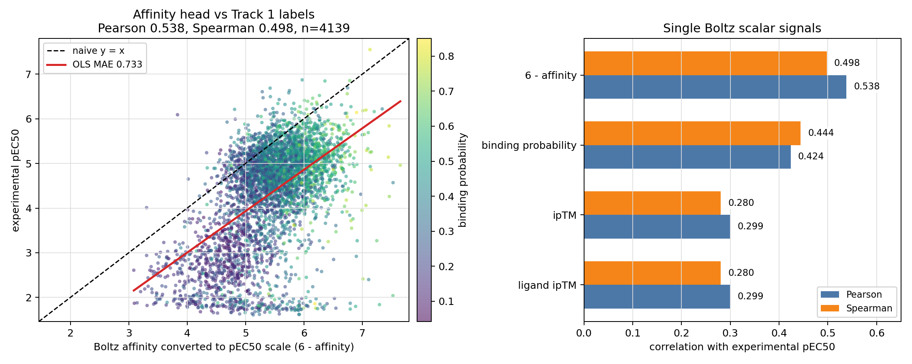
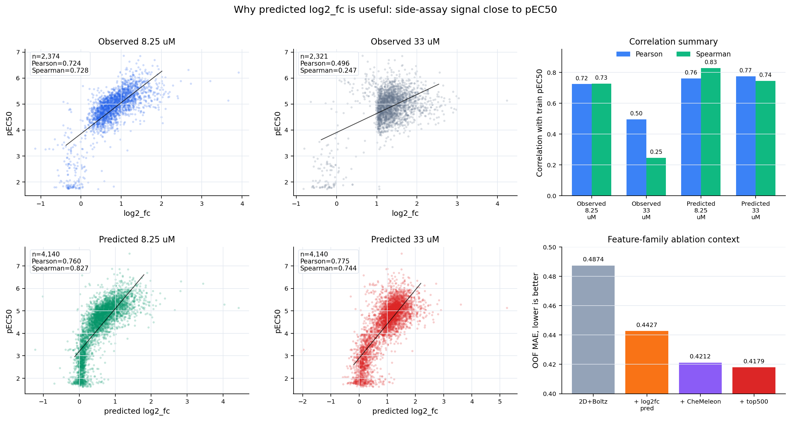
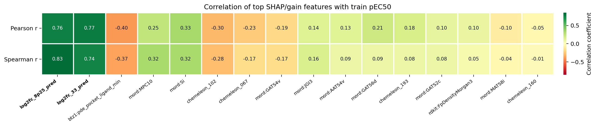
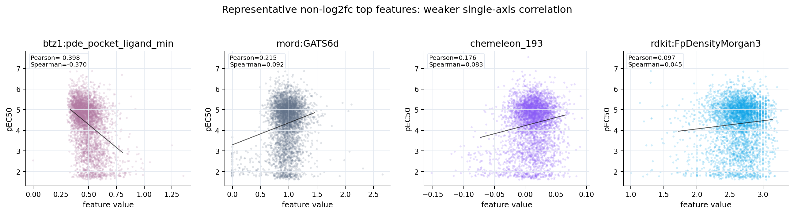

# cheme_2d_full_boltz_log2fc_pred 系の特徴量ブロック

確認日: 2026-05-17 JST

対象モデル:

- `tabpfn_cheme_2d_full_boltz_log2fc_pred_optuna_trial10_seed5ens_top500_umap`
- 同じ特徴量ファミリを使う `seed10ens_top500` / `seed5ens` / `umap_default` 系

このノートは、モデルの性能説明ではなく「入力特徴量が何を表しているか」を
人に説明するためのメモ。RDKit と Mordred は一般的な記述子なので軽めにし、
このrepoで独自に作った Boltz 系を少し厚めに書く。

## 全体像

`cheme_2d_full_boltz_log2fc_pred_optuna_trial10_seed5ens` は 2103 次元。

| block | dim | source | ざっくり何か |
|---|---:|---|---|
| CheMeleon | 300 | `compound_chemeleon` | descriptor foundation model の分子embedding |
| Mordred | 1515 | `load_train_mordred` / `load_mordred` | 2D分子記述子 |
| pose-Jazzy | 6 | `compound_boltz2_jazzy` | Boltz予測pose上のH-bond/hydration特徴 |
| RDKit full descriptors | 217 | `load_rdkit_full` | RDKit標準の物性・トポロジー記述子 |
| Boltz tier-0 | 19 | `compound_boltz2` | Boltz-2公式出力 + 派生差分 |
| Boltz tier-1 | 44 | `data/boltz2_confidence_features.parquet` | pLDDT/PAE/PDEをPXR pocket単位で再集計 |
| predicted `log2_fc` | 2 | `chemprop_pretrain_log2fc_predictions_optuna_trial10_seed5ens.parquet` | single-concentration assay の予測値 |

実装上は `track1_activity/scripts/run_train.py` の
`2d_full_boltz` と `cheme_2d_full_boltz_log2fc_pred*` loader が組み立てている。

## RDKit / Mordred

ここは一般的な cheminformatics 記述子。

- **Mordred**: 原子数、結合、電荷、トポロジー、自己相関、表面積、極性などの
  多数の2D記述子。train/testで共通に計算できる列だけを使い、NaN/Infは0に落とす。
- **RDKit full descriptors**: RDKit標準の分子量、LogP、TPSA、HBD/HBA、
  ring count、Morgan density などの小さめの記述子セット。

このモデルでは、Mordred/RDKitは「安定した2D構造情報の土台」という扱い。
Boltzやlog2fcのような新規軸を足しても、最終的なSHAPではMordredがかなり残る。

## Jazzy

Jazzy は AstraZeneca 発の、H-bond strength と hydration free energy を高速に出す
Python package。公式APIでは SMILES からRDKit moleculeを作り、必要なら3D化・
MMFF94最小化を行って、次の6特徴を返す。

| feature | meaning |
|---|---|
| `sdc` | carbon-bound H の donor strength 合計 |
| `sdx` | heteroatom-bound H の donor strength 合計 |
| `sa` | acceptor strength 合計 |
| `dga` | apolar hydration free energy |
| `dgp` | polar hydration free energy |
| `dgtot` | total hydration free energy |

このrepoには2種類の Jazzy がある。

| table | geometry | 使い道 |
|---|---|---|
| `compound_jazzy` | Jazzy/RDKitが自分で作る standalone conformer | 初期の `mordred_jazzy` 系 |
| `compound_boltz2_jazzy` | Boltz-2が予測した ligand pose conformer | `2d_full_boltz` 系で使用 |

このモデルで使っているのは **pose-Jazzy**。
`track1_activity/scripts/eda_cv_prep/11_compute_jazzy_pose.py` で、
Boltz postprocess済みの ligand pose mol にHを戻し、Jazzyの低レベルAPIを直接呼ぶ。

意図:

- standalone hydration/H-bond特徴ではなく、PXR pocket内に置かれたposeの幾何を反映する。
- ただしJazzyは本質的には小分子側のH-bond/hydration記述子なので、
  Boltzのpocket confidenceやaffinity headほど構造特異的ではない。

## CheMeleon

CheMeleon は、古典的な分子記述子を教師にした molecular foundation model。
このrepoでは Zenodo の `chemeleon_mp.pt` checkpoint を使い、
ChemProp v2 の MPNN encoding を 300次元 fingerprint として保存している。

実装:

- `db/compute_chemeleon.py`
- table: `compound_chemeleon`
- checkpoint: `https://zenodo.org/records/15460715/files/chemeleon_mp.pt`
- 入力: standardized SMILES
- 出力: ChemProp MPNN の graph-level encoding 300次元

説明するときは、
「Mordredのような手作り記述子をそのまま入れる代わりに、
それらを学習したD-MPNN由来の圧縮表現を入れている」
くらいで十分。

採用した理由は、CheMeleon単独が強かったからではない。
単独で TabPFN に入れた `tabpfn_chemeleon_umap` は MAE 0.5117 程度で、
完全に悪いわけではないが、Track 1 の主力モデルとしては物足りなかった。
一方で、2D/Boltz/log2fc 系の大きな特徴量セットに足すと、
`2d_full_boltz_log2fc_pred` 単独より明確に良くなった。

DBに残っている代表値:

| experiment id | model | feature set | MAE | Spearman | 読み方 |
|---:|---|---|---:|---:|---|
| 381 | `tabpfn_chemeleon_umap` | `chemeleon` | 0.5117 | 0.7185 | 単独でもそこそこだが主力級ではない |
| 569 | `tabpfn_2d_full_boltz_log2fc_pred_umap_default` | `2d_full_boltz_log2fc_pred` | 0.4427 | 0.8010 | 2D/Boltz/log2fcのみ |
| 728 | `tabpfn_cheme_2d_full_boltz_log2fc_pred_umap_default` | `cheme_2d_full_boltz_log2fc_pred` | 0.4212 | 0.8236 | CheMeleonを足すと大きく改善 |
| 911 | `tabpfn_cheme_2d_full_boltz_log2fc_pred_top500_umap` | same + top500 | 0.4179 | 0.8279 | さらにtop500で少し改善 |

つまり CheMeleon は「単独で当てに行くembedding」ではなく、
Mordred/RDKit/Boltz/log2fc と合わせたときに、既存の2D記述子では拾いにくい
分子グラフ由来のpriorを足す役割として採用した。
当時の詳細メモは多くないが、DB上の推移としてはこの解釈でよい。

このモデルでは CheMeleon は 300次元しかないが、SHAP family share ではかなり大きく、
Mordredと並ぶ広い2D/chemical prior として効いている。

## Boltz-2 特徴量

ここが一番オリジナル。PXRタンパク質と各リガンドを Boltz-2 で co-folding し、
出てきた affinity / confidence / predicted pose を Track 1 の活性予測用に
表形式へ落としたもの。

初期実装は Issue #100 より前の commit / PR にある。

| commit | PR | 内容 |
|---|---|---|
| `40744fb` | - | Boltz-2 full run script + postprocess |
| `713590a` | #72 | Boltz-2 pose-derived features for Track 1 |
| `429a317` | #74 | pooled Boltz trunk embedding member |
| `92f14d2` | #111 | Boltz strategy-3 + top-K feature selection |
| `791c49a` | #122 | Boltz pipeline を `track1_activity/boltz2/` に移動 |

### Boltzの入力と保存

PXRは UniProt O75469 の full-length 434 aa を使う。
binding pocket は holo PDB構造でよく接触する13残基を core pocket として固定している。

Core pocket residues:

```text
209, 211, 240, 243, 247, 281, 285, 288, 299, 306, 323, 407, 411
```

Boltz実行後、`track1_activity/boltz2/scripts/boltz2_postprocess.py` が
`compound_boltz2` に1化合物1行で保存する。
`compound_boltz2` は単なる特徴量テーブルではなく、以下も保持する。

- predicted complex の CIF path
- ligand pose の pkl/sdf path
- confidence JSON / affinity JSON path
- pLDDT, PAE, PDE, embeddings の npz path
- preprocessing failure / oversize flags

postprocessでは、Boltzがpreprocessing時に作ったRDKit mol pickleを再利用し、
CIFから読んだ座標だけを差し替えて ligand pose mol を作っている。
これは、CIFだけからbond orderや芳香性を復元すると壊れやすいため。

### Tier-0: Boltz公式出力 + 軽い派生特徴

Tier-0 は `compound_boltz2` から直接読む 19特徴。

| group | features | meaning |
|---|---|---|
| affinity value | `affinity_pred_value`, `_1`, `_2` | Boltz affinity head の log10(IC50-like) 値 |
| binding probability | `affinity_probability_binary`, `_1`, `_2` | binder probability |
| confidence | `confidence_score`, `ptm`, `iptm`, `ligand_iptm`, `protein_iptm` | complex/interface confidence |
| aggregate quality | `complex_plddt`, `complex_iplddt`, `complex_pde`, `complex_ipde` | global / interface quality summaries |
| geometry sanity | `ligand_atom_count`, `ligand_to_pocket_distance_a` | ligand size and pocket-centroid distance |
| ensemble disagreement | `ensemble_diff_affinity`, `ensemble_diff_prob` | member1 - member2 の差分 |

`affinity_pred_value` は log10(IC50-like) なので、pEC50とは向きが反対に近い。
粗く言えば `pEC50 ≈ 6 - affinity_pred_value` のような関係を期待するが、
assay差やEC50/IC50差があるため、絶対値としてではなく学習器への特徴量として使う。

この点は実測でも確認した。
train 4139 compoundsで `6 - affinity_pred_value` とpEC50の相関は
Pearson 0.5379、Spearman 0.4976。
方向性はあるが、単独で使えるほど強くはない。
線形補正しても MAE 0.733 で、`tabpfn_boltz2_tabular_tier0_umap_default`
も OOF MAE 0.5797 に留まった。
したがって、Boltz affinityは「PXRっぽい弱い構造signal」として、
他の2D/Boltz/log2fc特徴と一緒に使うのが妥当だった。



補足: Boltz-2本家のaffinity headは、単にtrunk embeddingを平均しているわけではない。
`z_trunk` にtrunk inputと予測構造のdistogramを足し、PairFormer moduleで処理したあと、
protein-ligand + intra-ligand pairをmean poolして
binding probability と `log10(IC50[μM])` 風の affinity value を出す。
我々の `pooled_boltz` 系はこのheadの再実装ではなく、
保存済みの `s` / `z` trunk tensorをPXR用に1024次元へpoolした別の特徴量。
つまり、Tier-0の `affinity_pred_value` は「本家headの出力」、
pooled trunkは「headに入る前のtrunk内部表現をTabPFN向けに使ったもの」と分けて説明する。

### Tier-1: confidence map をPXR用に再集計した特徴

Tier-1 は我々のオリジナル度が高い。
Boltz-2が返す token-level / token-pair-level の `.npz` を、
PXR pocket と ligand に分けて再集計している。

実装:

- `track1_activity/scripts/extract_boltz2_confidence_features.py`
- output: `data/boltz2_confidence_features.parquet`
- shape: 約4652 compounds x 44 features

Boltzのtoken順序は以下として扱う。

```text
0..433              PXR protein residues
434..434+N_lig-1    ligand atom tokens
```

44特徴の内訳:

| group | dim | 内容 |
|---|---:|---|
| protein pLDDT | 5 | PXR全体の mean/std/min/max/p10 |
| ligand pLDDT | 5 | ligand atom token の mean/std/min/max/p10 |
| pocket pLDDT | 5 | core pocket 13残基の mean/std/min/max/p10 |
| PAE protein-ligand | 4 | protein x ligand cross block の mean/std/min/max |
| PAE pocket-ligand | 4 | pocket x ligand cross block の mean/std/min/max |
| PDE pocket-ligand | 4 | pocket x ligand distance error の mean/std/min/max |
| PDE intra-ligand | 4 | ligand内 token pair の mean/std/min/max |
| per-residue pocket pLDDT | 13 | core pocket各残基の pLDDT |

用語:

- **pLDDT**: tokenごとの局所構造信頼度。高いほどその局所構造が信頼できる。
- **PAE**: token pair の相対配置誤差。低いほど相対配置が信頼できる。
- **PDE**: token pair の距離誤差。低いほど距離予測が信頼できる。

このモデルのSHAP上位にも `boltz_tier1__pde_pocket_ligand_min` が入っている。
これは「少なくとも一部のpocket residue - ligand atomペアについて、
Boltzが距離をかなり自信ありに置いているか」を見る特徴と解釈できる。

### 採用しなかったBoltz特徴

過去には ProLIF interaction fingerprint の Tier-2 も試した。
これは predicted complex から residue-level の H-bond / hydrophobic / VdW などを
bit化する特徴だった。

不採用理由は「IFPが構造的に無意味」というより、
その前段のLGBM重要度確認で gain がほとんど出なかったこと。
つまり、Boltz-2から取り出せる有効な表形式シグナルは、
すでに Tier-0 の affinity/confidence scalar と Tier-1 の pLDDT/PAE/PDE pocket集計に
かなり吸収されている、という解釈にした。

当時の bake-off では、Tier-2を足しても追加のOOF MAE/RAE改善はほぼなく、
利用されたIFP bitも少数で、gain shareもごく小さかった。
そのためこのモデルには入れていない。

PoseBusters 由来の物理妥当性boolも検討したが、PXRのdrug-like化合物ではほぼ定数で、
gainが出にくかったため最終特徴量には入れていない。

## predicted log2_fc

`log2_fc` は single-concentration assay の fold-change を予測した補助特徴。
blind test には measured single-concentration 行がないため、実測値を直接使うのではなく、
全 compound に対して予測値を作ってから特徴量として入れている。

このモデルで使っているのは:

```text
data/chemprop_pretrain_log2fc_predictions_optuna_trial10_seed5ens.parquet
```

列は2本。

| feature | meaning |
|---|---|
| `log2fc_8p25_pred` | 8.25 uM single-concentration log2 fold-change の予測 |
| `log2fc_33_pred` | 33 uM single-concentration log2 fold-change の予測 |

作り方:

1. ChemPropを 13,136 compounds の single-concentration `log2_fc` 2タスクでpretrainする。
2. Optuna trial10 のハイパーパラメータを使う。
3. seed 42, 43, 44, 45, 46 の5 seedを学習する。
4. 各seedの train+test 4653 compounds 予測を平均して `seed5ens` parquet にする。
5. `2d_full_boltz` にこの2列を足す。

このモデルでは LGBM top500 selector がこの2列を非常に強く選んでいる。
一方で TabPFN SHAP では、1特徴あたりの寄与は強いが、family total では
Mordred/CheMeleonほど支配的ではない。

### なぜ効くのか

これはモデル固有の説明から少し外れるが、Track 1 ではかなり重要。
`pEC50` は dose-response から得られる potency で、`log2_fc` は固定濃度での
PXR応答の fold-change。測っている量は同じではないが、どちらもPXR activationを
見ているので、生物学的にはかなり近い。

DB上の single-concentration coverage:

| concentration | rows | compounds | mean log2_fc | sd |
|---:|---:|---:|---:|---:|
| 8.25 uM | 10,753 | 10,752 | 0.3366 | 0.4094 |
| 33 uM | 9,528 | 9,527 | 0.6396 | 0.5705 |
| 99 uM | 706 | 706 | 1.2149 | 0.6172 |

Track 1 train 4,140化合物のうち、2,392化合物は measured single-concentration を持つ。
一方で blind test 513化合物には measured single-concentration 行がない。
そのため、実測 `log2_fc` を直接入れるのではなく、13k規模の side assay で
ChemProp predictor を作り、train/test全体へ予測値として展開している。

observed `log2_fc` と train `pEC50` の相関:

| observed label | n train | Pearson r with pEC50 |
|---|---:|---:|
| 8.25 uM `log2_fc` | 2,374 | 0.7237 |
| 33 uM `log2_fc` | 2,321 | 0.4961 |

optuna trial10 seed5ens の predicted `log2_fc` と train `pEC50` の相関:

| predicted feature | Pearson r | Spearman r |
|---|---:|---:|
| `log2fc_8p25_pred` | 0.7599 | 0.8269 |
| `log2fc_33_pred` | 0.7746 | 0.7442 |



上位SHAP/gain特徴量を同じ train `pEC50` との単独相関heatmapで見ると、
`log2fc_pred` 2本がかなり突出している。
Boltz/Mordred/CheMeleon/RDKitの上位特徴にも相関はあるが、
単独proxyとしては `log2fc_pred` ほど強くない。



代表的な非log2fc上位特徴量の散布図。
これらは単独でpEC50を強く説明するというより、
TabPFN内でlog2fcや他の2D特徴と組み合わさる補助軸として効いていると見る。



解釈:

- 8.25 uM は低めの固定濃度なので、potency差が出やすく、rank signal が強い。
- 33 uM は高めの固定濃度なので、potencyだけでなく efficacy / upper response 側の
  情報も混ざりやすい。
- 2本は互いに相関が高いが、完全には同じではない
  (predicted 2列の Pearson r は 0.9096)。
- したがって `log2fc_pred` は「pEC50を直接見た特徴」ではないが、
  同じPXR activation実験系から来る強い低忠実度proxyになっている。

代表的なablationもこの解釈と合う。

| comparison | MAE | Spearman | 読み方 |
|---|---:|---:|---|
| `2d_full_boltz` | 0.4874 | 0.7498 | log2fcなし |
| `2d_full_boltz_log2fc_pred` | 0.4427 | 0.8010 | predicted log2fcを足すと大きく改善 |
| `cheme_2d_full_boltz_log2fc_pred` | 0.4212 | 0.8236 | CheMeleonも足すとさらに改善 |
| `cheme_2d_full_boltz_log2fc_pred_top500` | 0.4179 | 0.8279 | top500で少し改善 |

完全に制御された比較ではないが、`log2fc_pred` を抜いた top-k 系はかなり悪化していた。
たとえば ADMET-AI top500 の no-log2fc 版は MAE 0.4631、
v3 top400 の no-log2fc 版は MAE 0.4871 だった。

注意点として、これは強いが危ない特徴でもある。
single-concentration assay の分布や、public test の化学空間がずれると、
OOFでは非常に強く見える方向がLBで過剰に動く可能性がある。
id56 の optuna trial10 top500 swap がLBで悪化したのは、
この `log2fc/top500` 軸を強くしすぎた一例として扱う。

## 外部・内部ソース

外部:

- Jazzy docs: https://jazzy.readthedocs.io/en/latest/usage.html
- CheMeleon paper: https://arxiv.org/abs/2506.15792
- CheMeleon checkpoint: https://zenodo.org/records/15460715
- Boltz-2 API/output summary: https://landing.biolm.ai/models/boltz2/
- Boltz confidence metrics notes: https://deepwiki.com/jwohlwend/boltz/3.5-confidence-prediction
- Mordred: https://github.com/mordred-descriptor/mordred
- RDKit descriptors/charges docs: https://www.rdkit.org/docs/

内部:

- `db/compute_jazzy.py`
- `track1_activity/scripts/eda_cv_prep/11_compute_jazzy_pose.py`
- `db/compute_chemeleon.py`
- `db/boltz2_schema.sql`
- `track1_activity/boltz2/src/boltz2/postprocess.py`
- `track1_activity/scripts/extract_boltz2_confidence_features.py`
- `track1_activity/scripts/run_chemprop_pretrain_optuna.py`
- `track1_activity/scripts/run_chemprop_pretrain_phase4_prep.py`
- historical commit `713590a`: `docs/track1_boltz2_features.md`
