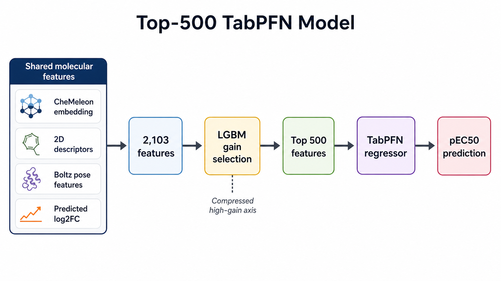
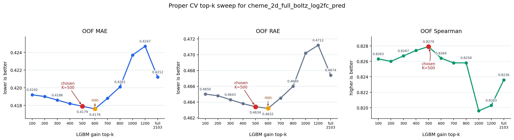
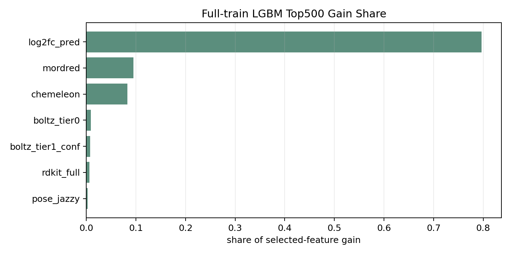
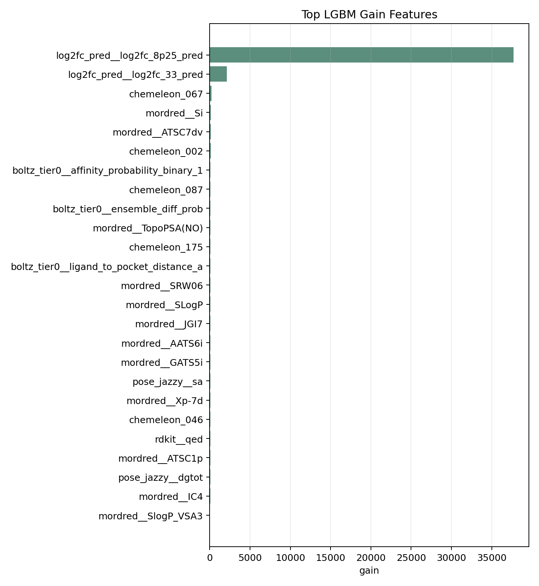
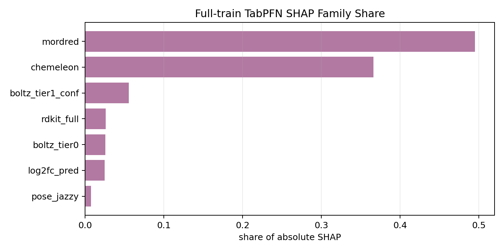
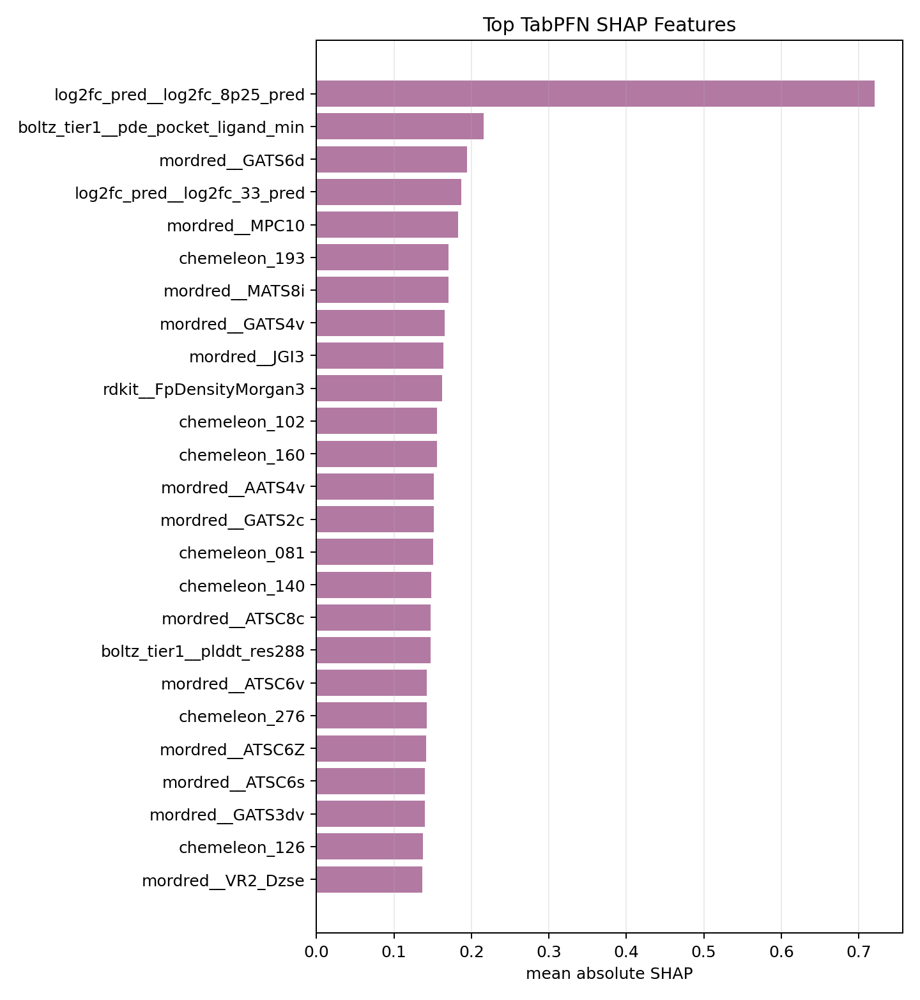

# tabpfn_cheme_2d_full_boltz_log2fc_pred_optuna_trial10_seed5ens_top500_umap

確認日: 2026-05-17 JST

## 位置づけ

これは `cheme_2d_full_boltz_log2fc_pred_optuna_trial10_seed5ens` という
2103次元特徴量を、foldごとに LGBM gain 上位500特徴へ圧縮してから
TabPFN に入れたモデル。

ただし、Track 1 の best submit である id55 の主成分ではない。
id55 の potent46 gate で使った top500 方向は
`tabpfn_cheme_2d_full_boltz_log2fc_pred_seed10ens_top500_umap`。

この optuna trial10 top500 版は後続の id56 で
`seed10ens_top500` から差し替える候補として試され、ローカル OOF は強かったが
public LB では悪化したため不採用になった。

## 何をしているか

元特徴量:

| ブロック | 次元 | 内容 |
|---|---:|---|
| CheMeleon embedding | 300 | `compound_chemeleon` に保存された foundation fingerprint |
| 2D/Boltz base | 1801 | Mordred、pose-Jazzy、RDKit、Boltz tier0/tier1 tabular features |
| predicted `log2_fc` | 2 | ChemProp optuna trial10 seed5 ensemble の 8.25 uM / 33 uM 予測 |
| 合計 | 2103 | TabPFN に入れる前の full feature |

各特徴量ブロックの中身は
[`cheme_2d_full_boltz_log2fc_pred_feature_blocks.md`](../features/cheme_2d_full_boltz_log2fc_pred_feature_blocks.md)
に分けて整理している。

学習の流れ:

1. UMAP split 5-fold を使う。
2. 各 fold で、その fold の train row だけを使って LGBMRegressor をfitする。
3. LGBM gain importance 上位500特徴を選ぶ。
4. その500特徴だけで TabPFNRegressor をfitする。
5. validation fold に OOF 予測を出す。
6. test は foldごとの選択特徴/TabPFN予測を平均する。

重要なのは、top500選択が fold の外側に漏れていないこと。
`13_tabpfn_top_k_importance.py` の古い探索では漏れがあり、このモデルは
`15_tabpfn_topk_proper_cv.py` で per-fold selection に直したもの。



## なぜ top500 か

top500 は、この optuna trial10 版で新しくゼロから決めた値ではなく、
元の `cheme_2d_full_boltz_log2fc_pred` 系で行った top-k sweep の結果を
引き継いだもの。

最初の探索は `13_tabpfn_top_k_importance.py`。
これは full train で1回だけ LGBM gain を計算してから top-k を切るため、
feature selection に y 情報が少し漏れる。したがって正式なOOF性能としては扱わない。
ただし、「2103次元をそのままTabPFNに入れるより、LGBM gainで圧縮した方がよい」
という仮説を見るための探索として使った。
この古い探索では、script comment 上で top500 が best だったことが残っている
(`OOF 0.4169 vs production 0.4212`)。

その後 `15_tabpfn_topk_proper_cv.py` で、各 outer fold の train row だけを使って
LGBM gain ranking を作る形に直した。DB に残っている proper CV の比較は次の通り。

| experiment id | K | MAE | RAE | Spearman | note |
|---:|---:|---:|---:|---:|---|
| 985 | 100 | 0.4192 | 0.4650 | 0.8263 | 圧縮しすぎ |
| 984 | 200 | 0.4190 | 0.4648 | 0.8260 | 圧縮しすぎ |
| 983 | 300 | 0.4186 | 0.4643 | 0.8267 | top500より少し弱い |
| 2472 | 400 | 0.4182 | 0.4638 | 0.8274 | top500に近い |
| 911 | 500 | 0.4179 | 0.4634 | 0.8279 | 当時採用。Spearman最良 |
| 2468 | 600 | 0.4176 | 0.4632 | 0.8264 | 追加試験ではMAE/RAE最良 |
| 2469 | 700 | 0.4188 | 0.4645 | 0.8258 | 少し悪化 |
| 982 | 800 | 0.4201 | 0.4660 | 0.8258 | 次元を戻しすぎると悪化 |
| 2470 | 1000 | 0.4237 | 0.4702 | 0.8196 | fullより悪い |
| 2471 | 1200 | 0.4247 | 0.4712 | 0.8203 | fullより悪い |
| 728 | full 2103 | 0.4212 | 0.4674 | 0.8236 | top-kなしの元モデル |



この比較からの解釈:

- full 2103次元は、TabPFNには少し大きすぎる。
- K=100-300 でも改善するが、情報を落としすぎる。
- K=500-600 あたりが最も良い帯で、K=500はSpearman最良、K=600はMAE/RAE最良。
- K=800以上は低gain特徴を戻しすぎて、fullに近づく方向で悪くなる。
- K=500 は「log2fc、CheMeleon、Mordred、Boltz系の主要特徴を残しつつ、
  低gainの記述子ノイズをかなり落とす」妥協点だった。
  追加試験後に見ても、K=600との差はMAEで0.0003程度なので、
  500を採用していた判断は大きくは外れていない。

このため、後続の seed5ens / seed10ens / seed15ens / optuna trial10 系では
K=500 を固定して発展させた。
実際、optuna trial10 版でも full model は MAE 0.3959 だったのに対して、
top500 版は MAE 0.3828-0.3829 まで改善している。

ただし、top-k sweep の再現性は少し割り切って見る。
当時の fold ごとの選択 feature index は保存していないため、
「なぜ500を選んだか」の根拠は DB に残る experiment summary と script comment を
主な証拠にする。今後もう一度厳密にやるなら、Kごとの選択feature listも保存する。

## LGBM gain と TabPFN SHAP 診断

ここは厳密な OOF 再現ではなく、説明用の診断として見ている。
実際のモデルは fold ごとに top500 を選び直すが、SHAP まで fold-local に
完全再現すると重くなりすぎるため、ここでは全 train row で LGBM selector を
1回 fit し、その top500 で TabPFN v2.6 を1回 fit している。

設定:

| item | value |
|---|---|
| selection | full-train LGBM gain top500 |
| TabPFN | v2.6, `n_estimators=8`, `softmax_temperature=0.9` |
| SHAP | `tabpfn_extensions.interpretability.shapiq` の imputation SHAP |
| SHAP index | first-order `SV`, `get_n_order_values(1)` で抽出 |
| imputer | baseline |
| budget | 512 |
| explained compounds | submission予測値の分位点から選んだ test 12件 |

診断の再実行コマンド:

```bash
pixi run python track1_activity/analysis/tabpfn_shape_diagnostic/optuna_top500_fulltrain_gain_tabpfn_shap.py \
  --n-explain 12 \
  --budget 512 \
  --force
```

注意点:

- このSHAPは「fold-local OOFモデルそのもの」ではなく、
  特徴量の大まかな使われ方を見るための full-train 診断。
- 以前の `tabpfn26_shap_top500` は `seed10ens` 向けであり、
  今回の optuna trial10 top500 とは別物。
- budget を 128 まで落とした KernelSHAP では値が不安定になったため、
  今回は budget 512 の結果だけを採用している。

### LGBM gain

LGBM selector の gain では、2本の predicted `log2_fc` が圧倒的に強い。
full-train top500 内の gain share は約79.7%が `log2fc_pred` に集中している。
ただしこれは「LGBM が特徴選択に使った軸」であって、
TabPFN の最終予測寄与そのものではない。

| family | selected | gain share |
|---|---:|---:|
| `log2fc_pred` | 2 | 79.7% |
| `mordred` | 246 | 9.5% |
| `chemeleon` | 196 | 8.2% |
| `boltz_tier0` | 13 | 0.9% |
| `boltz_tier1_conf` | 25 | 0.8% |
| `rdkit_full` | 14 | 0.6% |
| `pose_jazzy` | 4 | 0.3% |





### TabPFN SHAP

TabPFN SHAP では、family単位の寄与は LGBM gain より分散している。
`log2fc_pred` は1特徴あたりでは強いが、2本しかないため family total では
約2.5%にとどまる。一方で、Mordred と CheMeleon は選択本数が多く、
合計ではこの診断の大部分を占める。

| family | selected | SHAP share | mean abs SHAP / feature |
|---|---:|---:|---:|
| `mordred` | 246 | 49.5% | 0.0739 |
| `chemeleon` | 196 | 36.6% | 0.0686 |
| `boltz_tier1_conf` | 25 | 5.5% | 0.0813 |
| `rdkit_full` | 14 | 2.6% | 0.0684 |
| `boltz_tier0` | 13 | 2.5% | 0.0719 |
| `log2fc_pred` | 2 | 2.5% | 0.4540 |
| `pose_jazzy` | 4 | 0.7% | 0.0659 |





上位の単独特徴では `log2fc_pred__log2fc_8p25_pred` が最も大きい。
その次に Boltz tier1 の pocket-ligand PDE、Mordred の autocorrelation 系、
CheMeleon 成分、RDKit の Morgan density などが続く。

| rank | feature | family | mean abs SHAP |
|---:|---|---|---:|
| 1 | `log2fc_pred__log2fc_8p25_pred` | `log2fc_pred` | 0.7207 |
| 2 | `boltz_tier1__pde_pocket_ligand_min` | `boltz_tier1_conf` | 0.2158 |
| 3 | `mordred__GATS6d` | `mordred` | 0.1941 |
| 4 | `log2fc_pred__log2fc_33_pred` | `log2fc_pred` | 0.1872 |
| 5 | `mordred__MPC10` | `mordred` | 0.1825 |
| 6 | `chemeleon_193` | `chemeleon` | 0.1707 |
| 7 | `mordred__MATS8i` | `mordred` | 0.1702 |
| 8 | `mordred__GATS4v` | `mordred` | 0.1654 |
| 9 | `mordred__JGI3` | `mordred` | 0.1637 |
| 10 | `rdkit__FpDensityMorgan3` | `rdkit_full` | 0.1622 |

この結果からの読み方:

- LGBM selector は single-concentration `log2_fc` 予測を強く頼って top500 を作っている。
- TabPFN 側では、その2本だけで決まっているというより、
  Mordred/CheMeleon の広い特徴集合に予測を分散している。
- Boltz 系は主役ではないが、top SHAP には pocket-ligand PDE や affinity/probability 系が入り、
  補助的な3D/pose情報として使われている。
- id56 で LB が悪化したことを考えると、この「OOFで強い log2fc/top500 軸」は
  public set へそのまま移すと過剰に動いた可能性がある。

## DB 記録

DB の `experiments` に残っている。

| key | value |
|---|---|
| experiment id | 2380 |
| model_type | `tabpfn` |
| feature_set | `cheme_2d_full_boltz_log2fc_pred_optuna_trial10_seed5ens` |
| submission_path | `track1_activity/submissions/tabpfn_cheme_2d_full_boltz_log2fc_pred_optuna_trial10_seed5ens_top500_umap.csv` |
| OOF rows | 4140 |

OOF summary:

| metric | value |
|---|---:|
| MAE | 0.3829 in note / 0.38275 fold-average check |
| RAE | 0.4208 in note / 0.42464 fold-average check |
| Spearman | 0.8564 in note / 0.85390 fold-average check |

Fold metrics currently stored:

| fold | MAE | RAE | R2 | Spearman | Kendall |
|---:|---:|---:|---:|---:|---:|
| 0 | 0.391899 | 0.432341 | 0.772888 | 0.848310 | 0.663611 |
| 1 | 0.367505 | 0.369938 | 0.821031 | 0.881358 | 0.697961 |
| 2 | 0.402161 | 0.473513 | 0.701497 | 0.846675 | 0.665265 |
| 3 | 0.343096 | 0.440072 | 0.758500 | 0.837426 | 0.665979 |
| 4 | 0.409104 | 0.407323 | 0.767618 | 0.855737 | 0.667944 |

## 残っている成果物

再現・検証に必要な主要成果物は残っている。

| artifact | status |
|---|---|
| `data/chemprop_pretrain_log2fc_predictions_optuna_trial10_seed5ens.parquet` | exists, 4653 rows x 2 cols |
| `track1_activity/checkpoints/chemprop_pretrain_optuna/trial_010*/pretrain.pt` | seed 42,43,44,45,46 が存在 |
| `track1_activity/submissions/tabpfn_cheme_2d_full_boltz_log2fc_pred_optuna_trial10_seed5ens_top500_umap.csv` | exists |
| `experiment_oof_predictions` | 4140 rows exists |
| `compound_chemeleon` | 13136 rows exists |
| feature loader | current codeで 4140 x 2103 / 513 x 2103, NaNなしを確認 |
| `track1_activity/analysis/tabpfn_shape_diagnostic/outputs/optuna_trial10_top500_fulltrain_gain_tabpfn_shap/` | full-train gain/SHAP 診断 |

## 再現コマンド

現在のスクリプトで同名モデルを再生成するなら、TabPFN version を明示する。
現在の `15_tabpfn_topk_proper_cv.py` は default が v3 に変わっているため、
何も指定しないと `_v3` 付きの別モデルになる。

```bash
pixi run python track1_activity/scripts/boltz_affhead/15_tabpfn_topk_proper_cv.py \
  --feature cheme_2d_full_boltz_log2fc_pred_optuna_trial10_seed5ens \
  --K 500 \
  --seed 42 \
  --tabpfn-version v2_6 \
  --n-estimators 8 \
  --softmax-temperature 0.9
```

入力特徴量の smoke check:

```bash
pixi run python - <<'PY'
import sys
from pathlib import Path
sys.path.insert(0, str(Path("track1_activity/src").resolve()))
sys.path.insert(0, str(Path("track1_activity/scripts").resolve()))

from data import load_train_smiles_target, load_test_smiles
import run_train

train = load_train_smiles_target()
test = load_test_smiles()
Xtr, Xte = run_train.load_features(
    "cheme_2d_full_boltz_log2fc_pred_optuna_trial10_seed5ens",
    train,
    test,
)
print(Xtr.shape, Xte.shape)
PY
```

期待値:

```text
(4140, 2103) (513, 2103)
```

## 再現性評価

判定: かなり高い。ただし完全 bitwise 再現は期待しない方がよい。

理由:

- train/test の特徴量、log2fc parquet、OOF、submission CSV は残っている。
- optuna trial10 seed5 ensemble の checkpoint も残っている。
- top500 selection は per-fold LGBM gain で、コード上は再実行可能。
- TabPFN と GPU 実行は環境差で微小な揺れが出る可能性がある。
- foldごとの top500 feature index は別ファイルとして保存されていないため、
  選択特徴はコード・seed・ライブラリ version から再計算する必要がある。

再現時の注意点:

- `--tabpfn-version v2_6` を明示する。
- `data/chemprop_pretrain_log2fc_predictions_optuna_trial10_seed5ens.parquet`
  が存在することを確認する。
- `compound_chemeleon` と Boltz tier0/tier1 系 feature table がDBにあることを確認する。
- 生成済み CSV を上書きする可能性があるため、再実行前に必要なら退避する。

## LB 上の扱い

この単体モデルは OOF では非常に強いが、これを使った後続提出は public LB に転ばなかった。

関連する提出:

| id | 内容 | LB MAE | 判断 |
|---:|---|---:|---|
| 55 | id51 + seed10 top500 potent46 gate | 0.407080 | best anchor |
| 56 | old seed10ens top500 を optuna trial10 seed5ens top500 に swap | 0.413460 | 不採用 |

結論:

このモデルは「ローカル OOF 最強方向の1つ」だが、public Analog Set 1 では
過剰に動く、または id55 から見た悪い方向に近い可能性が高い。
説明資料では、best id55 の構成要素ではなく、
「OOF は強いが LB transfer に失敗した top500 variant」として扱う。
