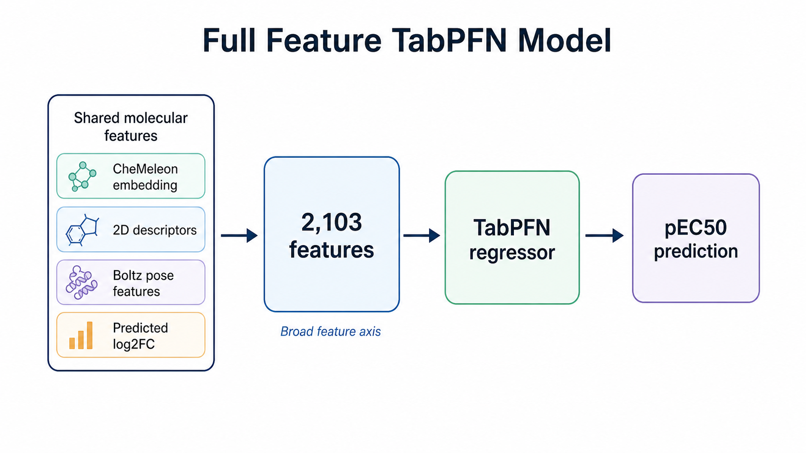
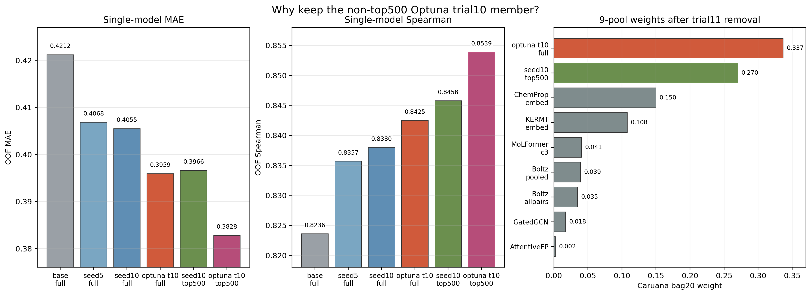

# tabpfn_cheme_2d_full_boltz_log2fc_pred_optuna_trial10_seed5ens_umap_default

確認日: 2026-05-18 JST

## 位置づけ

これは `cheme_2d_full_boltz_log2fc_pred_optuna_trial10_seed5ens` の
2103次元特徴量を、top-k圧縮せずそのまま TabPFN に入れたモデル。

現在の `run_ensemble.py` では、2D/Boltz/CheMeleon/`log2_fc` 系の
full feature 代表として残っている。対応する top500 代表は
`tabpfn_cheme_2d_full_boltz_log2fc_pred_seed10ens_top500_umap` で、
この2つが同じ特徴量ファミリーの中で少し違う役割を持つ。

一言でいうと、このモデルは「top500に寄せきらない broad tabular axis」。
OOF上は top500 版の方がさらに強いが、public LBでは top500方向への過集中が
悪化しやすかったため、full版は ensemble 内の安定した主力として意味がある。

## 何をしているか

元特徴量:

| ブロック | 次元 | 内容 |
|---|---:|---|
| CheMeleon embedding | 300 | `compound_chemeleon` に保存された foundation fingerprint |
| 2D/Boltz base | 1801 | Mordred、pose-Jazzy、RDKit、Boltz tier0/tier1 tabular features |
| predicted `log2_fc` | 2 | ChemProp optuna trial10 seed5 ensemble の 8.25 uM / 33 uM 予測 |
| 合計 | 2103 | そのまま TabPFN に入れる |

特徴量ブロックの中身は
[`cheme_2d_full_boltz_log2fc_pred_feature_blocks.md`](../features/cheme_2d_full_boltz_log2fc_pred_feature_blocks.md)
に分けて整理している。

学習の流れ:

1. UMAP split 5-fold を使う。
2. 各 fold で 2103次元の full feature をそのまま TabPFNRegressor に入れる。
3. validation fold に OOF 予測を出す。
4. test は foldごとの TabPFN 予測を平均する。

top500版と違って、foldごとの LGBM feature selection は入らない。
したがって、foldごとの選択 feature index が存在しないという問題もない。



## なぜ入っているか

採用理由は3つある。

1つ目は、単体OOFの改善が大きかったこと。
元の single-seed 系から seed5、seed10 と進めた後、Optuna trial10 の
`log2_fc` predictor に差し替えることで full版の OOF MAE は
0.4055 から 0.3959 まで改善した。

2つ目は、Caruana ensemble がこのモデルに大きな weight を置いたこと。
trial11 ADD を外した後の9-pool診断では、このモデルの weight は 0.337 で、
seed10 top500 の 0.270 よりも大きかった。つまり「単体で強いだけ」ではなく、
他メンバーと混ぜたときにも使える予測軸だった。

3つ目は、top500方向への過集中を避ける役割。
top500化は TabPFN にとって明らかに有効で、OOFではさらに良くなる。
ただし、過去の提出では top500 family の weight を増やす方向が
public LBで悪化しやすかった。full版は同じ `log2_fc`/CheMeleon/Boltz 情報を
持ちながら、LGBM gain上位だけに寄せないため、少し広い特徴量分布を残す。



この図の左2つは単体モデルの OOF、右は trial11 ADD を外した後の9-pool診断
`docs/superpowers/runs/2026-04-30-region-diagnostic.log` に残る
Caruana weight。OOFだけを見ると optuna trial10 top500 が最強だが、
実際の安定運用では `optuna trial10 full` と `seed10 top500` を並べる形になった。

## trial10 とは何か

ここでいう trial10 は、TabPFN 本体の Optuna ではなく、
single-concentration `log2_fc` を予測する ChemProp pretrain model の
ハイパーパラメータ探索で選ばれた trial。

探索スクリプトは `track1_activity/scripts/run_chemprop_pretrain_optuna.py`。
Optuna study 名は `log2fc_optuna_v1`。各 trial では次を一通り実行していた。

1. 13,136 compounds の single-concentration assay から、8.25 uM と 33 uM の
   2-head `log2_fc` ChemProp をpretrainする。
2. train/test 4653 compounds に対して `log2fc_8p25_pred` と
   `log2fc_33_pred` を出す。
3. `CheMeleon + 2D/Boltz + predicted log2_fc` の 2103次元特徴量を作る。
4. canonical UMAP split 5-fold で TabPFN OOF MAE を測る。
5. その TabPFN OOF MAE を Optuna objective にする。

つまり trial10 は「`log2_fc` 予測そのものの validation loss が最小だったtrial」
ではなく、「その `log2_fc` 予測を特徴量として downstream pEC50 TabPFN に入れたとき、
OOF MAE が良くなるtrial」として選ばれている。

trial10 の主な設定:

| item | value |
|---|---:|
| `message_hidden_dim` | 384 |
| `depth` | 4 |
| `aggregation` | `norm` |
| `mp_dropout` | 0.003 |
| `ffn_hidden_dim` | 128 |
| `ffn_num_layers` | 1 |
| `ffn_dropout` | 0.0047 |
| `learning_rate` | 0.0004567 |
| `lr_ratio` | 5 |
| `batch_size` | 64 |
| `w_33` | 0.975 |

`w_33` がかなり高いのが特徴で、33 uM 側の `log2_fc` task を強く見ている。
その結果、predicted `log2_fc` と pEC50 の相関はかなり高くなった。
このあたりは特徴量説明の
[`predicted log2_fc`](../features/cheme_2d_full_boltz_log2fc_pred_feature_blocks.md#predicted-log2_fc)
にもまとめている。

最終的な production 用 parquet は、trial10 を seed 42,43,44,45,46 で回して
平均した seed5 ensemble:

```text
data/chemprop_pretrain_log2fc_predictions_optuna_trial10_seed5ens.parquet
```

この seed5ens 化によって、trial10 の downstream full TabPFN は
`seed10ens_umap_default` の MAE 0.4055 から 0.3959 まで改善した。

## top500版との関係

この full版と top500版は、同じ情報源を見ているが挙動が違う。

| model | feature selection | OOF MAE | OOF RAE | OOF Spearman | 扱い |
|---|---|---:|---:|---:|---|
| `seed10ens_umap_default` | なし | 0.4055 | 0.4501 | 0.8380 | optuna前のfull代表 |
| `optuna_trial10_seed5ens_umap_default` | なし | 0.3959 | 0.4393 | 0.8425 | 現在のfull代表 |
| `seed10ens_top500_umap` | per-fold LGBM top500 | 0.3966 | 0.4401 | 0.8458 | 現在のtop500代表 |
| `optuna_trial10_seed5ens_top500_umap` | per-fold LGBM top500 | 0.3828 | 0.4246 | 0.8539 | OOF最強だがLB-negative |

見た目だけなら `optuna_trial10_seed5ens_top500_umap` に全部寄せたくなる。
ただし、それを実際に id56 で試すと public LB MAE は 0.413460 まで悪化した。
id55 の best anchor は 0.407080 なので、OOF差とは逆にかなり悪い。

このため、整理としては以下が自然。

- `optuna_trial10_seed5ens_umap_default` は、Optuna tuned `log2_fc` を使った
  broad full-feature member。
- `seed10ens_top500_umap` は、top500圧縮による別方向の強い member。
- `optuna_trial10_seed5ens_top500_umap` は、OOF診断としては非常に重要だが、
  productionでは「top500/log2fc軸に寄せすぎた危険例」として扱う。

## DB 記録

DB の `experiments` に残っている。

| key | value |
|---|---|
| experiment id | 1888 |
| model_type | `tabpfn` |
| feature_set | `cheme_2d_full_boltz_log2fc_pred_optuna_trial10_seed5ens` |
| submission_path | `track1_activity/submissions/tabpfn_cheme_2d_full_boltz_log2fc_pred_optuna_trial10_seed5ens_umap_default.csv` |
| OOF rows | 4140 |

OOF summary:

| metric | value |
|---|---:|
| MAE | 0.3959 |
| RAE | 0.4393 |
| Spearman | 0.8425 |

Fold metrics:

| fold | MAE | RAE | R2 | Spearman | Kendall |
|---:|---:|---:|---:|---:|---:|
| 0 | 0.412776 | 0.455372 | 0.750063 | 0.833452 | 0.646505 |
| 1 | 0.383235 | 0.385772 | 0.811979 | 0.872253 | 0.683628 |
| 2 | 0.407041 | 0.479259 | 0.700071 | 0.838402 | 0.652628 |
| 3 | 0.358629 | 0.459995 | 0.737069 | 0.821023 | 0.644166 |
| 4 | 0.417982 | 0.416163 | 0.765772 | 0.847337 | 0.655610 |

## 残っている成果物

再現・確認に必要な主要成果物は残っている。

| artifact | status |
|---|---|
| `data/chemprop_pretrain_log2fc_predictions_optuna_trial10_seed5ens.parquet` | exists |
| `track1_activity/checkpoints/chemprop_pretrain_optuna/trial_010*/pretrain.pt` | seed 42,43,44,45,46 が存在 |
| `track1_activity/submissions/tabpfn_cheme_2d_full_boltz_log2fc_pred_optuna_trial10_seed5ens_umap_default.csv` | exists |
| `experiment_oof_predictions` | 4140 rows exists |
| `compound_chemeleon` | DBに存在 |
| Boltz tier0/tier1 feature | DB/parquet loader経由で再構成可能 |

## 再現コマンド

現在の `run_train.py` は TabPFN default が v3 に変わっているため、
この当時のモデルを再現するなら `--tabpfn-version v2_6` を明示する。

```bash
pixi run python track1_activity/scripts/run_train.py \
  --model tabpfn \
  --feature cheme_2d_full_boltz_log2fc_pred_optuna_trial10_seed5ens \
  --split umap \
  --trials 0 \
  --tabpfn-version v2_6
```

入力特徴量の smoke check:

```bash
pixi run python - <<'PY'
import sys
from pathlib import Path
sys.path.insert(0, str(Path("track1_activity/src").resolve()))
sys.path.insert(0, str(Path("track1_activity/scripts").resolve()))

from data import load_train_smiles_target, load_test_smiles
import run_train

train = load_train_smiles_target()
test = load_test_smiles()
Xtr, Xte = run_train.load_features(
    "cheme_2d_full_boltz_log2fc_pred_optuna_trial10_seed5ens",
    train,
    test,
)
print(Xtr.shape, Xte.shape)
PY
```

期待値:

```text
(4140, 2103) (513, 2103)
```

## 再現性評価

判定: 高い。

理由:

- top500選択がないため、foldごとの feature index を保存していない問題がない。
- 入力特徴量、Optuna trial10 seed5ens parquet、checkpoint、OOF、submission CSV が残っている。
- DBにも experiment id 1888 と OOF 4140行が残っている。
- ただし TabPFN/GPU 実行なので、完全な bitwise 再現までは期待しない。

再現時の注意:

- `--tabpfn-version v2_6` を必ず明示する。
- 既存 experiment name と衝突する可能性があるため、再実行前にDB登録の扱いを確認する。
- 生成済み submission CSV を上書きする可能性がある。

## LB 上の扱い

このモデル自体は production pool に残す価値がある。
ただし、このファミリーを増やしすぎる方向は危険だった。

関連する提出:

| id | 内容 | LB MAE | 判断 |
|---:|---|---:|---|
| 32 | seed10 default + seed10 top500 の10-seed extension | 0.407847 | 当時の強い基準 |
| 38 | optuna trial10 default に swap し、さらに trial11 default を ADD | 0.410951 | OOFは強いがLB悪化 |
| 55 | id51 + seed10 top500 potent46 soft gate | 0.407080 | best anchor |
| 56 | seed10 top500 を optuna trial10 top500 に swap | 0.413460 | top500方向に寄せすぎて悪化 |

結論:

`optuna_trial10_seed5ens_umap_default` は、Optuna tuned `log2_fc` の成果を
production ensemble に入れるための主力full版として説明する。
一方で、trial11 ADD や optuna top500 swap は、
同じ強い軸を重ねすぎると public LB で外れるという negative control として扱う。
