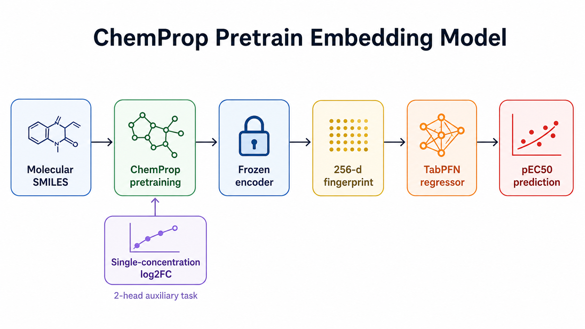

# tabpfn_chemprop_pretrain_embed_umap_default

確認日: 2026-05-18 JST

## 位置づけ

これは single-concentration `log2_fc` で ChemProp encoder をpretrainし、
その encoder を凍結して 256次元 fingerprint を抽出し、
その fingerprint だけを TabPFN に入れたモデル。

前に整理した `cheme_2d_full_boltz_log2fc_pred` 系とは似ているが、
`log2_fc` の使い方が違う。

- `cheme_2d_full_boltz_log2fc_pred` 系:
  `log2fc_8p25_pred` と `log2fc_33_pred` の2本を、最終特徴量として直接足す。
- このモデル:
  `log2_fc` は ChemProp encoder のpretrainにだけ使い、
  downstream pEC50 model には 256次元の frozen embedding を渡す。

一言でいうと、これは「low-fidelity pretrain then frozen embedding」レシピの
ChemProp版。後続の MoLFormer-c3、KERMT、AttentiveFP、GatedGCN などの
pretrain-embed 系モデルの基準になった。

## 何をしているか



学習の流れ:

1. `compounds.std_smiles` の 13,136 compounds を使う。
2. single-concentration assay から、8.25 uM と 33 uM の
   `log2_fc` を2-head targetとして作る。
3. NaN target はmaskしながら、ChemProp MPNN をpretrainする。
4. pretrain後、encoderを凍結し、train/test 4653 compounds について
   `MPNN.fingerprint()` の 256次元ベクトルを抽出する。
5. その 256次元 embedding を TabPFNRegressor に入れて pEC50 を予測する。

重要なのは、pEC50 label で ChemProp を直接fine-tuneしていないこと。
single-concentration の広い補助データで PXR-relevant な表現を作り、
最後の pEC50 学習は TabPFN に任せている。

## なぜ入っているか

採用理由は3つある。

1つ目は、当時このレシピが明確に強かったこと。
設計ログでは、ChemProp系で direct/scratch/fine-tune よりも
「pretrainして凍結embeddingをTabPFNに渡す」形が強い、という認識が残っている。
この結果が、その後の MoLFormer-c3 や KERMT などへの展開理由になった。

2つ目は、単体OOFが十分強かったこと。
`tabpfn_chemprop_pretrain_embed_umap_default` は OOF MAE 0.4371、
Spearman 0.8073。2D/Boltz/log2fc の最強系よりは弱いが、
単一の 256次元 embedding だけでこの水準まで来るので、
低次元の補助表現として価値があった。

3つ目は、ensemble内で安定してweightがついたこと。
`run_ensemble.py` のコメントでは、OOF MAE 0.4373 / Spearman 0.8102、
当時の pool single-best として扱われている。
後期の9-pool診断でも weight は 0.15 前後残っており、
主力2D系とは相関しつつも Caruana が完全には捨てなかった。

## predicted log2_fc 版との違い

このモデルは、`log2_fc` を「特徴量として明示的に2本入れる」モデルではない。

`log2_fc` が効く理由は、前の特徴量説明で見たように、
single-concentration assay が pEC50 とかなり強く相関するため。
ただし、その情報を使う経路は2種類ある。

| 経路 | 使い方 | 長所 | リスク |
|---|---|---|---|
| predicted `log2_fc` scalar | 8.25 uM / 33 uM 予測値を最終特徴量に足す | 非常に強い。LGBM gainでも上位 | 軸が強すぎてLBで過集中しやすい |
| ChemProp pretrain embedding | `log2_fc` でencoderを学習し、256d fingerprintを使う | 情報が分散した表現になる。別backboneに展開しやすい | 単体性能はscalar concatより弱い |

このため、このモデルは「最強の単体モデル」というより、
`log2_fc` signal を別の形でensembleへ入れるための表現モデルとして説明するのがよい。

## frozen / pretrain 周辺実験からの学び

このモデルの周辺には、「ChemPropをどう再利用するのがよいか」を見る実験が残っている。
結論は、単に ChemProp をfine-tuneするより、
`log2_fc` でpretrainした encoder を凍結し、その embedding を TabPFN に渡す方が強かった。

| model | 何をしたか | OOF MAE | Spearman | 読み方 |
|---|---|---:|---:|---|
| `chemprop_finetune_nopretrain_ablation_ablation_umap` | pEC50をscratchから直接学習 | 0.5298 | 0.7173 | 弱い |
| `chemprop_pretrain_finetune_umap` | `log2_fc` pretrain後、pEC50で全体fine-tune | 0.5071 | 0.7554 | pretrainは効くがまだ弱い |
| `chemprop_pretrain_finetune_frozen_umap` | encoder凍結 + pEC50 head fine-tune | 0.4713 | 0.7845 | 凍結はかなり改善 |
| `chemprop_pretrain_finetune_frozen_lowlr_umap` | frozen head fine-tuneのlr調整 | 0.4562 | 0.7945 | head fine-tuneでは最良付近 |
| `tabpfn_chemprop_pretrain_embed_umap_default` | frozen 256d embedding + TabPFN | 0.4371 | 0.8073 | この系列の本命 |

したがって、ここでの大事な学びは
「frozenにすれば何でも十分」ではなく、
「`log2_fc` pretrainで作った表現を、TabPFNの入力として使うのが強い」ということ。
ChemProp headでpEC50を直接当てにいくより、TabPFNに回した方が一段よかった。

また、別の補助特徴量でpretrain/frozen embeddingを作る試みもあった。
ただし、production member として採用されたのは default の
`tabpfn_chemprop_pretrain_embed_umap_default` で、
派生形は「少し良く見えても相関が高い」か「単体で弱い」ことが多かった。

| model | pretext / feature | OOF MAE | Spearman | default embedとの予測相関 | 判断 |
|---|---|---:|---:|---:|---|
| `tabpfn_chemprop_pretrain_embed_umap_default` | `log2_fc` pretrain 256d embed | 0.4371 | 0.8073 | 1.000 | 採用基準 |
| `tabpfn_chemprop_pretrain_optuna_trial10_embed_umap` | optuna trial10 384d embed | 0.4334 | 0.8069 | 0.965 | 単体は少し良いがLBでADD悪化 |
| `tabpfn_chemprop_assay_shape_embed_umap_default` | assay-shape auxiliary | 0.4379 | 0.8039 | 0.973 | かなり近いが、既存ChemProp axisと近い |
| `tabpfn_chemprop_drlatent_embed_umap_default` | dose-response latent | 0.4504 | 0.7906 | 0.958 | 使えるが本命より弱い |
| `tabpfn_chemprop_assay_shape_drlatent_embed_umap_default` | assay-shape + dose-response latent | 0.4534 | 0.7883 | 0.965 | 結合しても伸びなかった |
| `tabpfn_chemprop_mtr_embed_umap` | descriptor/MTR-style pretrain | 0.5136 | 0.7096 | 0.904 | 弱い |
| `tabpfn_cheme_2d_full_boltz_log2fc_drlatent_umap_default` | main feature + dose-response latent concat | 0.4273 | 0.8140 | 0.970 | main系よりは弱く、採用に至らず |
| `tabpfn_chemberta_5m_mtr_pretrain_embed_umap_default` | ChemBERTa MTR pretrain embed | 0.4971 | 0.7318 | 未確認 | 改善はあるが主力級ではない |
| `chemprop_strategy6_adaptive_readout_*` | frozen encoder + adaptive readout | 0.4818 | 0.7583 | 未確認 | Strategy 6 はこの設定では弱い |

この比較から、frozen embedding の成否は「何でpretrainしたか」にかなり依存する。
PXR activity に近い `log2_fc` / assay-shape 系は効くが、
一般的なdescriptor再構成や別形式のreadoutだけでは同じ強さにならなかった。
また、fingerprint/latent を足すconcat系も、少なくともDBに残る範囲では
`cheme_2d_full_boltz_log2fc_pred` 系を置き換えるほどではなかった。
ここは実験が多く、全てにきれいなメモが残っているわけではないが、
採用リストに残らなかったこと自体もかなり強い判断材料。

## seed averaging について

seed averaging は重要だったが、この 256d embedding モデルそのものではなく、
主に predicted `log2_fc` scalar を作る側で効いた。

`build_log2fc_seed_ensemble.py` と seed swap bakeoff には、
同一ChemProp architectureを複数seedでpretrainし、各compoundの
`log2fc_8p25_pred` / `log2fc_33_pred` を平均する方針が残っている。
これは異なる弱いencoderを混ぜるのではなく、同じ強いChemPropのseed違いを平均して
varianceを落とす、という狙いだった。

代表的な結果:

| comparison | default full MAE / Sp | top500 MAE / Sp | 解釈 |
|---|---|---|---|
| seed5 -> seed10 | 0.4068 / 0.836 -> 0.4056 / 0.840 | 0.3988 / 0.843 -> 0.3968 / 0.846 | Spearman改善が大きく、id32採用理由になった |
| seed10 -> seed15 | 0.4056 / 0.840 -> 0.4059 / 0.840 | 0.3968 / 0.846 -> 0.3961 / ~0.846 | 15seedではtaper。追加効果は小さい |

つまり、seed averaging は「効いた」が、無限に足すものではない。
5seedから10seedは意味があり、10seedから15seedはかなり頭打ちだった。
一方で、この default 256d embed 自体について、
同じ形で seed違いembeddingを作ってSWAPまで検証した明確な記録は見つけられていない。
したがって、ここでの seed averaging の教訓は
「ChemProp family全体」ではなく、主に predicted `log2_fc` scalar 側の話として扱う。

他backboneでも同じ発想は試されている。
たとえば KERMT seed5ens は単体で MAE 0.4485 -> 0.4455、
Spearman 0.789 -> 0.798 と改善した。ただし、後期になるほど
multi-seedの小さなOOF改善は public LB に移るとは限らず、
member weightやfamily過集中を見て採否を決める必要があった。

## optuna trial10 embed を採用しなかった理由

後から、Optuna trial10 checkpoint から 384次元 embedding を取り出した
`tabpfn_chemprop_pretrain_optuna_trial10_embed_umap` も試している。

単体OOFだけなら trial10 embed は少し良い。

| model | dim | OOF MAE | OOF RAE | OOF Spearman |
|---|---:|---:|---:|---:|
| default ChemProp pretrain embed | 256 | 0.4371 | 0.4854 | 0.8073 |
| optuna trial10 embed | 384 | 0.4334 | 0.4807 | 0.8069 |
| optuna trial11 embed | 384 | 0.4374 | 0.4857 | 0.8048 |

ただし、trial10 embed の ADD は public LB で悪化した。
id40 は OOF上は改善したが、LB MAE は 0.411041 で id32 baseline の
0.407847 より悪い。さらに同じ ChemProp family との相関が高く、
id40 notes では default embed との gate2 correlation が r=0.925 と記録されている。

結論として、optuna embed は「OOFでは良く見えるが、同じfamilyを増やしすぎるとLBで悪化する」
パターンの一例。productionでは default 256d embed を残し、
trial10 embed は不採用として扱う。

## DB 記録

DB の `experiments` に残っている。

| key | value |
|---|---|
| experiment id | 558 |
| model_type | `tabpfn` |
| feature_set | `chemprop_pretrain_embed` |
| submission_path | `track1_activity/submissions/tabpfn_chemprop_pretrain_embed_umap_default.csv` |
| OOF rows | 4140 |

OOF summary:

| metric | value |
|---|---:|
| MAE | 0.4371 |
| RAE | 0.4854 |
| Spearman | 0.8073 |

Fold metrics:

| fold | MAE | RAE | R2 | Spearman | Kendall |
|---:|---:|---:|---:|---:|---:|
| 0 | 0.465063 | 0.513055 | 0.672707 | 0.785167 | 0.594487 |
| 1 | 0.414383 | 0.417126 | 0.776995 | 0.848835 | 0.655703 |
| 2 | 0.447753 | 0.527195 | 0.640172 | 0.801901 | 0.614249 |
| 3 | 0.400636 | 0.513876 | 0.663150 | 0.779292 | 0.599534 |
| 4 | 0.457853 | 0.455860 | 0.719333 | 0.821551 | 0.627365 |

## 残っている成果物

再現・確認に必要な主要成果物は残っている。

| artifact | status |
|---|---|
| `track1_activity/checkpoints/chemprop_pretrain/pretrain.pt` | exists |
| `track1_activity/checkpoints/chemprop_pretrain/pretrain_meta.json` | exists |
| `data/chemprop_pretrain_embed.parquet` | exists, 4653 rows x 256 dims |
| `track1_activity/submissions/tabpfn_chemprop_pretrain_embed_umap_default.csv` | exists |
| `experiment_oof_predictions` | 4140 rows exists |

`pretrain_meta.json` に残る主な設定:

| item | value |
|---|---:|
| `message_hidden_dim` | 256 |
| `depth` | 4 |
| `aggregation` | `norm` |
| `mp_dropout` | 0.2 |
| `ffn_hidden_dim` | 256 |
| `ffn_num_layers` | 1 |
| `ffn_dropout` | 0.1 |
| `learning_rate` | 0.000136 |
| `lr_ratio` | 10 |
| `batch_size` | 128 |
| `task_weights_8p25_33` | `[1.0, 0.5]` |
| valid labels at 8.25 uM | 10,752 |
| valid labels at 33 uM | 9,527 |
| final val loss | 0.3647 |

## 再現コマンド

pretrain checkpoint を作る:

```bash
pixi run python track1_activity/scripts/run_chemprop_pretrain.py
```

256次元 embedding parquet を作る:

```bash
pixi run python track1_activity/scripts/run_chemprop_embed_extract.py
```

TabPFN downstream model を再実行する:

```bash
pixi run python track1_activity/scripts/run_train.py \
  --model tabpfn \
  --feature chemprop_pretrain_embed \
  --split umap \
  --trials 0 \
  --tabpfn-version v2_6
```

現在の `run_train.py` は TabPFN default が v3 に変わっているため、
当時の `_default` モデルを再現するなら `--tabpfn-version v2_6` を明示する。

入力特徴量の smoke check:

```bash
pixi run python - <<'PY'
import sys
from pathlib import Path
sys.path.insert(0, str(Path("track1_activity/src").resolve()))
sys.path.insert(0, str(Path("track1_activity/scripts").resolve()))

from data import load_train_smiles_target, load_test_smiles
import run_train

train = load_train_smiles_target()
test = load_test_smiles()
Xtr, Xte = run_train.load_features("chemprop_pretrain_embed", train, test)
print(Xtr.shape, Xte.shape)
PY
```

期待値:

```text
(4140, 256) (513, 256)
```

## 再現性評価

判定: 高い。

理由:

- checkpoint、metadata、embedding parquet、submission CSV、OOF が残っている。
- downstream の入力は 256次元 parquet なので、top-k feature index のような追加状態がない。
- `data/chemprop_pretrain_embed.parquet` は NaNなし、train/testを完全にcoverしている。
- ただし、checkpointをゼロから作り直す場合は ChemProp/Lightning/GPU の微小差で
  bitwise 再現は期待しない。

実務上は、既存の `chemprop_pretrain_embed.parquet` を固定入力として使えば、
downstream 再現性はかなり高い。

## LB 上の扱い

このモデルは単独提出の主役ではなく、ensemble member として価値があった。

関連する提出・判断:

| id | 内容 | LB MAE | 判断 |
|---:|---|---:|---|
| 32 | seed10 extension ensemble。ChemProp embed は既存memberとして残る | 0.407847 | 強い基準 |
| 40 | optuna trial10 embed を ADD | 0.411041 | OOF改善したがLB悪化。不採用 |
| 42 | ChemProp family metaで過集中を抑える診断 | 0.409074 | family share診断として有用 |

結論:

`tabpfn_chemprop_pretrain_embed_umap_default` は、
`log2_fc` signal を frozen embedding として持ち込む基準モデル。
現在の強い2D/top500系より単体性能は弱いが、pretrain-embed family の原型であり、
ensembleでは低次元・別経路の ChemProp 表現として残す意味がある。
