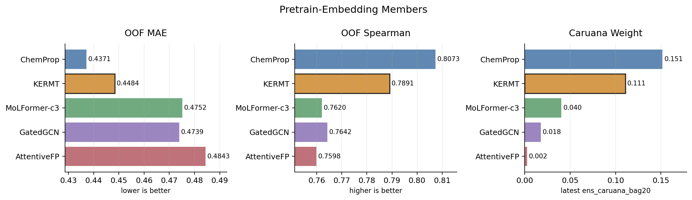

# tabpfn_kermt_pretrain_embed_umap_default

確認日: 2026-05-18 JST

## 位置づけ

これは KERMT/GROVER_base を single-concentration `log2_fc` で
continued-pretrainし、その graph-transformer embedding を凍結して
TabPFN に入れたモデル。

ChemProp pretrain embedding と同じ
「low-fidelity pretrain -> frozen embedding -> TabPFN」レシピだが、
backbone が ChemProp の D-MPNN ではなく、GROVER 系の graph transformer
になっている。

一言でいうと、これは
「同じ `log2_fc` signal を、ChemPropとは違う graph-transformer 表現で
ensemble に入れるためのモデル」。

## 何をしているか

学習の流れ:

1. 公開済みの `grover_base.pt` を KERMT 環境で読み込む。
2. `compounds.std_smiles` の 13,136 compounds について、
   8.25 uM と 33 uM の `log2_fc` を2-head targetとして作る。
3. 90/10 random splitで KERMT/GROVER_base を continued-pretrainする。
4. best checkpoint から fingerprint を抽出する。
5. 3200次元 embedding を `data/kermt_pretrain_embed.parquet` に保存する。
6. pEC50 downstream は、この 3200次元 embedding だけを TabPFN に入れる。

3200次元の内訳は、GROVER_base の hidden=800 に対して、
`atom_from_atom`, `atom_from_bond`, `bond_from_atom`, `bond_from_bond`
の4系統を取り出したもの。



## KERMT/GROVER の中身

KERMT は NVIDIA Digital Bio と Merck の
[NVIDIA-Digital-Bio/KERMT](https://github.com/NVIDIA-Digital-Bio/KERMT)
で公開されている、GROVER 系の molecular graph pretrained model。
GitHub README では、GROVER の enhanced reimplementation として説明されており、
DDP によるdistributed pretraining、Optuna系のHPO、`cuik-molmaker` による
finetune/prediction高速化が実装されている。

モデルとしては、SMILES文字列をそのまま読む language model ではなく、
分子を graph として扱う。

- node は atom。
- edge は bond。
- atom-based message passing と bond-based message passing の両方を使う。
- graph transformer backbone で、local chemical environment と graph全体の情報を学習する。
- published base model は約48M parameters。
- base checkpoint は ZINC15 と ChEMBL 由来の約11M compoundsでpretrainされている。

pretraining task は大きく2つ。

1. node/edge-level task:
   node/edge embedding から、その周囲の k-hop local subgraph を分類する。
   つまり、単一atom/bondそのものではなく、その近傍環境を当てる。
2. graph-level task:
   molecule-level embedding から、分子内に存在する functional group を
   multi-label classification で当てる。

このため、KERMT/GROVER は単なるfingerprint計算器ではなく、
「atom/bond近傍環境」と「分子全体のfunctional group」を同時に学習した
graph representation model と見るのがよい。

今回のPXRモデルでは、KERMT paperで主に議論されている
「multi-task finetuning model」としては使っていない。
我々の使い方はもう少しfeature-engineering寄りで、
PXR single-concentration `log2_fc` で continued-pretrain した後、
FFN head手前の 3200d fingerprint を固定特徴量として抜き出し、
pEC50 の最終学習は TabPFN に任せている。

## 外部での利用実績

OpenADMET の過去challengeでも、KERMT は一部の上位参加者に使われていた。
[ExpansionRx Blind Challengeの振り返り](https://openadmet.ghost.io/lessons-learned-from-the-openadmet-expansionrx-blind-challenge/)
では、上位参加者の model type に `Chemprop, KERMT`、
`Chemprop/KERMT`、`KERMT` が複数見える。
同記事のまとめでも、2D GNN が上位を支配し、Chemprop が人気だった一方で、
Merck/NVIDIA の KERMT architecture も使われた、と整理されている。

つまり、KERMT は「このPXR challengeで突然持ち込んだ謎モデル」ではなく、
OpenADMET系のblind challenge文脈でも、ChemPropと並ぶGNN/graph-transformer候補として
実際に試されていたモデル family。

## なぜ入っているか

採用理由は「単体性能」と「多様性」の両方。

単体OOFは MAE 0.4484 / Spearman 0.7891。
ChemProp pretrain embed よりは弱いが、MoLFormer-c3、GatedGCN、
AttentiveFP よりは強く、pretrain-embed 系では2番手の位置にいる。

さらに、現行の `ens_caruana_bag20` では weight 0.1107 が残っている。
これは ChemProp pretrain embed の 0.1515 に次ぐ pretrain-embed 系2番手で、
単体最強ではないが、ensemble が十分に使うだけの情報を持っている。

| model | family | OOF MAE | Spearman | current Caruana weight |
|---|---|---:|---:|---:|
| `tabpfn_chemprop_pretrain_embed_umap_default` | D-MPNN | 0.4371 | 0.8073 | 0.1515 |
| `tabpfn_kermt_pretrain_embed_umap_default` | graph transformer | 0.4484 | 0.7891 | 0.1107 |
| `tabpfn_molformer_c3_pretrain_embed_umap` | SMILES transformer | 0.4752 | 0.7620 | 0.0403 |
| `tabpfn_gatedgcn_pretrain_embed_umap_default` | gated GNN | 0.4739 | 0.7642 | 0.0175 |
| `tabpfn_attentivefp_pretrain_embed_umap_default` | graph attention | 0.4843 | 0.7598 | 0.0024 |

## 相関と役割

KERMT は完全に独立な軸ではない。
同じ `log2_fc` pretrain を使っているため、ChemPropや主力tabular modelとは
かなり相関する。

ただし、相関は高いなりに少しだけズレている。
この「少しズレた強い表現」が Caruana で weight を持った理由だと思う。

| comparison target | prediction r vs KERMT | residual r vs KERMT |
|---|---:|---:|
| `tabpfn_cheme_2d_full_boltz_log2fc_pred_optuna_trial10_seed5ens_umap_default` | 0.9498 | 0.8815 |
| `tabpfn_chemprop_pretrain_embed_umap_default` | 0.9453 | 0.8749 |
| `tabpfn_gatedgcn_pretrain_embed_umap_default` | 0.9409 | 0.8822 |
| `tabpfn_attentivefp_pretrain_embed_umap_default` | 0.9198 | 0.8423 |
| `tabpfn_molformer_c3_pretrain_embed_umap` | 0.9177 | 0.8288 |
| `tabpfn_pooled_boltz_umap_default` | 0.8979 | 0.8032 |

したがって、KERMT は「低相関の別世界モデル」ではなく、
ChemProp/log2fc 系に近いが、backbone差で少し違う誤差を出すモデルとして説明するのがよい。

## 周辺実験

KERMT embedding の圧縮も試している。
しかし、3200次元をそのまま TabPFN に渡す default が一番よかった。

| model | 何をしたか | OOF MAE | Spearman | 判断 |
|---|---|---:|---:|---|
| `tabpfn_kermt_pretrain_embed_umap_default` | 3200d full embedding | 0.4484 | 0.7891 | 採用 |
| `tabpfn_kermt_pretrain_embed_top500_umap` | feature top500 | 0.4502 | 0.7888 | 少し悪化 |
| `tabpfn_kermt_pretrain_embed_pca500_umap` | PCA 500d | 0.4567 | 0.7849 | 悪化 |
| `tabpfn_kermt_pretrain_embed_pls500_umap` | PLS 500d | 0.9636 | 0.4931 | 破綻 |
| `tabpfn_kermt_pretrain_embed_umap_default_v3` | TabPFN v3 | 0.4497 | 0.7885 | v2.6相当より少し弱い |

また、seed違いの KERMT embedding を平均した
`tabpfn_kermt_pretrain_embed_seed5ens_umap_default` も残っている。
これは単体OOFでは MAE 0.4453 / Spearman 0.7961 まで改善した。
ただし、最新の production allow-list では seed0 の
`tabpfn_kermt_pretrain_embed_umap_default` が残っており、
seed5ens を採用したLB evidence は見つけられていない。
そのため、seed5ens は「有望な参考実験」扱いにしておくのが安全。

## 再現性

再現に必要な主要成果物はかなり残っている。

| artifact | status |
|---|---|
| `models/kermt/grover_base.pt` | exists, SHA256記録あり |
| `models/kermt/pretrain/fold_0/model_0/model.pt` | exists, continued-pretrain best checkpoint |
| `data/kermt/embeddings.npz` | exists |
| `data/kermt_pretrain_embed.parquet` | exists, 13,136 rows x 3,200 dims |
| `data/kermt_pretrain_embed_seed43.parquet` など | exists |
| `data/kermt_pretrain_embed_seed5ens.parquet` | exists |
| `track1_activity/submissions/tabpfn_kermt_pretrain_embed_umap_default.csv` | exists |
| `experiment_oof_predictions` | 4,140 rows exists |

`models/kermt/README.md` に残っている pretrain 記録:

| item | value |
|---|---:|
| train compounds | 11,822 |
| val compounds | 1,314 |
| epochs | 30 |
| batch size | 32 |
| max lr | 0.0001 |
| final lr | 0.00002 |
| best val MAE | 0.2607 at epoch 16 |
| wall-clock | about 31 min on RTX 5080 |

注意点として、KERMT の `quiet.log` に出る `overall_scaffold_balanced_test_mae`
は KERMT 側の内部splitによる値で、Track 1 downstream OOFとは別物。
採否の根拠にするのは、あくまでDBに残した pEC50 downstream OOF と
ensemble weight。

## DB 記録

DB の `experiments` に残っている。

| key | value |
|---|---|
| experiment id | 653 |
| model_type | `tabpfn` |
| feature_set | `kermt_pretrain_embed` |
| submission_path | `track1_activity/submissions/tabpfn_kermt_pretrain_embed_umap_default.csv` |
| OOF rows | 4,140 |

OOF summary:

| metric | value |
|---|---:|
| MAE | 0.4484 |
| RAE | 0.4973 |
| Spearman | 0.7891 |

Fold metrics:

| fold | MAE | RAE | R2 | Spearman | Kendall |
|---:|---:|---:|---:|---:|---:|
| 0 | 0.475772 | 0.524869 | 0.657796 | 0.771548 | 0.583904 |
| 1 | 0.435415 | 0.438298 | 0.753114 | 0.824731 | 0.630374 |
| 2 | 0.446799 | 0.526071 | 0.649288 | 0.794803 | 0.604424 |
| 3 | 0.407620 | 0.522834 | 0.658242 | 0.756754 | 0.577491 |
| 4 | 0.476373 | 0.474299 | 0.695110 | 0.797786 | 0.598625 |

## 再現コマンド

KERMTは依存関係が重いため、main pixi env ではなく外部の KERMT-local pixi env で動かす。
main repo 側には wrapper と変換スクリプトが残っている。

pretrain CSV を作る:

```bash
pixi run python track1_activity/scripts/prepare_kermt_pretrain_csv.py
```

KERMT-local env で continued-pretrain する:

```bash
bash track1_activity/scripts/run_kermt_pretrain.sh 30
```

embedding を抽出する:

```bash
bash track1_activity/scripts/run_kermt_embed_extract.sh
```

NPZ を parquet に変換する:

```bash
pixi run python track1_activity/scripts/kermt_embed_npz_to_parquet.py
```

downstream TabPFN を再実行する:

```bash
pixi run python track1_activity/scripts/run_train.py \
  --model tabpfn \
  --feature kermt_pretrain_embed \
  --split umap \
  --trials 0 \
  --tabpfn-version v2_6
```

現在の `run_train.py` では、KERMT 3200d を TabPFN に入れるために
`ignore_pretraining_limits=True` が使われている。

## まとめ

KERMT は単体最強のモデルではない。
ただし、ChemPropと同じ `log2_fc` signal を、別の graph-transformer backboneで
表現し直したことで、ensembleに残るだけの違いを作れた。

説明するときは、
「ChemProp pretrain embed の成功を、GROVER/KERMT graph transformer に展開したもの」
「単体は中位だが、Caruana weightが大きく残ったのでproduction memberになった」
「seed5ensは良いが、現行採用はseed0」
という整理で十分だと思う。

## 参考情報

- [NVIDIA-Digital-Bio/KERMT](https://github.com/NVIDIA-Digital-Bio/KERMT)
- [KERMT paper: Multitask finetuning and acceleration of chemical pretrained models for small molecule drug property prediction](https://arxiv.org/abs/2510.12719)
- [Lessons Learned from the OpenADMET - ExpansionRx Blind Challenge](https://openadmet.ghost.io/lessons-learned-from-the-openadmet-expansionrx-blind-challenge/)
