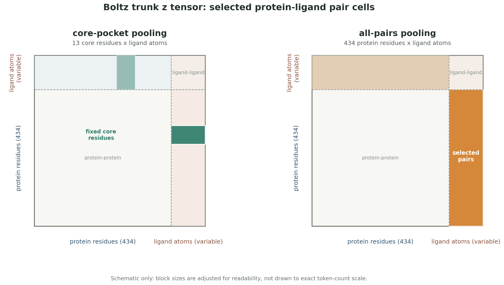
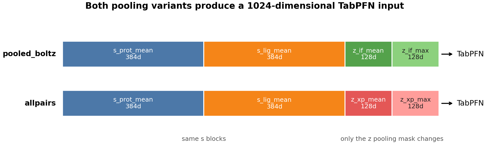

# Boltz trunk pooled TabPFN members

確認日: 2026-05-18 JST

対象モデル:

- `tabpfn_pooled_boltz_umap_default`
- `tabpfn_pooled_boltz_allpairs_umap_default`

関連するBoltz特徴:

- `cheme_2d_full_boltz_log2fc_pred` 系に入っている Boltz tier-0 / tier-1 / pose-Jazzy
- `tabpfn_boltz_trunk_pretrain_*` 系の探索
- `tabpfn_repooled_trunk_region_zstats_umap_default` 系の探索

## 位置づけ

この2つは、Boltz-2がPXR-ligand complexを予測するときに内部で作る
trunk representationを、1化合物1本の固定長vectorへpoolし、
その1024次元vectorをTabPFNに入れたモデル。

一言でいうと、
「PXR pocketの中でligandを見た protein-ligand structural embedding を、
Track 1 activity modelに入れるためのオリジナル特徴量」。

現行ensembleでのweightは大きくない。
直近の9-pool診断では以下の程度。

| member | current approximate weight |
|---|---:|
| `tabpfn_pooled_boltz_umap_default` | 0.0456 |
| `tabpfn_pooled_boltz_allpairs_umap_default` | 0.0350 |
| combined Boltz trunk share | 0.0806 |

ただし、これは「弱いからどうでもいい」ではない。
Boltz trunkはchemistry-only modelとは別の構造軸で、
過去にdropやswapを試すとOOFでは良く見えてもpublic LBで悪化することがあった。
現在は、強い `cheme/top500/log2fc` familyの過集中を避ける
diversity reserve として残している。

## Boltz由来の情報は2種類ある

Track 1で使ったBoltz情報は、大きく2種類に分けると説明しやすい。

| family | 使い方 | 主な保存先 | 役割 |
|---|---|---|---|
| Boltz tabular / pose features | affinity, confidence, predicted pose, pocket confidence集計 | `compound_boltz2`, `data/boltz2_confidence_features.parquet`, `compound_boltz2_jazzy` | `cheme_2d_full_boltz_log2fc_pred` 系の大きなtabular feature blockに入る |
| Boltz trunk embeddings | internal `s` / `z` tensorsを1024dへpool | `data/boltz_affhead/pooled*.parquet` | 独立したTabPFN ensemble memberになる |

前者はすでに
[feature block doc](../features/cheme_2d_full_boltz_log2fc_pred_feature_blocks.md)
で説明している。
このdocでは、後者の trunk pooling member を中心にまとめる。

## Affinity head単独の相関

Boltz-2の `affinity_pred_value` は `log10(IC50[uM])` に近い値なので、
pEC50とは向きが逆になる。
そのため、Track 1のpEC50スケールに雑に合わせるなら
`6 - affinity_pred_value` と見る。


実測すると、affinity headは完全なノイズではないが、単独ではかなり粗い。

| scalar | Pearson vs pEC50 | Spearman vs pEC50 | n |
|---|---:|---:|---:|
| `6 - affinity_pred_value` | 0.5379 | 0.4976 | 4139 |
| `affinity_probability_binary` | 0.4238 | 0.4443 | 4139 |
| `iptm` | 0.2995 | 0.2803 | 4139 |
| `ligand_iptm` | 0.2995 | 0.2803 | 4139 |

線形補正を入れると、
`pEC50 = 4.860 - 0.928 * affinity_pred_value`
で MAE 0.733。
素朴な `pEC50 = 6 - affinity_pred_value` は MAE 1.150 だった。

つまり、Boltz affinity headは「方向性のある弱いPXR signal」ではあるが、
そのままpEC50予測器として使えるほど強くはない。
IC50-like値とPXR pEC50のassay差、EC50/IC50差、PXR agonist特有の転写応答、
pose/confidenceの不確実性が混ざるためだと思う。

このため、最終的な扱いは
「affinity単独モデル」ではなく、
Boltz tier-0の1要素として、Mordred/RDKit/CheMeleon/`log2_fc` と一緒に
TabPFNやLGBMへ渡す形にした。
実際、`tabpfn_boltz2_tabular_tier0_umap_default` は
OOF MAE 0.5797 と弱く、affinity/confidence scalarだけでは採用水準に届かなかった。

## 本家affinity headとの比較

Boltz-2本家のaffinity headと、このdocで扱う `pooled_boltz` / `pooled_boltz_allpairs` は、
どちらもBoltz内部表現を使うが、目的と処理がかなり違う。

| 観点 | Boltz-2 本家 affinity head | 今回の pooled Boltz trunk |
|---|---|---|
| 目的 | protein-ligand affinityを直接予測 | PXR pEC50用の補助特徴を作る |
| 入力 | `z_trunk`、trunk input、予測構造のdistogram | 保存済みtrunk tensor `s` / `z` |
| 追加ネットワーク | PairFormer module + MLP head | なし。mean/max poolingだけ |
| pooling | protein-ligand + intra-ligand pairをmean poolし、intra-proteinは除外 | core-pocket x ligand、または全PXR residue x ligandをmean/max pool |
| 出力 | binding probability と `log10(IC50[μM])` 風の affinity value | 1024次元embedding特徴 |
| 学習 | ChEMBL/BindingDB/PubChem等でaffinity headを学習。trunkはdetach | downstreamでTabPFNがpEC50を学習 |
| 補正 | 2 member ensemble + molecular weight補正 | 補正なし。MW等は別特徴として学習器側に渡る |

本家headは、trunk表現をそのまま読むのではなく、
予測構造から作った距離情報をPairFormerで重ねたうえで、
結合するかどうかとIC50-like値を直接出す専用head。
一方、我々のpooled trunkは、そのheadを再現したものではない。
Boltzがcomplexを作る途中で持っている `s` / `z` representationを、
PXR用に固定長化してTabPFNに渡す特徴量である。

それでも参考にした点はある。
本家affinity headも protein-ligand pair representation を重視し、
intra-protein pairをそのまま平均しない。
今回のs/z ablationでも `s` より `z`、特にprotein-ligand pair側が効いており、
「PXR活性にはligand単体特徴だけでなく、PXR-ligand pair表現が必要」
という解釈とは整合している。

ただし、過去メモでは本家headに近い interaction-only masked pooling と、
より広い all-pairs pooling の両方を試しており、
PXRでは all-pairs 系の方が実務上よかった。
そのため、現在は「本家headの設計思想は参考にするが、
PXR向けには単純な論文再現よりもCV/LBで残ったpoolingを採用する」
という扱いにしている。

## 何をしているか

Boltz-2は、PXR protein chainとligandを入力すると、
最終poseやaffinity headの出力だけでなく、内部のtrunk tensorも保存できる。

今回使ったtrunk tensor:

| tensor | shape | 意味 |
|---|---|---|
| `s` | `(1, T, 384)` | protein residue / ligand atom tokenごとのsingle representation |
| `z` | `(1, T, T, 128)` | token pairごとのpair representation |

ここで `T = 434 + ligand atom count`。
最初の434 tokenはPXRのresidue、以降がligand atom token。

PXRは UniProt O75469 のfull-length 434 aaを使っている。
core pocketは、holo PDB構造で頻出する13残基として固定した。

```text
209, 211, 240, 243, 247, 281, 285, 288, 299, 306, 323, 407, 411
```

このtoken配置を前提に、可変長のtrunk tensorを固定長1024次元へpoolする。
まず、`z` tensorのどこをpoolするかが `core-pocket` と `all-pairs` の主な違いになる。



最終的なTabPFN入力はどちらも1024次元で、`s_prot_mean` と `s_lig_mean` は共通。
違いは最後の256次元の `z` blockで、core-pocket版は固定した13残基周辺のlocal pocket signalを見に行き、
all-pairs版はprotein全体とligand atomのcross representationを広く要約する。



## core-pocket版: `pooled_boltz`

`tabpfn_pooled_boltz_umap_default` が使う特徴。

実装:

- `track1_activity/scripts/boltz_affhead/01_pool_embeddings.py`
- output: `data/boltz_affhead/pooled.parquet`

特徴量:

| block | dim | pooling |
|---|---:|---|
| `s_prot_mean` | 384 | PXR 434 residue tokenのmean |
| `s_lig_mean` | 384 | ligand atom tokenのmean |
| `z_if_mean` | 128 | core pocket 13 residues x ligand atom pairsのmean |
| `z_if_max` | 128 | core pocket 13 residues x ligand atom pairsのmax |
| total | 1024 | - |

考え方:

- `s_prot_mean` は、Boltzがそのcomplex内で見たPXR全体の状態。
- `s_lig_mean` は、Boltzがpocket内で見たligand側の状態。
- `z_if_*` は、PXR core pocketとligandの相互作用pair表現。

このcore-pocket版は、我々がPXR用に定義した13残基に焦点を当てている。
「どのresidueをpocketとして見るか」まで含めて、かなりこのrepo固有の設計。

## all-pairs版: `pooled_boltz_allpairs`

`tabpfn_pooled_boltz_allpairs_umap_default` が使う特徴。

実装:

- `track1_activity/scripts/boltz_affhead/01b_pool_allpairs.py`
- output: `data/boltz_affhead/pooled_allpairs.parquet`

特徴量:

| block | dim | pooling |
|---|---:|---|
| `s_prot_mean` | 384 | PXR 434 residue tokenのmean |
| `s_lig_mean` | 384 | ligand atom tokenのmean |
| `z_xp_mean` | 128 | all PXR residues x ligand atom pairsのmean |
| `z_xp_max` | 128 | all PXR residues x ligand atom pairsのmax |
| total | 1024 | - |

こちらはcore pocketに限定せず、PXR 434 residuesすべてとligand atomのcross pairsを使う。
Boltz-2のaffinity headが protein-ligand pair mask を使うことを参考にした設計。

core-pocket版より広い。
local pocket signalを狙う `pooled_boltz` と、
protein-ligand cross representationを広く見る `pooled_boltz_allpairs` を
少し違うstructural viewとして並べた。

## なぜTabPFNに入れたか

Boltz trunk vectorは、人間が直接解釈するためのdescriptorではない。
`s` / `z` はBoltzがcomplex構造を作るために内部で学習したrepresentationで、
各dimensionに「LogP」や「H-bond数」のような明示名はない。

そのため、LightGBMよりもTabPFNに渡して、
1024次元の連続embeddingを非線形に読む方がよかった。

初期比較:

| model | feature | OOF MAE | Spearman | note |
|---|---|---:|---:|---|
| `lgbm_pooled_boltz_umap` | core-pocket 1024d | 0.5115 | 0.7328 | 同featureのLGBM、後にdrop |
| `mlp_pooled_boltz_umap` | core-pocket 1024d | 0.5377 | 0.7138 | 弱い |
| `tabpfn_pooled_boltz_umap_default` | core-pocket 1024d | 0.4860 | 0.7539 | 採用 |
| `tabpfn_pooled_boltz_allpairs_umap_default` | all-pairs 1024d | 0.4859 | 0.7577 | 採用 |

TabPFN版がはっきり強く、LGBM版は後にGatedGCN h512 embedを入れるときにswap outした。

## s/z ablationでわかったこと

Boltz trunkの中でも、どの部分が効いているかを切り分けた。

| subset | dim | OOF MAE | 解釈 |
|---|---:|---:|---|
| `zmean` | 128 | 0.4897 | per-dim情報密度が高い |
| `zonly` = `z_mean + z_max` | 256 | 0.4893 | pair表現だけでもかなり強い |
| `sonly` = `s_prot + s_lig` | 768 | 0.5075 | single表現だけでは弱い |
| `slig` | 384 | 0.5155 | ligand singleのみは弱い |
| `sprot` | 384 | 0.5328 | protein singleのみはかなり弱い |
| `zmax` | 128 | 0.5755 | 単独では弱い |
| `nozmax` | 896 | 0.4886 | zmaxを抜くとraw allpairsより悪化 |
| raw allpairs | 1024 | 0.4859 | 採用版 |

発見:

- Boltz trunkで一番情報密度が高いのは `z`、つまり protein-ligand pair representation。
- `s` 側は次元数の割に弱い。
- ただし、単独で弱い `zmax` も、他のblockと合わせると効いている。
  `nozmax` が悪化したため、単純なsolo ablationだけでdrop判定はできない。

この結果は、Boltz-2のaffinity moduleがpair representationを重視する設計とも整合する。
PXR活性でも「ligand単体の3D形状」より、
PXR residue-ligand atom pairの表現が効いていた、と説明できる。

## 探索した派生モデル

Boltz trunkはオリジナリティが高かったので、かなり派生も試した。

| model / family | idea | OOF MAE | conclusion |
|---|---|---:|---|
| `tabpfn_boltz_trunk_pretrain_embed_c_concat_umap_default` | 13k trunkを`log2_fc`でpretrainし、embedding化 | 0.4850 | raw allpairsと同程度、単独では少し良い |
| `tabpfn_boltz_raw_plus_pretrain_concat_umap_default` | raw 1024d + pretrain embedをconcat | 0.4818 | trunk-onlyでは最良だが、ensembleでは冗長 |
| `boltz_trunk_pretrain_c_concat_full_ft_umap` | pretrained encoderをpEC50でfull finetune | 0.4890 | TabPFN版に負け |
| `tabpfn_repooled_trunk_region_zstats_umap_default` | raw NPZからregion別にre-pool | 0.4744 | 単体は改善、しかし既存trunkと高相関 |
| `tabpfn_boltz2_tabular_tier0_umap_default` | affinity/confidence scalarのみ | 0.5797 | 単体弱い |
| `lgbm_boltz2_contact_umap_default` | residue contact-shell features | 0.6296 | 単体かなり弱い |
| ProLIF IFP | predicted poseからinteraction fingerprint | - | gainほぼなし、不採用 |

Boltz trunk pretrainは期待値が高かった。
ChemProp/KERMT/MoLFormerでは `log2_fc` pretrain -> frozen embedding -> TabPFN が強かったため、
Boltz trunkにも同じStrategy-3を適用した。
しかし結果は、raw trunk poolですでに拾える情報が多く、
pretrain embeddingを足してもpool内ではほぼ吸収された。

## re-pooled trunkを戻さなかった理由

2026-05-05に、raw NPZを読み直して
`repooled_trunk_region_zstats` を作った。
これは13,134 compoundsをcoverする3,713次元のre-pooled trunk特徴で、
単体OOFはかなり良かった。

| model | OOF MAE | Spearman |
|---|---:|---:|
| `tabpfn_pooled_boltz_umap_default` | 0.4860 | 0.7539 |
| `tabpfn_pooled_boltz_allpairs_umap_default` | 0.4859 | 0.7577 |
| `tabpfn_repooled_trunk_region_zstats_umap_default` | 0.4744 | 0.7691 |

しかし、既存trunk memberとの相関が非常に高かった。

| comparison | Pearson r |
|---|---:|
| repooled vs allpairs | 0.9863 |
| repooled vs core pooled | 0.9822 |
| repooled vs raw_plus_pretrain | 0.9753 |

さらに、public LBではsimple swap/dropが悪化した。

| submission | change | LB MAE | Spearman |
|---|---|---:|---:|
| id51 | anchor before repooled direction | 0.407326 | 0.847006 |
| id52 | repooled swap-core + old allpairs kept | 0.408710 | 0.844332 |
| id53 | repooled core-only, old allpairs dropped | 0.410564 | 0.841477 |

したがって、re-pooled trunkは「単体ではより良いBoltz trunk表現」だが、
このpoolの中ではLB-negativeだった。
現在は、古い `pooled_boltz` / `pooled_boltz_allpairs` を残す方が実務的に安全、
という扱いにしている。

## Dropしない理由

Boltz trunkのweightは合計8%程度で、単体性能もcore modelより弱い。
それでもdropしない理由は、AttentiveFP/GatedGCNと似ている。

2026-04-27の `drop_att_gate_pb` では、
AttentiveFP、GatedGCN、`pooled_boltz_allpairs` を落としたところ、
OOFは大きく良く見えた。
しかしpublic LBは悪化した。

| variant | local read | public LB read |
|---|---|---|
| drop low-weight members including allpairs | OOF MAE -0.0059, Sp +0.0056 | LB MAE +0.0057, Sp -0.0096 |

このとき Caruana weight が `cheme/top500/log2fc` familyに強く寄り、
family shareが約0.94まで上がった。
つまり、Boltz allpairsのような低weight memberは、
局所OOF上では削れそうに見えても、
blind testでは強い同系統モデルへの過集中を抑える役割を持っていた。

さらに、family-meta実験 id42 では、
chemprop/cheme familyを1つのmeta memberに畳むと、
`pooled_boltz_allpairs` と `pooled_boltz` のweightが
それぞれ 0.065 / 0.056 まで自然に戻った。
これは、強いchemistry familyの過集中が緩むと、
Boltz trunkが構造系の補助signalとして使われることを示している。

## 再現性メモ

現在確認できるartifact:

| artifact | status |
|---|---|
| `data/boltz_affhead/pooled.parquet` | exists, 4,652 rows x 1,024 features, NaNなし |
| `data/boltz_affhead/pooled_allpairs.parquet` | exists, 4,652 rows x 1,024 features, NaNなし |
| `data/boltz_affhead/repooled_trunk_region_zstats.parquet` | exists, 13,134 rows x 3,713 feature columns, NaNなし |
| `compound_boltz2` | 4,653 rows, 4,652 embeddings/confidence/affinity rows |
| `compound_boltz2_trunk_fast` | 13,134 rows |
| `track1_activity/submissions/tabpfn_pooled_boltz_umap_default.csv` | exists |
| `track1_activity/submissions/tabpfn_pooled_boltz_allpairs_umap_default.csv` | exists |

注意点:

- full Boltz-2 inferenceを完全に再実行するには時間がかかる。
  4,653 compoundsのfull runは数日スケール。
- 既存のdownstream再現なら、`data/boltz_affhead/pooled*.parquet` を固定入力として使えばよい。
- `compound_boltz2` はpose/confidence/affinityを含むfull-run層。
  `compound_boltz2_trunk_fast` はtrunk-only層。
  この2つを混同しない。
- 2026-05-12に巨大なfast runtime outputsは削除済みだが、
  既存のpooled DB vector/parquet artifactは残っている。
- raw NPZを再読みに行くre-pool系スクリプトは、
  削除済みruntime pathに依存する場合がある。

downstream再評価の主な入口:

```bash
pixi run python track1_activity/scripts/boltz_affhead/01_pool_embeddings.py
pixi run python track1_activity/scripts/boltz_affhead/01b_pool_allpairs.py

pixi run python track1_activity/scripts/run_train.py \
  --model tabpfn \
  --feature pooled_boltz \
  --split umap \
  --trials 0

pixi run python track1_activity/scripts/run_train.py \
  --model tabpfn \
  --feature pooled_boltz_allpairs \
  --split umap \
  --trials 0
```

full Boltz pipelineから再作成する場合の入口:

```bash
pixi run python track1_activity/boltz2/scripts/boltz2_build_inputs.py
bash track1_activity/boltz2/scripts/boltz2_full_run.sh
pixi run python track1_activity/boltz2/scripts/boltz2_postprocess.py --db
pixi run python track1_activity/boltz2/scripts/boltz2_posebusters.py --workers 8 --db
```

## 説明するときの短い言い方

Boltz-2を単に「dockした」わけではない。
PXR-ligand complexをBoltz-2で予測し、その内部trunk表現を取り出して、
PXR residue tokenとligand atom tokenのsingle/pair representationを
1024次元にpoolした。

結果として、単体では中位のモデルに留まったが、
chemistry-only / `log2_fc` familyとは違うprotein-ligand structural axisを持つ。
public LBでは、この低weight構造軸を雑に削ったり置き換えたりすると
むしろ悪化したため、現在はdiversity reserveとして残している。

## 研究としての価値

このpooled Boltz trunkは、今回のコンペでは低weightの補助memberに留まったが、
研究テーマとしてはかなり価値がありそう。

ポイントは、Boltz-2の最終構造や本家affinity headの出力だけではなく、
その手前のtrunk表現を、protein-ligand task用の汎用表現として取り出せること。
今回はPXRに固定して、`s` / `z` tensorを1024次元へpoolし、
pEC50予測の補助特徴として使った。
しかし同じ考え方は、以下のような別タスクにも広げられる可能性がある。

- 構造生成や長いdiffusion stepを省いた、trunk-onlyの高速affinity / activity予測
- PXR以外のprotein-ligand活性予測
- binding / non-binding 分類
- selectivity や target-specific response の補助表現
- 本家affinity headとは別の、task-specificな軽量headの学習

特に、full Boltz inferenceは重いが、trunk-onlyなら構造生成をスキップして
より大規模な化合物集合へ適用できる。
これは、構造予測モデルを「最終poseを出す道具」としてだけでなく、
protein-aware molecular representation extractor として使う方向。

今回のPXR結果だけで一般化を主張するのは早いが、
`z` pair representationが単体で強く、chemistry-only familyと違うaxisを持っていたことは、
Boltz trunkに独立した情報が入っていることの実験的な手がかりになる。
この方向は、本コンペ後に別研究として整理する予定。

## 参照した主な記録

- GitHub issue #100:
  - 2026-04-21 Boltz trunk strategy-3 plan
  - 2026-04-22 Boltz strategy-3 results and s/z ablation
  - 2026-05-05 trunk-fast inventory and re-pool experiments
  - 2026-05-06 re-pooled Boltz core-only LB readback
- `docs/papers/boltz2_affinity_notes.md`
- `docs/superpowers/specs/2026-04-21-boltz-trunk-log2fc-pretrain-design.md`
- `track1_activity/scripts/boltz_affhead/01_pool_embeddings.py`
- `track1_activity/scripts/boltz_affhead/01b_pool_allpairs.py`
- `track1_activity/scripts/boltz_affhead/37_trunk_fast_inventory.py`
- `track1_activity/scripts/boltz_affhead/38_repool_trunk_npz.py`
- `track1_activity/scripts/boltz_affhead/39_repool_bakeoff.py`
- `track1_activity/scripts/boltz_affhead/40_trunk_residual_head.py`
- `track1_activity/boltz2/scripts/boltz2_postprocess.py`
