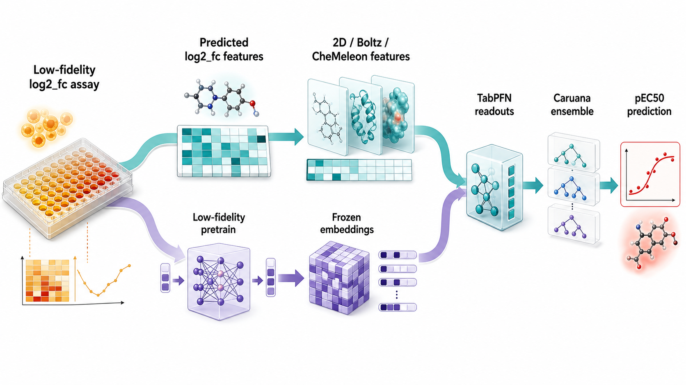
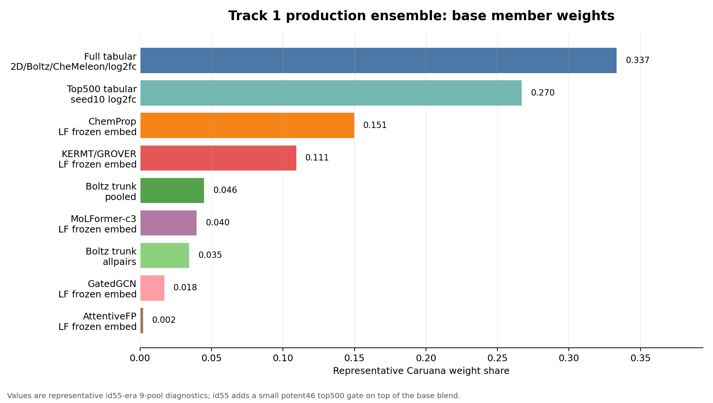
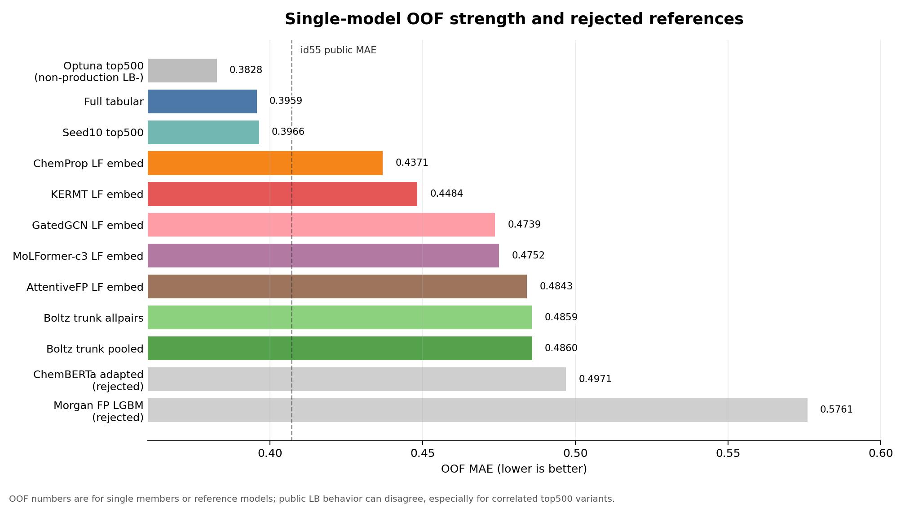

# Track 1 model strategy report

確認日: 2026-05-18 JST

このreportは、個別modelではなく、Track 1 activity model全体の設計思想を説明するためのもの。
中心にある考え方は、Buterez et al. 2024 の multi-fidelity transfer learning を、
PXR challenge向けに実験的に翻訳したもの。

参照した論文:

- Buterez et al. 2024, *Transfer learning with graph neural networks for improved molecular property prediction in the multi-fidelity setting*
- LiteParseで添付PDFを再parse済み: `/tmp/pxr_liteparse/buterez2024.txt`
- 既存parse: `docs/papers/shotgun_raw/buterez2024_multifidelity/buterez2024.txt`

## 0. まず全体像

Track 1の最終形は、単一の巨大モデルではなく、
`log2_fc` 由来の強いactivity軸を複数の形に変換し、
それを TabPFN と Caruana ensemble でまとめたもの。

id55 `ens_id51_top500_potent46_t40_soft_g35` は、
baseの `ens_caruana_bag20` blendに、potent46近傍でtop500方向を少し借りる
soft gateを足した提出。
したがって、下のweightは id55 そのもののgate係数ではなく、
id55周辺の9-pool診断で見ていた「base ensemble member weight」の目安。

このreportで使う `LF` は `low-fidelity` の略。
ここでは、pEC50より直接性は低いがPXR activityに近い補助signalである
single-concentration `log2_fc` assayを指す。
たとえば `LF frozen embed` は、
`log2_fc` でpretrainしたencoderをfreezeし、そのembeddingをTabPFNに渡すmodel familyのこと。







### Production member一覧

| role | member | approx wt | 簡単な説明 | 詳細report |
|---|---|---:|---|---|
| broad tabular core | `tabpfn_cheme_2d_full_boltz_log2fc_pred_optuna_trial10_seed5ens_umap_default` | 0.337 | 2D descriptor, Boltz特徴, CheMeleon, predicted `log2_fc` を全部使うfull-feature TabPFN。top500に寄せすぎない主軸。 | [full tabular](models/tabpfn_cheme_2d_full_boltz_log2fc_pred_optuna_trial10_seed5ens_umap_default.md) |
| selected tabular core | `tabpfn_cheme_2d_full_boltz_log2fc_pred_seed10ens_top500_umap` | 0.270 | 同じfeature universeからfoldごとにLGBM gain上位500を選ぶTabPFN。id55 gateでもこの方向を少し借りた。 | [top500 diagnostics](models/tabpfn_cheme_2d_full_boltz_log2fc_pred_optuna_trial10_seed5ens_top500_umap.md) |
| LF frozen GNN embed | `tabpfn_chemprop_pretrain_embed_umap_default` | 0.151 | ChemPropを `log2_fc` でpretrainし、frozen embeddingをTabPFNで読む。Buterez型戦略の中心例。 | [ChemProp](models/tabpfn_chemprop_pretrain_embed_umap_default.md) |
| LF frozen graph-transformer embed | `tabpfn_kermt_pretrain_embed_umap_default` | 0.111 | GROVER/KERMT系のgraph transformerを `log2_fc` に寄せたembedding。単体OOFとdiversityのバランスが良い。 | [KERMT](models/tabpfn_kermt_pretrain_embed_umap_default.md) |
| structural reserve | `tabpfn_pooled_boltz_umap_default` | 0.046 | Boltz trunkの内部表現をprotein/ligand/pair poolingしてTabPFNに渡す。weightは低いが独自性が高い。 | [Boltz trunk](models/tabpfn_pooled_boltz_trunk_umap.md) |
| LF frozen transformer embed | `tabpfn_molformer_c3_pretrain_embed_umap` | 0.040 | MoLFormer-c3のSMILES transformer表現を `log2_fc` でPXR向けにして使う補助軸。 | [MoLFormer](models/tabpfn_molformer_c3_pretrain_embed_umap.md) |
| structural reserve | `tabpfn_pooled_boltz_allpairs_umap_default` | 0.035 | Boltz trunkのall protein-ligand pair側をpoolした別視点。pooled版と相関は高いがdropは危険だった。 | [Boltz trunk](models/tabpfn_pooled_boltz_trunk_umap.md) |
| LF frozen GNN embed | `tabpfn_gatedgcn_pretrain_embed_umap_default` | 0.018 | GatedGCNを `log2_fc` でpretrainした512d embedding。低weightだがdropでfamily過集中が起きやすい。 | [GNN aux](models/tabpfn_gnn_pretrain_embed_aux_members.md) |
| LF frozen GNN embed | `tabpfn_attentivefp_pretrain_embed_umap_default` | 0.002 | AttentiveFPのpretrain embedding。weightは最小だが、低weight memberを雑に削るとLBで悪化する例があった。 | [GNN aux](models/tabpfn_gnn_pretrain_embed_aux_members.md) |

この一覧を見ると、weightの大半は
`log2_fc` predicted scalarを含むtabular coreにある。
ただし、ChemProp/KERMT/MoLFormer/GNN/Boltz trunkは
「単体最強」ではなく、強い同系統モデルへの過集中を避けるための
diversity reserveとして残っている。
なお、灰色で示した `optuna_trial10_seed5ens_top500` はOOF上は非常に強いが、
id56でpublic LBが悪化したため、id55を説明するときは
「production本体」ではなく「top500/log2fc軸に寄せすぎた危険例」として扱う。

## 1. 基本戦略

PXR Track 1 の最終目的は pEC50 予測だが、pEC50 labelは4,140件しかない。
一方で、同じPXR周辺の補助実験として single-concentration `log2_fc`
がより多く存在する。

この構造は、Buterez et al. が扱う multi-fidelity setting に近い。

| Buterez et al. の概念 | このrepoでの対応 |
|---|---|
| high-fidelity target | Track 1 train pEC50 |
| low-fidelity measurement | single-concentration `log2_fc` at 8.25 uM / 33 uM |
| low-fidelity model output | ChemProp等が予測した `log2fc_8p25_pred`, `log2fc_33_pred` |
| low-fidelity representation | `log2_fc` でpretrainしたencoderの frozen embedding |
| high-fidelity downstream model | TabPFN / LGBM / ensemble |

ただし、我々は論文の手法をそのまま再現したわけではない。
PXRでは、以下の形が最も強かった。

```text
single-concentration log2_fc
  -> foundation / GNN backbone をpretrain
  -> encoderをfreeze
  -> embeddingまたはlog2fc predictionを抽出
  -> TabPFNでpEC50を学習
  -> Caruana ensembleでfamilyを調整
```

重要なのは、`log2_fc` を「pEC50の疑似ラベル」として雑に増やしたのではなく、
PXR activity に近い low-fidelity signal として、予測値または表現に変換して使ったこと。

## 2. Buterez et al. から引き継いだ考え

Buterez et al. は、screening cascade のように低コスト・低fidelityの測定と、
高コスト・高fidelityの測定がある状況で、低fidelity情報をどう高fidelity予測へ渡すかを調べている。

論文から本repoに持ち込んだ主な考えは3つ。

1つ目は、low-fidelity labelをそのまま使うだけでは不十分という点。
論文でも、label augmentationだけが常に最善ではなく、
low-fidelity modelの表現や予測を使う方が有効な場面が多い。

2つ目は、encoderを高fidelity taskへ直接fine-tuneしすぎるより、
low-fidelityで学んだ表現を固定し、downstream modelに渡す方が強い場合があるという点。
このrepoでは ChemProp, MoLFormer-c3, KERMT, GatedGCN, AttentiveFP で
「`log2_fc` pretrain -> frozen embedding -> TabPFN」を横展開した。

3つ目は、readout/downstream modelが重要という点。
Buterez et al. では adaptive readout が鍵になる。
このrepoでは、その役割をかなり TabPFN が担った。
つまり、encoderそのものに pEC50 を直接当てさせるより、
encoderを「PXR-relevant representation extractor」として使い、
TabPFNに小標本回帰を任せた。

## 3. `log2_fc` が効いた理由

`log2_fc` は single-concentration assay なので、pEC50そのものではない。
それでも、PXR activity の近いproxyだった。

実測相関:

| signal | n train | Pearson r with pEC50 | Spearman r with pEC50 |
|---|---:|---:|---:|
| observed 8.25 uM `log2_fc` | 2,374 | 0.7237 | - |
| observed 33 uM `log2_fc` | 2,321 | 0.4961 | - |
| predicted `log2fc_8p25_pred` | 4,140 | 0.7599 | 0.8269 |
| predicted `log2fc_33_pred` | 4,140 | 0.7746 | 0.7442 |

特に predicted `log2_fc` は、coverageがtrain/test全体に広がるうえ、
生のobserved labelよりも滑らかなactivity proxyになる。
このため、LGBM gainでも常に最上位に来た。

一方で、疑似pEC50ラベルを使うself-training系はうまくいかなかった。
代表例として、plain `lgbm_mordred_umap_default` は MAE 0.5291 だったが、
pseudo label を足した変種はむしろ悪化した。

| model | pseudo setting | OOF MAE | Spearman |
|---|---|---:|---:|
| `lgbm_mordred_umap_default` | none | 0.5291 | 0.7111 |
| `lgbm_mordred_umap_default_pseudo0.05_minc0.9` | conservative pseudo | 0.5317 | 0.7109 |
| `lgbm_mordred_umap_default_pseudo0.1` | pseudo weight 0.1 | 0.5447 | 0.7256 |
| `lgbm_mordred_umap_default_pseudo0.5` | pseudo weight 0.5 | 0.5699 | 0.7332 |
| `lgbm_mordred_umap_default_pseudo1.0` | pseudo weight 1.0 | 0.5781 | 0.7289 |

したがって、我々の成功パターンは
「ターゲットの疑似ラベルを増やす」ではなく、
「実験的に意味のあるlow-fidelity assayを、予測値または表現として使う」だった。

## 4. 2つの `log2_fc` 利用経路

最終poolには、`log2_fc` signal が大きく2経路で入っている。

| 経路 | 代表model | 説明 | 長所 | 注意点 |
|---|---|---|---|---|
| predicted scalar | `tabpfn_cheme_2d_full_boltz_log2fc_pred_*` | ChemPropで `log2_fc` を予測し、2D/Boltz/CheMeleon特徴へ2本足す | 最も強い。top500化でさらに伸びる | family過集中しやすい |
| frozen embedding | `tabpfn_chemprop_pretrain_embed_umap_default` など | `log2_fc` でencoderをpretrainし、embeddingをTabPFNへ渡す | backbone差で少し違う誤差を出せる | scalar concatほど単体は強くない |

この2つは同じlow-fidelity signalに由来するが、ensemble内での役割は違う。
predicted scalar は強い主軸。
frozen embedding は、そのsignalを別backboneの表現として分散させる補助軸。

## 5. TabPFNをdownstream readoutにした理由

TabPFNは、このrepoでは「小標本の非線形readout」として非常に強かった。
特に frozen embedding や選択済みtabular特徴を読むとき、
ChemProp head、LGBM、KANより良いことが多かった。

代表的な比較:

| input / family | downstream | OOF MAE | Spearman | 読み方 |
|---|---|---:|---:|---|
| ChemProp `log2_fc` pretrain embed | TabPFN | 0.4371 | 0.8073 | 本命 |
| ChemProp `log2_fc` pretrain, frozen head FT | ChemProp head | 0.4562 | 0.7945 | 改善するがTabPFNに負け |
| ChemProp `log2_fc` pretrain embed | KAN | 0.4674 | 0.7872 | 回帰器としては動くが新軸にならない |
| ChemProp assay-shape embed | TabPFN | 0.4379 | 0.8039 | TabPFN側が強い |
| ChemProp assay-shape embed | LGBM | 0.4565 | 0.7948 | 同系inputではTabPFNに負け |
| Boltz pooled trunk | TabPFN | 0.4860 | 0.7539 | LGBMより良い |
| Boltz pooled trunk | LGBM | 0.5115 | 0.7328 | embeddingを読むには弱い |

KANはChemProp embedding上で MAE 0.4675 まで来たので、単体回帰器としては成立している。
しかし Caruana ADD 診断では weight 0.0015 程度で、
既存ChemProp/TabPFN familyと相関が高く、新しいensemble axisにはならなかった。

## 6. direct fine-tuning が弱かった理由

多くのfoundation / neural backboneで、pEC50への直接fine-tuningは弱かった。
理由は単純で、4,140件のpEC50だけでは大きいencoderを安定して寄せにくく、
CV上はよく見えてもLBに移りにくい。

代表例:

| model | recipe | OOF MAE | Spearman | 判断 |
|---|---|---:|---:|---|
| `chemprop_finetune_nopretrain_ablation_ablation_umap` | ChemProp direct scratch pEC50 | 0.5298 | 0.7173 | 弱い |
| `chemprop_pretrain_finetune_umap` | `log2_fc` pretrain後にfull FT | 0.5071 | 0.7554 | pretrainは効くが弱い |
| `chemprop_pretrain_finetune_frozen_lowlr_umap` | frozen head FT | 0.4562 | 0.7945 | 良いがTabPFN embedに負け |
| `peft_molformer_xl_lora_r32a64_umap_default` | MoLFormer direct LoRA pEC50 | 0.5290 | 0.7050 | 弱い |
| `attentivefp_optuna_umap` | direct AttentiveFP | 0.5280 | 0.6984 | 不採用 |
| `gatedgcn_optuna_umap` | direct GatedGCN | 0.5463 | 0.6965 | 不採用 |
| `graphgps_optuna_umap` | direct GraphGPS | 0.5714 | 0.6642 | 不採用 |

この結果から、我々の基本方針は
「大きいencoderをpEC50へ直接合わせる」ではなく、
「low-fidelityでPXR向き表現を作り、downstream TabPFNで読む」に固まった。

## 7. top-k feature selection の位置づけ

top-kは、強いtabular feature stackでは有効だった。
`cheme_2d_full_boltz_log2fc_pred` は2103次元あり、
そのままTabPFNに入れると低gain特徴のノイズも入る。
そこでfoldごとにLGBM gain上位だけを選び、TabPFNへ渡した。

proper CVでの代表結果:

| feature stack | K | OOF MAE | Spearman |
|---|---:|---:|---:|
| `cheme_2d_full_boltz_log2fc_pred` | 400 | 0.4182 | 0.8274 |
| `cheme_2d_full_boltz_log2fc_pred` | 500 | 0.4179 | 0.8279 |
| `cheme_2d_full_boltz_log2fc_pred` | 600 | 0.4176 | 0.8264 |
| `cheme_2d_full_boltz_log2fc_pred` | full 2103 | 0.4212 | 0.8236 |
| `optuna_trial10_seed5ens` | top500 | 0.3828 | 0.8539 |
| `optuna_trial10_seed5ens` | full | 0.3959 | 0.8425 |

一方で、top-kは万能ではない。
frozen embedding系では、dense embedding全体に情報が分散しており、
feature selectionやPCA/PLS圧縮は逆効果になりやすかった。

| frozen model | variant | OOF MAE | Spearman | 判断 |
|---|---|---:|---:|---|
| KERMT | full 3200d embedding | 0.4484 | 0.7891 | 採用 |
| KERMT | top500 | 0.4502 | 0.7888 | 少し悪化 |
| KERMT | PCA500 | 0.4567 | 0.7849 | 悪化 |
| KERMT | PLS500 | 0.9636 | 0.4931 | 破綻 |

したがって、top-kは
「大量の手作り/表形式特徴からノイズを落とす手段」であり、
「pretrained embeddingを雑に圧縮する手段」ではない。

## 8. FP / ChemBERTa / generic representation が弱かった理由

Morgan FP、RDKit descriptor、ChemBERTa、BERT-SMILESのような一般的表現も試したが、
このPXR taskでは主力にはならなかった。

代表例:

| family | model | OOF MAE | Spearman | 読み方 |
|---|---|---:|---:|---|
| Morgan FP | `lgbm_morgan_r2_2048` | 0.5761 | 0.6772 | 単体弱い |
| Morgan count FP | `lgbm_count_morgan_r2_2048_scaffold` | 0.5373 | 0.7162 | 改善するが主力未満 |
| RDKit desc | `single_rdkit_desc` | 0.5645 | 0.6570 | 弱い |
| Mordred + Morgan | `optuna_mordred+morgan` | 0.5004 | 0.7400 | 2D baselineとしては使えるが主力未満 |
| ChemBERTa raw | `lgbm_chemberta` | 0.5850 | 0.6521 | 弱い |
| ChemBERTa raw | `tabpfn_chemberta_5m_mtr_umap_default` | 0.5287 | 0.6914 | 弱い |
| ChemBERTa adapted | `tabpfn_chemberta_5m_mtr_pretrain_embed_umap_default` | 0.4971 | 0.7318 | 改善するが採用水準未満 |
| BERT-SMILES | `tabpfn_bert_base_smiles_umap_default` | 0.6690 | 0.5558 | かなり弱い |

FPが弱かった理由は、PXRでは単純な部分構造一致だけでは足りず、
single-concentration response や assay-specific なactivity軸が必要だったためだと思う。
ChemPropはMorgan FPの上位互換というより、
`log2_fc` pretrainによって「PXR応答に寄ったfingerprint」を作れた点が大きい。
その結果、汎用FPや汎用ChemBERTa表現よりも強くなった。

## 9. Ensemble上の最終判断

最終的な強さは、単体OOFだけでは決まらなかった。
同じ `log2_fc` family は非常に強いが、足しすぎるとpublic LBで悪化することもあった。
そのため、最終判断は以下を同時に見た。

- 単体OOF MAE / Spearman
- 既存memberとの予測相関・残差相関
- Caruana weight
- family shareの偏り
- public LB readback
- submission preflightでのanchor shift

このため、production poolは
「最強familyだけを増やす」のではなく、
`log2_fc` 主軸、ChemProp/KERMT/MoLFormer/GNN frozen embedding、
CheMeleon/2D/Boltz tabular、Boltz trunk diversity reserveを組み合わせる形になった。

## 10. 一言で説明するなら

我々のTrack 1 modelは、PXR pEC50を直接小データで当てるだけではなく、
single-concentration `log2_fc` を low-fidelity activity proxy として使い、
それを predicted scalar と frozen embedding の2経路でpEC50モデルへ渡した。

Buterez et al. の multi-fidelity transfer learning の発想に近いが、
このタスクでは最終readoutとして TabPFN が非常に強く、
foundation modelを直接fine-tuneするより、
`log2_fc` で作った表現を凍結してTabPFNに読ませる方が安定した。

一方で、汎用FPやChemBERTa、単純なpseudo label self-trainingは弱かった。
PXRでは「一般的な分子表現」より、
PXR assayに近いlow-fidelity signalをどう安全に使うかが勝負だった。

## 参照

- `docs/track1_explain/models/tabpfn_chemprop_pretrain_embed_umap_default.md`
- `docs/track1_explain/models/tabpfn_cheme_2d_full_boltz_log2fc_pred_optuna_trial10_seed5ens_top500_umap.md`
- `docs/track1_explain/models/tabpfn_cheme_2d_full_boltz_log2fc_pred_optuna_trial10_seed5ens_umap_default.md`
- `docs/track1_explain/models/tabpfn_kermt_pretrain_embed_umap_default.md`
- `docs/track1_explain/models/tabpfn_molformer_c3_pretrain_embed_umap.md`
- `docs/track1_explain/models/tabpfn_gnn_pretrain_embed_aux_members.md`
- `docs/track1_explain/features/cheme_2d_full_boltz_log2fc_pred_feature_blocks.md`
- `track1_activity/analysis/oof_reliability_audit/outputs/pseudo_public_retrain/pseudo_public_retrain_report.md`
- `track1_activity/analysis/kan_embed/outputs/best_full256_h32_lr1e3/report.md`
