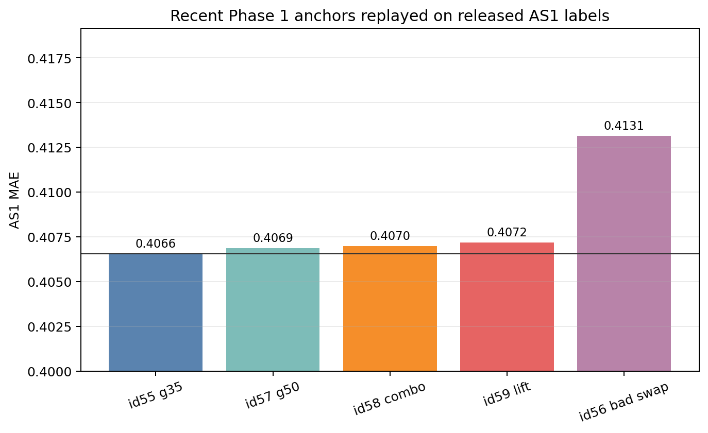
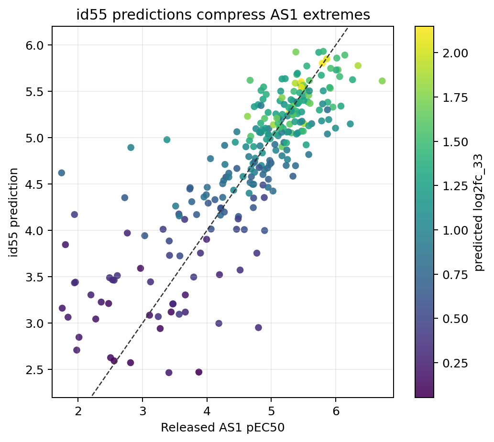
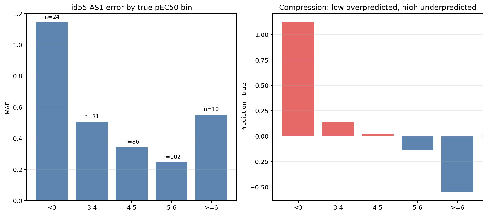
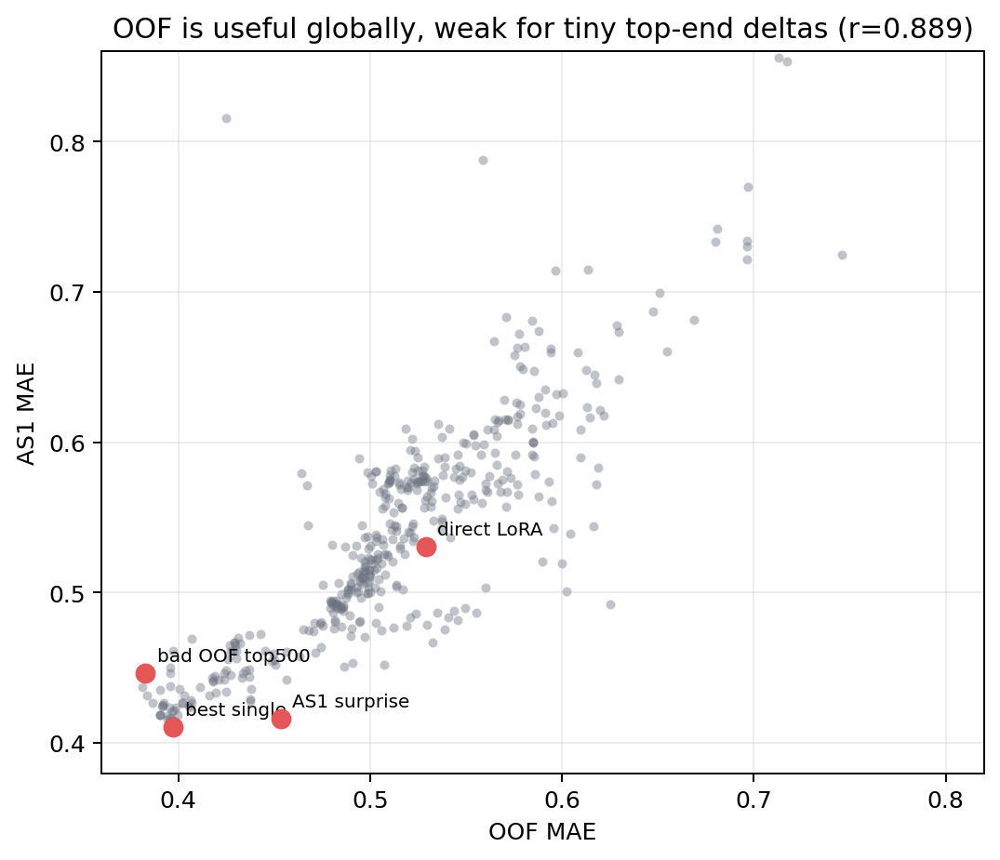
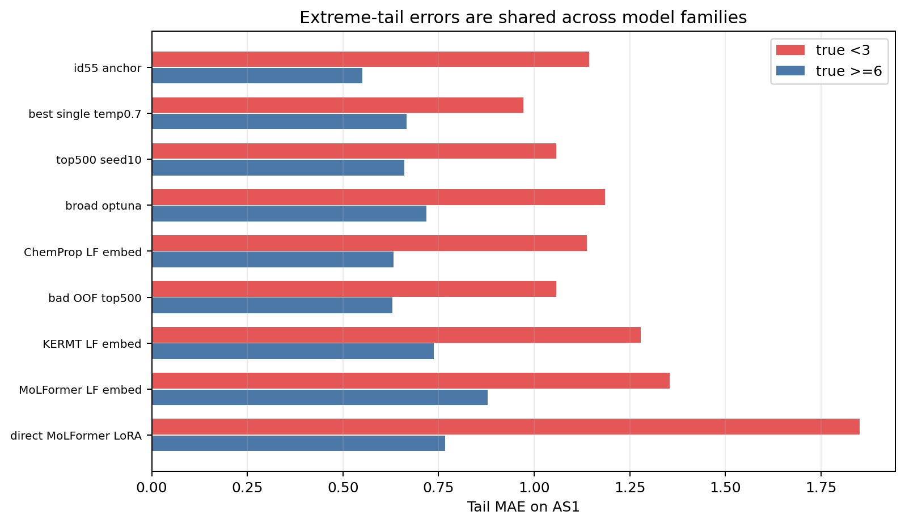
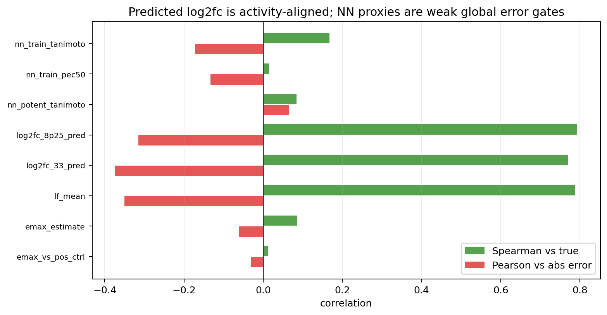
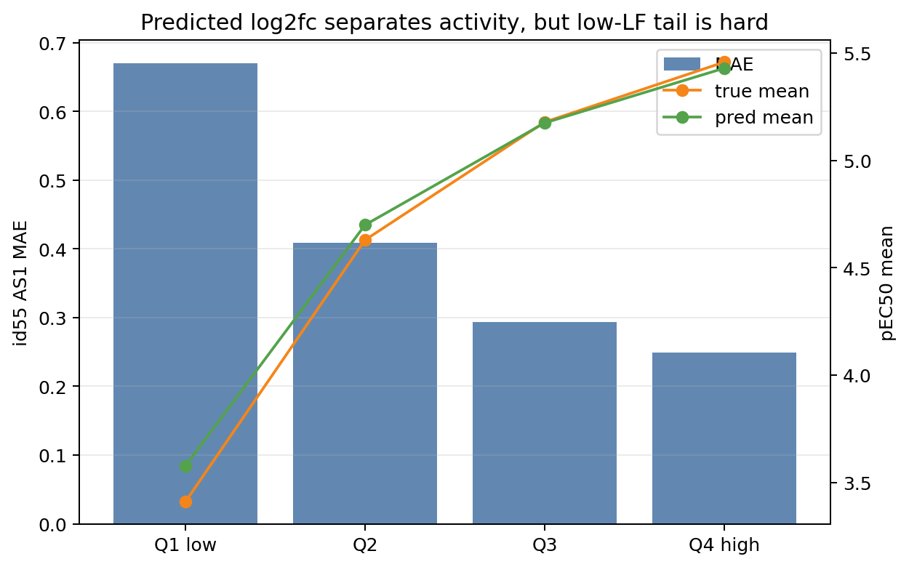
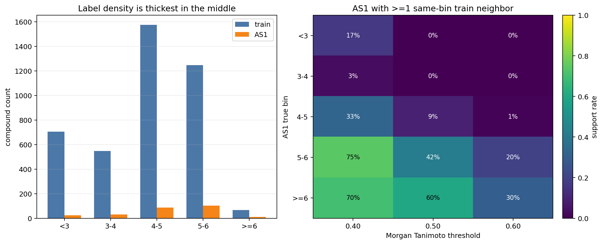

# Track 1 Phase 2 answer-check report

確認日: 2026-06-09 JST

このreportは、Phase 2で公開された Analog Set 1 label を使って、
Phase 1でやってきたTrack 1 activity modelingの答え合わせをまとめたもの。
新しいmodel trainingや新しいprediction生成ではなく、既存のsubmission CSV、
既存のOOF summary、既存のproduction member、`docs/track1_explain/` の主張を
released labelで再採点した確認系の整理である。

詳細ログは GitHub issue #208 に残している。
このreportでは、人に説明しやすい結論と図を優先する。
化合物構造つきの個別case studyは
[`phase2_compound_case_study_report.md`](phase2_compound_case_study_report.md)
に分けた。

## 0. Scope

今回やったこと:

- `test_activity_phase1_labels` の253 compoundsを Analog Set 1として使った。
- 既存のTrack 1 submission CSVをAS1 labelにjoinして再採点した。
- 個別model、production member、id55/id57/id58/id59/id56周辺のpredictionを比較した。
- id55の大きな誤差を、true pEC50 bin、train nearest neighbor、predicted `log2_fc`、
  AS1 label-side Emaxで見た。
- issue #100 と `docs/track1_explain/` のPhase 1主張を、
  confirmed / qualified の形で確認した。

今回やっていないこと:

- AS1 labelで新しいmodelを学習すること。
- AS2の新しいpredictionを作ること。
- HTChemを使った追加解析。
- 古いstable submission pathが上書きされている可能性のある全historical rowの完全復元。

## 1. まず結論

Phase 1の大筋は合っていた。
ただし、ここで再現しているのはPhase 1 live leaderboardそのものではなく、
live leaderboardが参照していたAnalog Set 1部分の再採点である。
`log2_fc` 由来のlow-fidelity activity axisはAS1でも本物だった。
id55/id60 anchor `ens_id51_top500_potent46_t40_soft_g35` も、
recent Phase 1候補の中ではAS1で実際に一番良かった。

一方で、最終modelの弱点もかなりはっきりした。
中心的な失敗は **極端値の圧縮** である。
true pEC50がとても低いcompoundを高めに予測し、
true pEC50がとても高いcompoundを低めに予測する。
つまり、rank orderingは強いが、tailの絶対値を当てきれていない。

もう一つ重要なのは、OOFの読み方である。
OOF MAEとAS1 MAEは全体としては強く相関するが、
top-endでの小さい差や、local gateの改善をそのまま信じるには弱い。
id58/id59は狙っていた高活性側のunderpredictionを少し改善したが、
denseな中高活性領域も一緒に動かしてしまい、net MAEではid55より悪くなった。

## 2. AS1 replayはPhase 1 live LBの近似であり、interim LBではない

Track 1 testは513 compounds。
Phase 2で公開された `test_activity_phase1_labels` は253 compoundsで、
残り260 compoundsはまだblindである。
OpenADMETのPhase 2告知では、Phase 1中のlive leaderboardはAnalog Set 1だけを表示し、
Analog Set 2はhiddenのままだったと説明されている。
一方、Phase 1終了後のinterim leaderboardは、
各teamのlatest Phase 1 submissionをAnalog Set 1 + Analog Set 2のfull testで採点した
別物である。

このreportでやっているのは、released AS1 labelによるlive-LB成分の答え合わせであり、
interim leaderboardやfinal Phase 2 leaderboardの再現ではない。
recentなunique/current CSVをAS1 labelで再採点すると、recorded live LB MAEと
おおむね `0.0003-0.0006` 程度で一致した。

したがって、Phase 1 live LBで観察したcandidate差分の答え合わせ対象としては、
released AS1 labelを使ってよい。
ただし、古いstable file pathは後から上書きされている可能性があるため、
exact historical replayには注意が必要。



Recent anchorsのAS1 replay:

| candidate | AS1 MAE | bias | Spearman | 読み方 |
|---|---:|---:|---:|---|
| id55 `g35` | 0.4066 | +0.0516 | 0.8488 | recent best anchor |
| id57 `g50` | 0.4069 | +0.0519 | 0.8486 | id55を少し強めたが微悪化 |
| id58 `combo` | 0.4070 | +0.0588 | 0.8479 | local gateは微悪化 |
| id59 `lift` | 0.4072 | +0.0596 | 0.8480 | high-activity liftも微悪化 |
| id56 `bad swap` | 0.4131 | +0.0403 | 0.8424 | top500/log2fc-heavy方向の明確な失敗 |

この結果から、Phase 1末期に「小さいlocal-gain submissionを止める」と判断したのは正しかった。

## 3. id55の失敗はtail compression

id55のAS1全体性能:

| n | MAE | RMSE | bias | Spearman | true mean | pred mean |
|---:|---:|---:|---:|---:|---:|---:|
| 253 | 0.4066 | 0.5835 | +0.0516 | 0.8488 | 4.6641 | 4.7157 |

true vs predictionを見ると、低活性側と高活性側の両方が中央に寄っている。
予測rangeは `2.4665-5.9314` で、true range `1.745-6.72` よりかなり狭い。



true pEC50 binごとの誤差:



| true pEC50 bin | n | MAE | bias | true mean | pred mean |
|---|---:|---:|---:|---:|---:|
| `<3` | 24 | 1.1438 | +1.1237 | 2.3192 | 3.4428 |
| `3-4` | 31 | 0.5036 | +0.1394 | 3.5645 | 3.7039 |
| `4-5` | 86 | 0.3415 | +0.0153 | 4.6440 | 4.6593 |
| `5-6` | 102 | 0.2444 | -0.1377 | 5.4175 | 5.2799 |
| `>=6` | 10 | 0.5507 | -0.5507 | 6.1885 | 5.6378 |

読み方:

- true `<3` はほぼ全て上方向に外している。
- true `>=6` はほぼ全て下方向に外している。
- `3-4` binもMAE 0.5036と大きく、17件はoverprediction、14件はunderpredictionだった。
  平均biasだけ見ると+0.1394だが、実際には両方向に外れているので、単純なglobal shiftでは直しにくい。
- denseな `5-6` binではid55が強い。
- id55は「low tailを直したmodel」ではなく、
  high sideを崩しすぎず、dense領域で強かったbalanced anchorと見るべき。

## 4. 個別modelの答え合わせ

442 experimentsについて、current `experiments.submission_path` CSVとOOF summaryを
AS1で比較した。
OOF MAEとAS1 MAEのPearson correlationは `0.8887` だった。



これは、OOFが無意味だったという話ではない。
むしろ全体の方向性としてはかなり意味がある。
ただし、上位model同士の `0.001-0.004` 程度の差や、
同じfeature family内の最適化差をそのままpublic analog subsetへ移せるほどではなかった。

重要な個別model結果:

| model | OOF MAE | AS1 MAE | 読み方 |
|---|---:|---:|---|
| `seed10ens_top500_umap_v3_temp0p7` | 0.3974 | 0.4107 | best single-ish AS1 row |
| `seed10ens_top500_umap_v3` | 0.3971 | 0.4135 | top500 familyは強い |
| `seed10ens_top400_umap_v3` | 0.3960 | 0.4136 | top-kは有効 |
| `chemprop_assay_shape_drlatent_embed` | 0.4534 | 0.4164 | OOFよりAS1で良いsurprise |
| production `seed10ens_top500` | 0.3966 | 0.4214 | 強いがid55 anchor未満 |
| broad optuna trial10 | 0.3959 | 0.4376 | good OOF, weaker AS1 |
| bad OOF top500 trial10 | 0.3828 | 0.4467 | OOF過集中の代表例 |
| direct MoLFormer LoRA | 0.5290 | 0.5307 | negative resultはAS1でも確認 |

ここで重要なのは、top500自体が悪いわけではないこと。
top-k selected TabPFN/log2fc familyはAS1でも強い。
悪かったのは、OOF最適化されたtop500/log2fc方向に広く寄せすぎたcaseである。

## 5. Tail errorはmodel family共通

selected model familyでtail MAEを見ると、
low-end overpredictionとhigh-end underpredictionはensemble固有ではない。
多くの個別modelも同じ圧縮癖を持つ。



| model | AS1 MAE | true `<3` MAE | true `>=6` MAE |
|---|---:|---:|---:|
| id55 anchor | 0.4066 | 1.1438 | 0.5507 |
| best single temp0.7 | 0.4107 | 0.9718 | 0.6660 |
| top500 seed10 | 0.4214 | 1.0583 | 0.6604 |
| broad optuna | 0.4376 | 1.1857 | 0.7185 |
| ChemProp LF embed | 0.4441 | 1.1381 | 0.6315 |
| bad OOF top500 | 0.4467 | 1.0576 | 0.6298 |
| KERMT LF embed | 0.4546 | 1.2793 | 0.7368 |
| MoLFormer LF embed | 0.5055 | 1.3537 | 0.8790 |
| direct MoLFormer LoRA | 0.5307 | 1.8512 | 0.7664 |

best singleはlow tailではid55より良いが、高活性tailではid55より悪い。
id55はtail全体とdense領域のバランスで勝っている。

## 6. id57/id58/id59/id56は何を間違えたか

id57/id58/id59は、AS1上で見ると完全な勘違いではなかった。
とくにid58/id59はtrue `>=6` のunderpredictionを少し改善した。
ただし、gateやliftが十分にlocalではなく、
すでに高めに出ている `4.5-5.6` 付近のcompoundも一緒に動かした。
その小さなmiddle damageが、tail improvementを上回った。

id56はもっと分かりやすい。
top500/log2fc-heavy方向へ広く動かしたため、
一部のlow-end missは改善したが、denseな `4-6` 領域と高活性側を壊した。
これはPhase 1での「top500過集中が危険」というwarningをAS1が確認した形。

したがって、修正された教訓はこうなる。

- `top500` は危険、ではない。
- `top500/log2fc` は強いが、広く寄せすぎると危険。
- `high-activity lift` は偽signal、ではない。
- high sideのunderpredictionは本物だが、lift対象を十分に絞れなかった。

## 7. predicted `log2_fc` はAS1でも本物だった

predicted `log2_fc` は、AS1 true pEC50と強く単調相関していた。

| proxy | Spearman vs true pEC50 | Pearson vs abs error | 読み方 |
|---|---:|---:|---|
| `log2fc_8p25_pred` | +0.793 | -0.315 | true activity axisとして強い |
| `log2fc_33_pred` | +0.770 | -0.374 | 同上 |
| `lf_mean` | +0.788 | -0.350 | 同上 |
| train NN Tanimoto | +0.167 | -0.172 | global gateとしては弱い |
| train NN pEC50 | +0.015 | -0.133 | activity補正には弱い |
| potent NN Tanimoto | +0.084 | +0.065 | global error detectorではない |



`log2fc_33_pred` quartileで見ると、high LF側はtrue pEC50も高く、
id55のMAEも低い。



| `log2fc_33_pred` quartile | n | MAE | bias | true mean | pred mean |
|---|---:|---:|---:|---:|---:|
| Q1 low | 64 | 0.6704 | +0.1667 | 3.4111 | 3.5778 |
| Q2 | 63 | 0.4090 | +0.0700 | 4.6294 | 4.6995 |
| Q3 | 63 | 0.2934 | -0.0038 | 5.1783 | 5.1745 |
| Q4 high | 63 | 0.2493 | -0.0284 | 5.4575 | 5.4292 |

この結果は、Phase 1の中心戦略をかなり強く支持している。
`log2_fc` はPXR activity proxyとして効いていた。
ただし、low LF側の大きな誤差は残っており、
LFだけでlow-tail activity cliffを解けるわけではない。

## 8. nearest-neighborでtailは見抜けたか

train nearest neighborやpotent-neighbor similarityは、
globalなerror correction signalとしては弱い。
しかし、largest missの解釈には役立つ。

まずlabel countだけを見ると、train/AS1ともに中央が厚い。
train全体では `<3` は704件あり、低活性labelそのものが極端に少ないわけではない。
一方、AS1の `<3` は24件しかなく、`>=6` はtrain全体でも66件、AS1では10件しかない。
高活性端は純粋にlabel supportが薄い。



| true bin | train count | AS1 count |
|---|---:|---:|
| `<3` | 704 | 24 |
| `3-4` | 548 | 31 |
| `4-5` | 1,575 | 86 |
| `5-6` | 1,247 | 102 |
| `>=6` | 66 | 10 |

より重要なのは、AS1 compoundに同じtrue activity binのtrain近傍があるかどうかである。
Morgan Tanimoto `>=0.50` では、same-bin train neighborが1件以上あるAS1 compoundの割合は、
`<3` と `3-4` が0%、`4-5` が9%、`5-6` が42%、`>=6` が60%だった。
`>=0.40` まで緩めても、`<3` は17%、`3-4` は3%にとどまる。

| AS1 true bin | AS1 n | same-bin support >=0.40 | same-bin support >=0.50 | same-bin support >=0.60 |
|---|---:|---:|---:|---:|
| `<3` | 24 | 17% | 0% | 0% |
| `3-4` | 31 | 3% | 0% | 0% |
| `4-5` | 86 | 33% | 9% | 1% |
| `5-6` | 102 | 75% | 42% | 20% |
| `>=6` | 10 | 70% | 60% | 30% |

したがって、「activity cliff」と強く言い切るより、
AS1の局所supportが薄く、moderate similarityの近傍から滑らかに外挿している、
と見る方が正確である。

true `<3` のAS1 compoundsは、nearest train pEC50平均が `5.59` と高く、
平均Tanimotoも約 `0.51` だった。
つまり、弱いAS1 compoundのかなりの部分は、
moderately similarなactive train analogに近い。
smoothなfingerprint/log2fc modelが「完全にinactive」と言い切れなかったのは自然だが、
sim 0.5前後なので、強いactivity-cliff証拠というよりlocal support不足の兆候として扱う。

代表的なlow-end overprediction:

| compound | true | pred | error | train NN sim / pEC50 | potent NN sim | `lf_mean` |
|---|---:|---:|---:|---:|---:|---:|
| `OADMET-0006439` | 1.745 | 4.621 | +2.876 | 0.476 / 2.670 | 0.433 | 0.579 |
| `OADMET-0006458` | 1.945 | 4.172 | +2.227 | 0.500 / 6.010 | 0.500 | 0.325 |
| `OADMET-0006534` | 2.820 | 4.895 | +2.075 | 0.554 / 6.685 | 0.554 | 0.788 |
| `OADMET-0006336` | 1.805 | 3.847 | +2.042 | 0.500 / 6.685 | 0.500 | 0.131 |

代表的なhigh-end underprediction:

| compound | true | pred | error | train NN sim / pEC50 | potent NN sim | `lf_mean` |
|---|---:|---:|---:|---:|---:|---:|
| `OADMET-0006546` | 6.720 | 5.612 | -1.108 | 0.612 / 5.905 | 0.323 | 1.709 |
| `OADMET-0006455` | 6.225 | 5.149 | -1.076 | 0.433 / 5.830 | 0.177 | 0.887 |
| `OADMET-0006284` | 6.080 | 5.341 | -0.739 | 0.486 / 6.260 | 0.486 | 1.124 |
| `OADMET-0006386` | 6.260 | 5.626 | -0.634 | 0.540 / 6.140 | 0.540 | 1.237 |

ここからの実務的な読みは、
NNは「このcompoundを上げ下げしろ」という直接gateよりも、
「この領域ではlocal supportが薄く、外挿が不安定」という不確実性の説明に向いている、ということ。

## 9. production member / diversity reserveの読み直し

current nine production membersをAS1で見ると、
simple all-9 averageよりもdocs-approx weighted blendの方が良かった。
これはweightingの重要性を支持する。

一方で、AS1のweighted leave-one-outだけを見ると、
`molformer_c3`、Boltz pooled/allpairs、`attentivefp` はMAE改善に強く寄与しているとは言いにくい。
`top500_seed10`、`kermt`、`broad_optuna_t10`、`gatedgcn`、`chemprop_lf_embed` は
current weighted replayで残す根拠がある。

したがって、Phase 1の
「low-weight diversity reserveは落とすと危険」
という主張は、完全に間違いではないが、そのままPhase 2へ持ち越すには強すぎる。

修正後の教訓:

- weak single modelでもensemble contextでは役に立つことがある。
- ただし、reserve memberの価値はweight・anchor・historical context依存。
- Phase 2では、reserveを慣性で残すのではなく、AS1 replayで再確認してから使う。

## 10. docs claim audit

AS1で確認された主張:

| Phase 1 claim | AS1 result |
|---|---|
| `log2_fc` low-fidelity axisが中心 | confirmed |
| direct MoLFormer LoRA / direct fine-tuningは弱い | confirmed |
| OOFは有用だがsmall local moveには弱い | confirmed |
| id55はbest practical anchor | confirmed |
| id56 top500-heavy directionは危険 | confirmed |
| preflight PASSはLB改善保証ではない | confirmed |
| high/low tailが問題 | confirmed and sharpened |

修正が必要な主張:

| Phase 1 claim | AS1での修正 |
|---|---|
| top500は危険 | top500は強い。危険なのは過集中。 |
| high-activity liftは間違い | signalは本物。localityが足りなかった。 |
| diversity reserveは落としてはいけない | exact contextで再確認が必要。 |
| NN/potent analog gateで安全に補正できる | global correction signalとしては弱い。 |

## 11. Phase 2で次に確認すべきこと

このanswer-checkから、次の確認課題はかなり絞られた。

1. AS2に対して、極端low/highを無理に補正すべきか、それとも不確実性として扱うべきか。
2. AS1のlow-tail local-support不足を、AS2 labelなしで認識できるfeature/gateが本当にあるか。
3. production reserve memberを、AS1 replayで再weight/recheckするか。
4. HTChemや外部データを、training dataではなくvalidation stratum / qualitative auditとしてどう使うか。
5. AS1 labelへ過適合しないPhase 2 validation designをどう作るか。

現時点での保守的な結論:

- まずはid55近傍のscaleとtail errorを理解する。
- `log2_fc` axisは信用してよいが、過集中は避ける。
- AS1の小さい改善をそのままAS2へ持ち込まない。
- 新しい学習やsubmission設計の前に、validation designを作る。

## 12. Reproducibility

Figures and CSV summaries were generated by:

```bash
pixi run python track1_activity/analysis/phase2_answer_check/build_phase2_answer_check_assets.py
```

Main generated assets:

- `docs/track1_explain/assets/phase2_answer_check/anchor_replay_summary.csv`
- `docs/track1_explain/assets/phase2_answer_check/id55_error_by_true_bin.csv`
- `docs/track1_explain/assets/phase2_answer_check/oof_vs_as1_experiments.csv`
- `docs/track1_explain/assets/phase2_answer_check/selected_model_tail_errors.csv`
- `docs/track1_explain/assets/phase2_answer_check/proxy_correlations.csv`
- `docs/track1_explain/assets/phase2_answer_check/train_as1_label_bin_counts.csv`
- `docs/track1_explain/assets/phase2_answer_check/as1_local_train_support_summary.csv`

Validation used for this report:

```bash
pixi run python track1_activity/analysis/phase2_answer_check/build_phase2_answer_check_assets.py
pixi run ruff check track1_activity/analysis/phase2_answer_check/build_phase2_answer_check_assets.py
```
