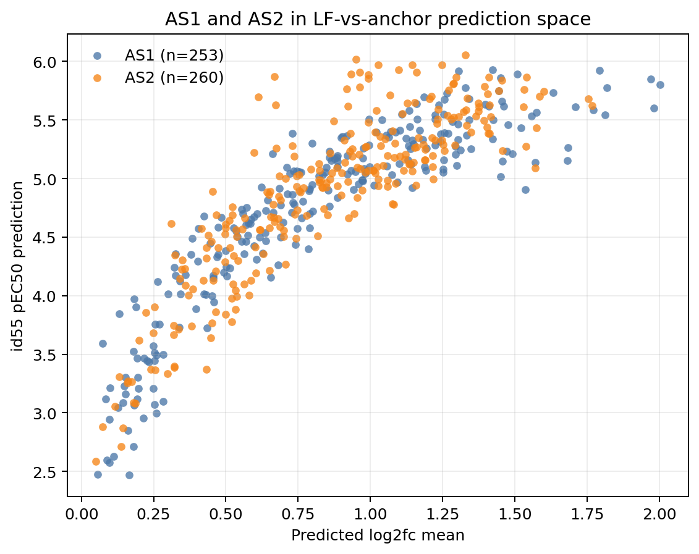
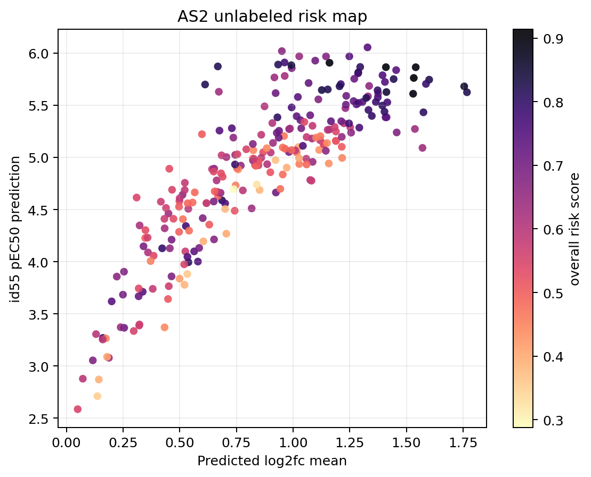

# Phase 2 AS2 unlabeled risk map

Built from existing predictions and proxy features only. This does not fit
AS2 labels, does not generate a new submission, and should be read as a
triage map for final-evaluation risk rather than a leaderboard feedback
loop.

## Inputs

- Anchor: `track1_activity/submissions/ens_id51_top500_potent46_t40_soft_g35.csv`.
- Production member CSVs found: 9.
- Missing production member CSVs: 0.
- LF proxy: chemprop optuna trial10 seed5ens predicted `log2_fc` parquet.
- Chemistry support: Morgan nearest-neighbor context against train activity.
- AS1 case anchors: released AS1 low-tail overpredictions, high-tail
  underpredictions, and 3-4 large-error cases.

## Split summary

| split   |   n |   pred_id55_mean |   pred_id55_p90 |   pred_id55_max |   lf_mean_mean |   lf_mean_p90 |   lf_mean_max |   member_std_mean |   member_std_p90 |   member_std_max |   nn_train_tanimoto_mean |   nn_train_tanimoto_p90 |   nn_train_tanimoto_max |   nn_potent_tanimoto_mean |   nn_potent_tanimoto_p90 |   nn_potent_tanimoto_max |   nn_weak_tanimoto_mean |   nn_weak_tanimoto_p90 |   nn_weak_tanimoto_max |   train_support_pred_bin_n_ge_0.50_mean |   train_support_pred_bin_n_ge_0.50_p90 |   train_support_pred_bin_n_ge_0.50_max |   low_tail_risk_score_mean |   low_tail_risk_score_p90 |   low_tail_risk_score_max |   high_tail_risk_score_mean |   high_tail_risk_score_p90 |   high_tail_risk_score_max |   mid_3to4_ambiguity_score_mean |   mid_3to4_ambiguity_score_p90 |   mid_3to4_ambiguity_score_max |   overall_risk_score_mean |   overall_risk_score_p90 |   overall_risk_score_max |
|:--------|----:|-----------------:|----------------:|----------------:|---------------:|--------------:|--------------:|------------------:|-----------------:|-----------------:|-------------------------:|------------------------:|------------------------:|--------------------------:|-------------------------:|-------------------------:|------------------------:|-----------------------:|-----------------------:|----------------------------------------:|---------------------------------------:|---------------------------------------:|---------------------------:|--------------------------:|--------------------------:|----------------------------:|---------------------------:|---------------------------:|--------------------------------:|-------------------------------:|-------------------------------:|--------------------------:|-------------------------:|-------------------------:|
| AS1     | 253 |           4.7157 |          5.5626 |          5.9314 |         0.8283 |        1.4407 |        2.0026 |            0.2146 |           0.3704 |           0.5823 |                   0.5267 |                  0.6230 |                  0.8065 |                    0.4021 |                   0.5625 |                   0.8065 |                  0.2922 |                 0.3650 |                 0.4762 |                                  0.2727 |                                 1.0000 |                                 2.0000 |                     0.5022 |                    0.6585 |                    0.8755 |                      0.4964 |                     0.8166 |                     0.9654 |                          0.5188 |                         0.7388 |                         0.8993 |                    0.6627 |                   0.8406 |                   0.9654 |
| AS2     | 260 |           4.8788 |          5.7140 |          6.0549 |         0.8589 |        1.3494 |        1.7674 |            0.2060 |           0.3528 |           0.5959 |                   0.5380 |                  0.6431 |                  0.7692 |                    0.3942 |                   0.6074 |                   0.7500 |                  0.2841 |                 0.3626 |                 0.5217 |                                  0.2423 |                                 1.0000 |                                 2.0000 |                     0.4992 |                    0.6775 |                    0.8230 |                      0.5054 |                     0.7756 |                     0.9137 |                          0.4830 |                         0.6869 |                         0.8142 |                    0.6251 |                   0.7992 |                   0.9137 |

## Short read

- AS2 id55 predictions are +0.1631 pEC50 higher on average than AS1.
- AS2 LF mean is +0.0306 higher than AS1.
- AS2 compounds with overall risk score >= 0.80: 26.
- AS2 compounds directly similar to tagged AS1 miss sets at Tanimoto >= 0.50: 0.
- The highest-ranked AS2 rows are mostly high-prediction/high-LF or
  potent-neighbor/low-support cases. This points more toward high-tail
  saturation risk than a clean replay of the AS1 low-tail cliff cases.

## AS2 tag counts

| tag                             |   as2_count |
|:--------------------------------|------------:|
| tag_potent_neighbor_low_support |          87 |
| tag_high_lf_saturated           |          37 |
| tag_member_disagreement         |          24 |
| tag_high_lf_but_not_high_pred   |          22 |
| tag_low_lf_high_pred            |           0 |
| tag_as1_low_case_like           |           0 |
| tag_as1_high_case_like          |           0 |
| tag_as1_mid_case_like           |           0 |

## Top AS2 compounds by overall triage score

| molecule_name   |   pred_id55 |   lf_mean |   member_std |   nn_train_tanimoto |   nn_train_pec50 |   nn_potent_tanimoto |   train_support_pred_bin_n_ge_0.50 |   max_sim_to_as1_low_overpred |   max_sim_to_as1_high_underpred |   low_tail_risk_score |   high_tail_risk_score |   mid_3to4_ambiguity_score |   overall_risk_score |   tag_count |
|:----------------|------------:|----------:|-------------:|--------------------:|-----------------:|---------------------:|-----------------------------------:|------------------------------:|--------------------------------:|----------------------:|-----------------------:|---------------------------:|---------------------:|------------:|
| OADMET-0006438  |      5.7618 |    1.5327 |       0.2445 |              0.5385 |           6.1950 |               0.5385 |                                  0 |                        0.2051 |                          0.2533 |                0.6936 |                 0.9137 |                     0.5255 |               0.9137 |           2 |
| OADMET-0006457  |      5.8645 |    1.5413 |       0.1533 |              0.5147 |           6.1950 |               0.5147 |                                  0 |                        0.1829 |                          0.2597 |                0.6526 |                 0.9012 |                     0.4290 |               0.9012 |           2 |
| OADMET-0006508  |      5.8651 |    1.4098 |       0.0913 |              0.6981 |           6.0900 |               0.6981 |                                  0 |                        0.1600 |                          0.2174 |                0.7110 |                 0.9011 |                     0.4450 |               0.9011 |           2 |
| OADMET-0006359  |      5.9075 |    1.1608 |       0.1251 |              0.6140 |           6.0900 |               0.6140 |                                  0 |                        0.1807 |                          0.2432 |                0.7774 |                 0.8971 |                     0.4709 |               0.8971 |           1 |
| OADMET-0006576  |      5.8144 |    1.2879 |       0.1432 |              0.7400 |           6.0900 |               0.7400 |                                  0 |                        0.1282 |                          0.2273 |                0.7045 |                 0.8948 |                     0.4263 |               0.8948 |           2 |
| OADMET-0006614  |      5.6101 |    1.5299 |       0.1124 |              0.6140 |           6.0900 |               0.6140 |                                  0 |                        0.1687 |                          0.2917 |                0.5943 |                 0.8945 |                     0.3619 |               0.8945 |           2 |
| OADMET-0006265  |      5.6809 |    1.7553 |       0.2083 |              0.6000 |           6.4700 |               0.6000 |                                  0 |                        0.2118 |                          0.1932 |                0.6774 |                 0.8623 |                     0.7417 |               0.8623 |           2 |
| OADMET-0006124  |      5.6265 |    1.4119 |       0.1160 |              0.5205 |           6.1950 |               0.5205 |                                  0 |                        0.2069 |                          0.2209 |                0.6645 |                 0.8490 |                     0.3129 |               0.8490 |           2 |
| OADMET-0006239  |      5.8840 |    0.9925 |       0.1973 |              0.6984 |           6.0700 |               0.6984 |                                  0 |                        0.1928 |                          0.2099 |                0.8165 |                 0.8404 |                     0.7636 |               0.8404 |           1 |
| OADMET-0006550  |      5.6458 |    1.1268 |       0.1937 |              0.5072 |           6.1950 |               0.5072 |                                  0 |                        0.2676 |                          0.2564 |                0.8049 |                 0.8344 |                     0.5286 |               0.8344 |           1 |
| OADMET-0006524  |      5.6246 |    1.7674 |       0.1831 |              0.4242 |           6.2550 |               0.4242 |                                  0 |                        0.2208 |                          0.2208 |                0.5857 |                 0.8246 |                     0.5322 |               0.8246 |           1 |
| OADMET-0006478  |      5.7453 |    1.6007 |       0.1378 |              0.4848 |           5.9150 |               0.2651 |                                  0 |                        0.1852 |                          0.2405 |                0.5334 |                 0.8236 |                     0.3523 |               0.8236 |           1 |
| OADMET-0006339  |      5.6516 |    1.1532 |       0.1703 |              0.5652 |           6.1950 |               0.5652 |                                  0 |                        0.2289 |                          0.2143 |                0.8230 |                 0.8187 |                     0.4645 |               0.8230 |           1 |
| OADMET-0006502  |      5.8722 |    0.6680 |       0.1531 |              0.6538 |           6.1400 |               0.6538 |                                  0 |                        0.1959 |                          0.1735 |                0.8229 |                 0.7325 |                     0.6193 |               0.8229 |           1 |
| OADMET-0006267  |      5.6990 |    0.6118 |       0.2156 |              0.6800 |           6.1400 |               0.6800 |                                  0 |                        0.2021 |                          0.1789 |                0.8210 |                 0.7187 |                     0.6557 |               0.8210 |           1 |
| OADMET-0006163  |      5.6816 |    1.2052 |       0.2710 |              0.5167 |           5.8650 |               0.3239 |                                  1 |                        0.2429 |                          0.2603 |                0.6675 |                 0.8189 |                     0.5480 |               0.8189 |           1 |
| OADMET-0006312  |      5.7510 |    1.4440 |       0.1859 |              0.6491 |           5.8650 |               0.2289 |                                  1 |                        0.1923 |                          0.3194 |                0.4873 |                 0.8186 |                     0.3671 |               0.8186 |           1 |
| OADMET-0006097  |      5.5703 |    1.3230 |       0.1680 |              0.6522 |           6.6300 |               0.6522 |                                  0 |                        0.1818 |                          0.1977 |                0.6615 |                 0.8177 |                     0.5787 |               0.8177 |           2 |
| OADMET-0006377  |      5.8902 |    0.9341 |       0.2103 |              0.6456 |           6.1400 |               0.6456 |                                  0 |                        0.1939 |                          0.1717 |                0.8145 |                 0.7698 |                     0.7188 |               0.8145 |           1 |
| OADMET-0006391  |      4.5885 |    0.6864 |       0.3245 |              0.6622 |           6.1400 |               0.6622 |                                  0 |                        0.1957 |                          0.1720 |                0.5195 |                 0.4424 |                     0.8142 |               0.8142 |           1 |

## Figures

## Interpretation guardrails

- High risk is not an instruction to shift a prediction. It marks compounds
  where the anchor may be extrapolating or where Phase 1 AS1 failure modes
  have nearby analogs.
- The risk scores are rank-based diagnostics, not calibrated probabilities.
- AS2 is still blinded at compound level and is not available as a
  live leaderboard feedback target during Phase 2.
- The 2026-05-28 interim leaderboard snapshot includes AS1+AS2 full-test
  scoring for each team's latest Phase 1 submission. It is useful as a
  team/submission-level sanity check, but it does not reveal which AS2
  compounds drove the score.

## Generated files

- `track1_activity/analysis/phase2_as2_risk_map/outputs/all_test_risk_map.csv`
- `track1_activity/analysis/phase2_as2_risk_map/outputs/as2_risk_map.csv`
- `track1_activity/analysis/phase2_as2_risk_map/outputs/split_summary.csv`
- `track1_activity/analysis/phase2_as2_risk_map/outputs/as2_tag_counts.csv`
