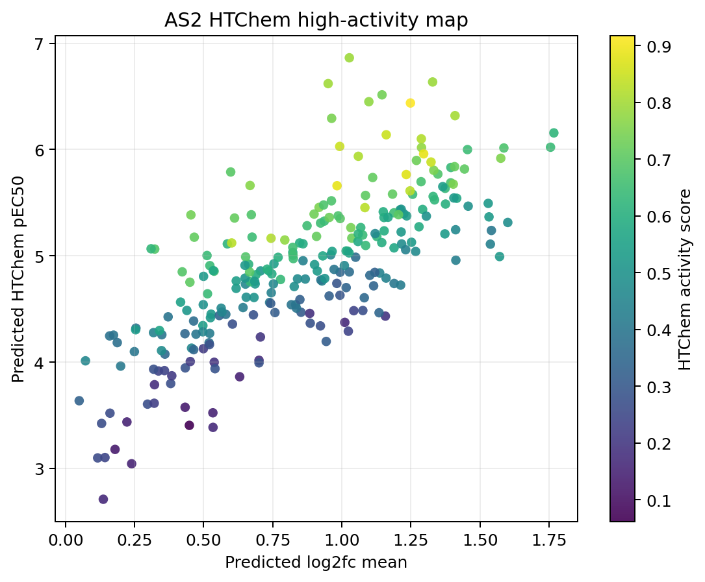

# Phase 2 AS2 unlabeled risk map

Built from existing predictions and proxy features only. This does not fit
AS2 labels, does not generate a new submission, and should be read as a
triage map for final-evaluation risk rather than a leaderboard feedback
loop.

## Inputs

- Anchor: `track1_activity/submissions/ens_id51_top500_potent46_t40_soft_g35.csv`.
- Production member CSVs found: 9.
- Missing production member CSVs: 0.
- LF proxy: chemprop optuna trial10 seed5ens predicted `log2_fc` parquet.
- HTChem proxy: ChemProp-embedding Ridge prediction of corrected HTChem pEC50,
  nearest HTChem analog, and Morgan UMAP cluster context.
- Chemistry support: Morgan nearest-neighbor context against train activity.
- AS1 case anchors: released AS1 low-tail overpredictions, high-tail
  underpredictions, and 3-4 large-error cases.

## Split summary

| split   |   n |   pred_id55_mean |   pred_id55_p90 |   pred_id55_max |   lf_mean_mean |   lf_mean_p90 |   lf_mean_max |   member_std_mean |   member_std_p90 |   member_std_max |   nn_train_tanimoto_mean |   nn_train_tanimoto_p90 |   nn_train_tanimoto_max |   nn_potent_tanimoto_mean |   nn_potent_tanimoto_p90 |   nn_potent_tanimoto_max |   nn_weak_tanimoto_mean |   nn_weak_tanimoto_p90 |   nn_weak_tanimoto_max |   train_support_pred_bin_n_ge_0.50_mean |   train_support_pred_bin_n_ge_0.50_p90 |   train_support_pred_bin_n_ge_0.50_max |   pred_htchem_mean |   pred_htchem_p90 |   pred_htchem_max |   htchem_minus_lf_z_mean |   htchem_minus_lf_z_p90 |   htchem_minus_lf_z_max |   nn_htchem_tanimoto_mean |   nn_htchem_tanimoto_p90 |   nn_htchem_tanimoto_max |   nn_htchem_corrected_pec50_mean |   nn_htchem_corrected_pec50_p90 |   nn_htchem_corrected_pec50_max |   htchem_activity_score_mean |   htchem_activity_score_p90 |   htchem_activity_score_max |   htchem_space_score_mean |   htchem_space_score_p90 |   htchem_space_score_max |   low_tail_risk_score_mean |   low_tail_risk_score_p90 |   low_tail_risk_score_max |   high_tail_risk_score_mean |   high_tail_risk_score_p90 |   high_tail_risk_score_max |   mid_3to4_ambiguity_score_mean |   mid_3to4_ambiguity_score_p90 |   mid_3to4_ambiguity_score_max |   overall_risk_score_mean |   overall_risk_score_p90 |   overall_risk_score_max |
|:--------|----:|-----------------:|----------------:|----------------:|---------------:|--------------:|--------------:|------------------:|-----------------:|-----------------:|-------------------------:|------------------------:|------------------------:|--------------------------:|-------------------------:|-------------------------:|------------------------:|-----------------------:|-----------------------:|----------------------------------------:|---------------------------------------:|---------------------------------------:|-------------------:|------------------:|------------------:|-------------------------:|------------------------:|------------------------:|--------------------------:|-------------------------:|-------------------------:|---------------------------------:|--------------------------------:|--------------------------------:|-----------------------------:|----------------------------:|----------------------------:|--------------------------:|-------------------------:|-------------------------:|---------------------------:|--------------------------:|--------------------------:|----------------------------:|---------------------------:|---------------------------:|--------------------------------:|-------------------------------:|-------------------------------:|--------------------------:|-------------------------:|-------------------------:|
| AS1     | 253 |           4.7157 |          5.5626 |          5.9314 |         0.8283 |        1.4407 |        2.0026 |            0.2146 |           0.3704 |           0.5823 |                   0.5267 |                  0.6230 |                  0.8065 |                    0.4021 |                   0.5625 |                   0.8065 |                  0.2922 |                 0.3650 |                 0.4762 |                                  0.2727 |                                 1.0000 |                                 2.0000 |             4.7313 |            5.6932 |            7.0054 |                  -0.0684 |                  0.6477 |                  1.2966 |                    0.3193 |                   0.5303 |                   1.0000 |                           5.3476 |                          6.3238 |                          6.9661 |                       0.4908 |                      0.7302 |                      0.8965 |                    0.5100 |                   0.7716 |                   0.8677 |                     0.5022 |                    0.6585 |                    0.8755 |                      0.4964 |                     0.8166 |                     0.9654 |                          0.5188 |                         0.7388 |                         0.8993 |                    0.6627 |                   0.8406 |                   0.9654 |
| AS2     | 260 |           4.8788 |          5.7140 |          6.0549 |         0.8589 |        1.3494 |        1.7674 |            0.2060 |           0.3528 |           0.5959 |                   0.5380 |                  0.6431 |                  0.7692 |                    0.3942 |                   0.6074 |                   0.7500 |                  0.2841 |                 0.3626 |                 0.5217 |                                  0.2423 |                                 1.0000 |                                 2.0000 |             4.8898 |            5.7708 |            6.8628 |                   0.0665 |                  0.8654 |                  2.2568 |                    0.2852 |                   0.3580 |                   0.7761 |                           5.2361 |                          6.3372 |                          6.9661 |                       0.5108 |                      0.7433 |                      0.9173 |                    0.4922 |                   0.6239 |                   0.8507 |                     0.4992 |                    0.6775 |                    0.8230 |                      0.5054 |                     0.7756 |                     0.9137 |                          0.4830 |                         0.6869 |                         0.8142 |                    0.6251 |                   0.7992 |                   0.9137 |

## Short read

- AS2 id55 predictions are +0.1631 pEC50 higher on average than AS1.
- AS2 LF mean is +0.0306 higher than AS1.
- AS2 compounds with overall risk score >= 0.80: 26.
- AS2 compounds directly similar to tagged AS1 miss sets at Tanimoto >= 0.50: 0.
- AS2 compounds with HTChem nearest-neighbor Tanimoto >= 0.50: 20.
- AS2 compounds in a Morgan UMAP cluster containing HTChem compounds: 44.
- The highest-ranked AS2 rows are mostly high-prediction/high-LF or
  potent-neighbor/low-support cases. This points more toward high-tail
  saturation risk than a clean replay of the AS1 low-tail cliff cases.
- The HTChem map should be read as a high-activity/local-chemistry
  diagnostic. It is not broad enough to replace the existing AS2 map.

## AS2 tag counts

| tag                                |   as2_count |
|:-----------------------------------|------------:|
| tag_htchem_top500_lift_candidate   |         135 |
| tag_htchem_vs_lf_high              |          98 |
| tag_potent_neighbor_low_support    |          87 |
| tag_htchem_pred_high_q80           |          70 |
| tag_htchem_mixed_cluster           |          44 |
| tag_high_lf_saturated              |          37 |
| tag_htchem_pred_very_high_q90      |          30 |
| tag_htchem_activity_top_as1_decile |          30 |
| tag_member_disagreement            |          24 |
| tag_high_lf_but_not_high_pred      |          22 |
| tag_htchem_active_neighbor         |          20 |
| tag_htchem_near_ge_050             |          20 |
| tag_htchem_near_ge_060             |          11 |
| tag_low_lf_high_pred               |           0 |
| tag_as1_mid_case_like              |           0 |
| tag_as1_low_case_like              |           0 |
| tag_as1_high_case_like             |           0 |

## Top AS2 compounds by overall triage score

| molecule_name   |   pred_id55 |   lf_mean |   pred_htchem |   htchem_minus_lf_z |   nn_htchem_tanimoto |   nn_htchem_corrected_pec50 |   htchem_activity_score |   htchem_space_score |   member_std |   nn_train_tanimoto |   nn_train_pec50 |   nn_potent_tanimoto |   train_support_pred_bin_n_ge_0.50 |   max_sim_to_as1_low_overpred |   max_sim_to_as1_high_underpred |   low_tail_risk_score |   high_tail_risk_score |   mid_3to4_ambiguity_score |   overall_risk_score |   tag_count |
|:----------------|------------:|----------:|--------------:|--------------------:|---------------------:|----------------------------:|------------------------:|---------------------:|-------------:|--------------------:|-----------------:|---------------------:|-----------------------------------:|------------------------------:|--------------------------------:|----------------------:|-----------------------:|---------------------------:|---------------------:|------------:|
| OADMET-0006438  |      5.7618 |    1.5327 |        5.3661 |             -0.9227 |               0.2432 |                      6.3520 |                  0.5250 |               0.4397 |       0.2445 |              0.5385 |           6.1950 |               0.5385 |                                  0 |                        0.2051 |                          0.2533 |                0.6936 |                 0.9137 |                     0.5255 |               0.9137 |           4 |
| OADMET-0006457  |      5.8645 |    1.5413 |        5.2384 |             -1.1113 |               0.2262 |                      5.1088 |                  0.4058 |               0.3868 |       0.1533 |              0.5147 |           6.1950 |               0.5147 |                                  0 |                        0.1829 |                          0.2597 |                0.6526 |                 0.9012 |                     0.4290 |               0.9012 |           2 |
| OADMET-0006508  |      5.8651 |    1.4098 |        6.3187 |              0.6244 |               0.2500 |                      5.7768 |                  0.8009 |               0.5149 |       0.0913 |              0.6981 |           6.0900 |               0.6981 |                                  0 |                        0.1600 |                          0.2174 |                0.7110 |                 0.9011 |                     0.4450 |               0.9011 |           7 |
| OADMET-0006359  |      5.9075 |    1.1608 |        6.1387 |              0.9846 |               0.2750 |                      5.4910 |                  0.8498 |               0.5978 |       0.1251 |              0.6140 |           6.0900 |               0.6140 |                                  0 |                        0.1807 |                          0.2432 |                0.7774 |                 0.8971 |                     0.4709 |               0.8971 |           6 |
| OADMET-0006576  |      5.8144 |    1.2879 |        6.1003 |              0.6295 |               0.2609 |                      5.7768 |                  0.8175 |               0.5562 |       0.1432 |              0.7400 |           6.0900 |               0.7400 |                                  0 |                        0.1282 |                          0.2273 |                0.7045 |                 0.8948 |                     0.4263 |               0.8948 |           7 |
| OADMET-0006614  |      5.6101 |    1.5299 |        5.4932 |             -0.7487 |               0.2368 |                      5.6445 |                  0.5220 |               0.4740 |       0.1124 |              0.6140 |           6.0900 |               0.6140 |                                  0 |                        0.1687 |                          0.2917 |                0.5943 |                 0.8945 |                     0.3619 |               0.8945 |           4 |
| OADMET-0006265  |      5.6809 |    1.7553 |        6.0214 |             -0.5949 |               0.2747 |                      5.4736 |                  0.6418 |               0.5577 |       0.2083 |              0.6000 |           6.4700 |               0.6000 |                                  0 |                        0.2118 |                          0.1932 |                0.6774 |                 0.8623 |                     0.7417 |               0.8623 |           5 |
| OADMET-0006124  |      5.6265 |    1.4119 |        5.2452 |             -0.7920 |               0.2360 |                      5.6933 |                  0.4642 |               0.4141 |       0.1160 |              0.5205 |           6.1950 |               0.5205 |                                  0 |                        0.2069 |                          0.2209 |                0.6645 |                 0.8490 |                     0.3129 |               0.8490 |           2 |
| OADMET-0006239  |      5.8840 |    0.9925 |        6.0290 |              1.2439 |               0.2821 |                      5.3443 |                  0.8481 |               0.5107 |       0.1973 |              0.6984 |           6.0700 |               0.6984 |                                  0 |                        0.1928 |                          0.2099 |                0.8165 |                 0.8404 |                     0.7636 |               0.8404 |           6 |
| OADMET-0006550  |      5.6458 |    1.1268 |        5.1818 |             -0.1916 |               0.2778 |                      6.4289 |                  0.6253 |               0.5516 |       0.1937 |              0.5072 |           6.1950 |               0.5072 |                                  0 |                        0.2676 |                          0.2564 |                0.8049 |                 0.8344 |                     0.5286 |               0.8344 |           1 |
| OADMET-0006524  |      5.6246 |    1.7674 |        6.1563 |             -0.4466 |               0.2703 |                      4.8282 |                  0.6228 |               0.4123 |       0.1831 |              0.4242 |           6.2550 |               0.4242 |                                  0 |                        0.2208 |                          0.2208 |                0.5857 |                 0.8246 |                     0.5322 |               0.8246 |           4 |
| OADMET-0006478  |      5.7453 |    1.6007 |        5.3136 |             -1.1546 |               0.2360 |                      6.1180 |                  0.4821 |               0.4518 |       0.1378 |              0.4848 |           5.9150 |               0.2651 |                                  0 |                        0.1852 |                          0.2405 |                0.5334 |                 0.8236 |                     0.3523 |               0.8236 |           1 |
| OADMET-0006339  |      5.6516 |    1.1532 |        5.2348 |             -0.1855 |               0.2857 |                      5.1584 |                  0.5919 |               0.5680 |       0.1703 |              0.5652 |           6.1950 |               0.5652 |                                  0 |                        0.2289 |                          0.2143 |                0.8230 |                 0.8187 |                     0.4645 |               0.8230 |           1 |
| OADMET-0006502  |      5.8722 |    0.6680 |        5.6616 |              1.5390 |               0.2529 |                      5.1895 |                  0.7615 |               0.4552 |       0.1531 |              0.6538 |           6.1400 |               0.6538 |                                  0 |                        0.1959 |                          0.1735 |                0.8229 |                 0.7325 |                     0.6193 |               0.8229 |           5 |
| OADMET-0006267  |      5.6990 |    0.6118 |        5.3553 |              1.2711 |               0.2500 |                      5.3764 |                  0.7136 |               0.4481 |       0.2156 |              0.6800 |           6.1400 |               0.6800 |                                  0 |                        0.2021 |                          0.1789 |                0.8210 |                 0.7187 |                     0.6557 |               0.8210 |           4 |
| OADMET-0006163  |      5.6816 |    1.2052 |        5.3867 |             -0.1105 |               0.3443 |                      5.8663 |                  0.7028 |               0.6527 |       0.2710 |              0.5167 |           5.8650 |               0.3239 |                                  1 |                        0.2429 |                          0.2603 |                0.6675 |                 0.8189 |                     0.5480 |               0.8189 |           3 |
| OADMET-0006312  |      5.7510 |    1.4440 |        5.8162 |             -0.1182 |               0.2727 |                      5.8043 |                  0.7061 |               0.5718 |       0.1859 |              0.6491 |           5.8650 |               0.2289 |                                  1 |                        0.1923 |                          0.3194 |                0.4873 |                 0.8186 |                     0.3671 |               0.8186 |           4 |
| OADMET-0006097  |      5.5703 |    1.3230 |        5.8822 |              0.2587 |               0.7576 |                      5.6991 |                  0.8466 |               0.7601 |       0.1680 |              0.6522 |           6.6300 |               0.6522 |                                  0 |                        0.1818 |                          0.1977 |                0.6615 |                 0.8177 |                     0.5787 |               0.8177 |          11 |
| OADMET-0006377  |      5.8902 |    0.9341 |        5.4780 |              0.6595 |               0.2500 |                      3.4111 |                  0.6762 |               0.4481 |       0.2103 |              0.6456 |           6.1400 |               0.6456 |                                  0 |                        0.1939 |                          0.1717 |                0.8145 |                 0.7698 |                     0.7188 |               0.8145 |           4 |
| OADMET-0006391  |      4.5885 |    0.6864 |        4.7357 |              0.2778 |               0.2716 |                      5.1895 |                  0.5189 |               0.5204 |       0.3245 |              0.6622 |           6.1400 |               0.6622 |                                  0 |                        0.1957 |                          0.1720 |                0.5195 |                 0.4424 |                     0.8142 |               0.8142 |           3 |

## Top AS2 compounds by HTChem activity score

| molecule_name   |   pred_id55 |   lf_mean |   pred_htchem |   htchem_minus_lf_z |   nn_htchem_tanimoto |   nn_htchem_corrected_pec50 |   htchem_activity_score |   htchem_space_score |   member_std |   nn_train_tanimoto |   nn_train_pec50 |   nn_potent_tanimoto |   train_support_pred_bin_n_ge_0.50 |   max_sim_to_as1_low_overpred |   max_sim_to_as1_high_underpred |   low_tail_risk_score |   high_tail_risk_score |   mid_3to4_ambiguity_score |   overall_risk_score |   tag_count |
|:----------------|------------:|----------:|--------------:|--------------------:|---------------------:|----------------------------:|------------------------:|---------------------:|-------------:|--------------------:|-----------------:|---------------------:|-----------------------------------:|------------------------------:|--------------------------------:|----------------------:|-----------------------:|---------------------------:|---------------------:|------------:|
| OADMET-0006205  |      5.9687 |    1.2484 |        6.4376 |              1.1676 |               0.2821 |                      6.8884 |                  0.9173 |               0.4339 |       0.1928 |              0.6167 |           5.8900 |               0.2436 |                                  1 |                        0.2533 |                          0.1892 |                0.6589 |                 0.7459 |                     0.5444 |               0.7459 |           6 |
| OADMET-0006492  |      5.2717 |    0.9828 |        5.6594 |              0.7813 |               0.7183 |                      5.6991 |                  0.8861 |               0.7574 |       0.1828 |              0.5789 |           6.6300 |               0.5789 |                                  0 |                        0.1522 |                          0.1848 |                0.6322 |                 0.6714 |                     0.5715 |               0.6714 |           9 |
| OADMET-0006130  |      5.8673 |    1.2963 |        5.9593 |              0.4240 |               0.3699 |                      6.8884 |                  0.8859 |               0.5651 |       0.1354 |              0.5397 |           6.3250 |               0.5397 |                                  0 |                        0.2195 |                          0.1512 |                0.8054 |                 0.7510 |                     0.5786 |               0.8054 |           7 |
| OADMET-0006093  |      5.5054 |    1.2332 |        5.7645 |              0.3191 |               0.6719 |                      6.6752 |                  0.8754 |               0.7539 |       0.1142 |              0.6719 |           6.6300 |               0.6719 |                                  0 |                        0.1772 |                          0.1609 |                0.6779 |                 0.7111 |                     0.5126 |               0.7111 |          11 |
| OADMET-0006359  |      5.9075 |    1.1608 |        6.1387 |              0.9846 |               0.2750 |                      5.4910 |                  0.8498 |               0.5978 |       0.1251 |              0.6140 |           6.0900 |               0.6140 |                                  0 |                        0.1807 |                          0.2432 |                0.7774 |                 0.8971 |                     0.4709 |               0.8971 |           6 |
| OADMET-0006239  |      5.8840 |    0.9925 |        6.0290 |              1.2439 |               0.2821 |                      5.3443 |                  0.8481 |               0.5107 |       0.1973 |              0.6984 |           6.0700 |               0.6984 |                                  0 |                        0.1928 |                          0.2099 |                0.8165 |                 0.8404 |                     0.7636 |               0.8404 |           6 |
| OADMET-0006097  |      5.5703 |    1.3230 |        5.8822 |              0.2587 |               0.7576 |                      5.6991 |                  0.8466 |               0.7601 |       0.1680 |              0.6522 |           6.6300 |               0.6522 |                                  0 |                        0.1818 |                          0.1977 |                0.6615 |                 0.8177 |                     0.5787 |               0.8177 |          11 |
| OADMET-0006101  |      5.3263 |    1.2470 |        5.6110 |              0.0843 |               0.6774 |                      6.6752 |                  0.8271 |               0.7546 |       0.1302 |              0.6774 |           6.6300 |               0.6774 |                                  0 |                        0.1605 |                          0.2254 |                0.5556 |                 0.7793 |                     0.4952 |               0.7793 |           9 |
| OADMET-0006362  |      5.1808 |    1.0836 |        5.4534 |              0.2688 |               0.5441 |                      6.6752 |                  0.8251 |               0.7362 |       0.1433 |              0.5441 |           6.6300 |               0.5441 |                                  0 |                        0.1875 |                          0.1786 |                0.5609 |                 0.6291 |                     0.5067 |               0.6291 |           8 |
| OADMET-0006373  |      4.4178 |    0.6014 |        5.1210 |              0.9879 |               0.7761 |                      6.5873 |                  0.8240 |               0.7608 |       0.4442 |              0.6111 |           6.6300 |               0.6111 |                                  0 |                        0.1591 |                          0.1579 |                0.4375 |                 0.3725 |                     0.6796 |               0.6796 |           9 |
| OADMET-0006118  |      4.9325 |    0.7439 |        5.1649 |              0.7040 |               0.6866 |                      6.6752 |                  0.8203 |               0.7560 |       0.4388 |              0.6866 |           6.6300 |               0.6866 |                                  0 |                        0.1512 |                          0.1429 |                0.5614 |                 0.4570 |                     0.7958 |               0.7958 |           9 |
| OADMET-0006576  |      5.8144 |    1.2879 |        6.1003 |              0.6295 |               0.2609 |                      5.7768 |                  0.8175 |               0.5562 |       0.1432 |              0.7400 |           6.0900 |               0.7400 |                                  0 |                        0.1282 |                          0.2273 |                0.7045 |                 0.8948 |                     0.4263 |               0.8948 |           7 |
| OADMET-0006212  |      5.1955 |    1.0598 |        5.9361 |              0.9604 |               0.2800 |                      4.8282 |                  0.8110 |               0.4447 |       0.1687 |              0.4308 |           3.3500 |               0.4118 |                                  0 |                        0.1974 |                          0.1707 |                0.5304 |                 0.5812 |                     0.4585 |               0.5812 |           5 |
| OADMET-0006508  |      5.8651 |    1.4098 |        6.3187 |              0.6244 |               0.2500 |                      5.7768 |                  0.8009 |               0.5149 |       0.0913 |              0.6981 |           6.0900 |               0.6981 |                                  0 |                        0.1600 |                          0.2174 |                0.7110 |                 0.9011 |                     0.4450 |               0.9011 |           7 |
| OADMET-0006475  |      6.0190 |    0.9505 |        6.6199 |              2.1214 |               0.2125 |                      6.1849 |                  0.7958 |               0.3739 |       0.1424 |              0.6545 |           5.9500 |               0.2703 |                                  0 |                        0.1410 |                          0.1625 |                0.6191 |                 0.6668 |                     0.2854 |               0.6668 |           5 |
| OADMET-0006361  |      5.9693 |    1.0273 |        6.8628 |              2.2568 |               0.2048 |                      6.1849 |                  0.7912 |               0.3589 |       0.1908 |              0.6786 |           5.9500 |               0.2597 |                                  1 |                        0.1410 |                          0.1429 |                0.5337 |                 0.6431 |                     0.3890 |               0.6431 |           5 |
| OADMET-0006167  |      6.0549 |    1.3287 |        6.6355 |              1.2353 |               0.2125 |                      6.0996 |                  0.7880 |               0.3739 |       0.1547 |              0.7692 |           5.9500 |               0.3014 |                                  0 |                        0.1392 |                          0.1667 |                0.6086 |                 0.7486 |                     0.4167 |               0.7486 |           6 |
| OADMET-0006199  |      5.5221 |    1.2885 |        6.0181 |              0.5199 |               0.2763 |                      4.8282 |                  0.7800 |               0.4359 |       0.1447 |              0.4478 |           6.2550 |               0.4478 |                                  0 |                        0.1975 |                          0.2278 |                0.6001 |                 0.7824 |                     0.3860 |               0.7824 |           6 |
| OADMET-0006602  |      5.9277 |    1.0979 |        6.4498 |              1.5445 |               0.1975 |                      6.0996 |                  0.7760 |               0.3531 |       0.1636 |              0.6727 |           5.9500 |               0.3014 |                                  1 |                        0.1392 |                          0.1667 |                0.5483 |                 0.7059 |                     0.3435 |               0.7059 |           5 |
| OADMET-0006467  |      5.0782 |    0.7936 |        5.1488 |              0.5637 |               0.3514 |                      6.8884 |                  0.7755 |               0.4909 |       0.1081 |              0.5902 |           5.8900 |               0.2976 |                                  1 |                        0.1974 |                          0.2222 |                0.5074 |                 0.5524 |                     0.4101 |               0.5524 |           3 |

## Figures

## Interpretation guardrails

- High risk is not an instruction to shift a prediction. It marks compounds
  where the anchor may be extrapolating or where Phase 1 AS1 failure modes
  have nearby analogs.
- The risk scores are rank-based diagnostics, not calibrated probabilities.
- AS2 is still blinded at compound level and is not available as a
  live leaderboard feedback target during Phase 2.
- The 2026-05-28 interim leaderboard snapshot includes AS1+AS2 full-test
  scoring for each team's latest Phase 1 submission. It is useful as a
  team/submission-level sanity check, but it does not reveal which AS2
  compounds drove the score.

## Generated files

- `track1_activity/analysis/phase2_as2_risk_map/outputs/all_test_risk_map.csv`
- `track1_activity/analysis/phase2_as2_risk_map/outputs/as2_risk_map.csv`
- `track1_activity/analysis/phase2_as2_risk_map/outputs/as2_htchem_map.csv`
- `track1_activity/analysis/phase2_as2_risk_map/outputs/split_summary.csv`
- `track1_activity/analysis/phase2_as2_risk_map/outputs/as2_tag_counts.csv`
