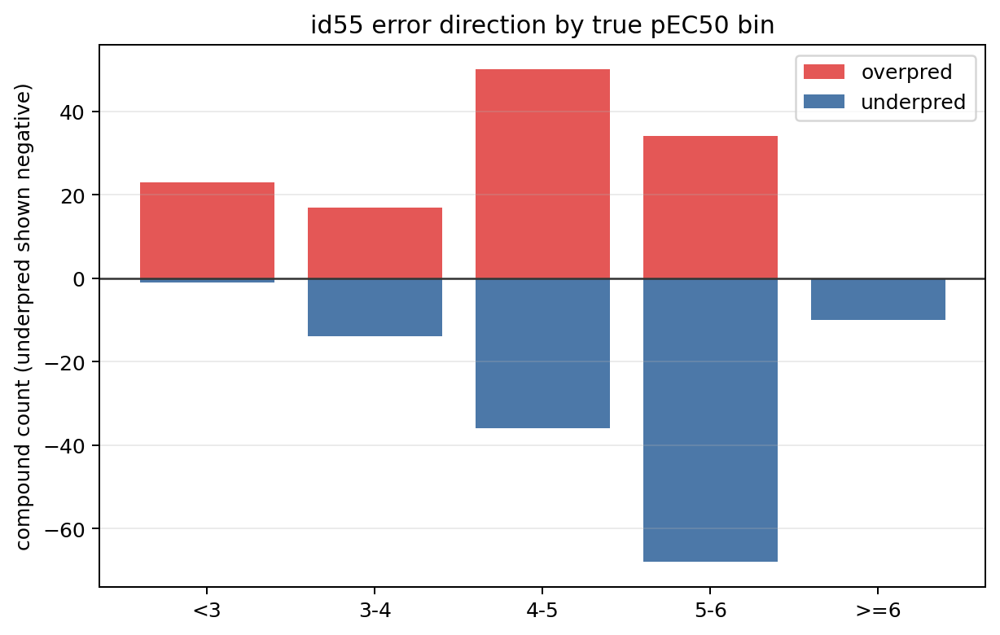
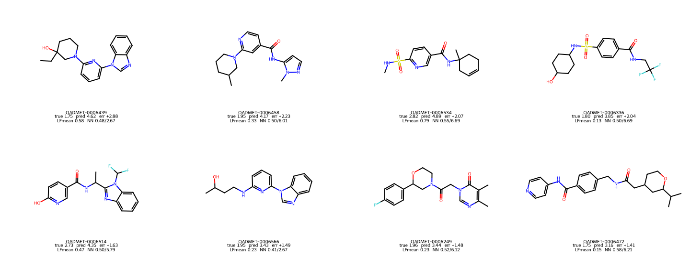
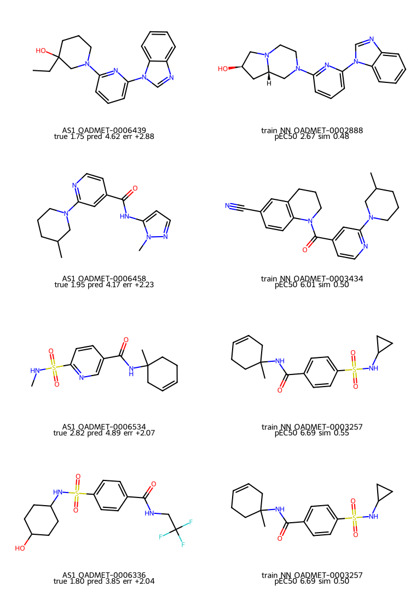
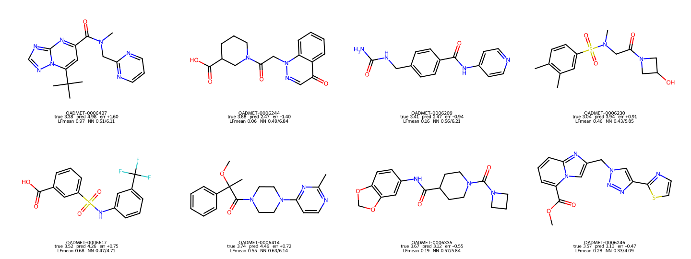
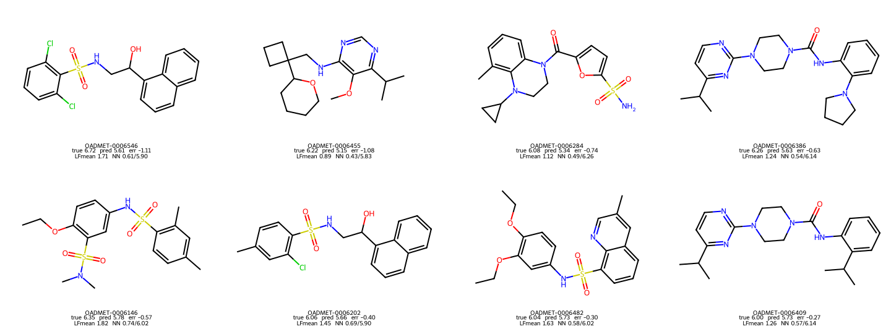
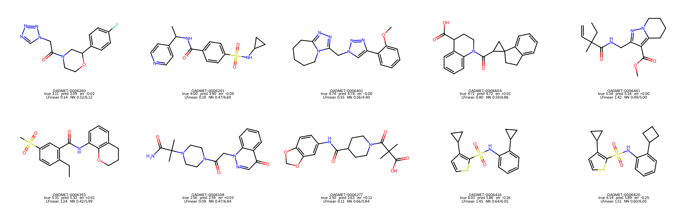

# Track 1 Phase 2 compound case-study report

確認日: 2026-06-09 JST

このreportは、`phase2_answer_check_report.md` の続きとして、
id55 anchor `ens_id51_top500_potent46_t40_soft_g35` がAS1で大きく外したcompoundを
個別に見るためのcase studyである。

目的は、新しいpredictionを作ることではなく、
「どのcompoundで、どんな方向に、なぜ外れたように見えるか」を
構造、predicted `log2_fc`、train nearest neighbor contextと一緒に確認すること。

## 0. 先に結論

id55の大外れは、単純にlow/high tailだけではない。
たしかにtrue `<3` のlow tailはほぼ上方向に外れ、
true `>=6` のhigh tailは全て下方向に外れている。
しかし `3-4` binも十分に大きく外れており、しかも上下両方向に割れている。

| true bin | direction | n | MAE | bias |
|---|---|---:|---:|---:|
| `<3` | overpred | 23 | 1.1830 | +1.1830 |
| `<3` | underpred | 1 | 0.2415 | -0.2415 |
| `3-4` | overpred | 17 | 0.5863 | +0.5863 |
| `3-4` | underpred | 14 | 0.4032 | -0.4032 |
| `4-5` | overpred | 50 | 0.3068 | +0.3068 |
| `4-5` | underpred | 36 | 0.3896 | -0.3896 |
| `5-6` | overpred | 34 | 0.1601 | +0.1601 |
| `5-6` | underpred | 68 | 0.2865 | -0.2865 |
| `>=6` | underpred | 10 | 0.5507 | -0.5507 |



このため、Phase 2で注意すべき失敗は3種類ある。

1. low-tail overprediction: inactiveに近いAS1 compoundをactive analogっぽく読んでしまう。
2. mid-low bidirectional error: `3-4` 付近で、同じbin内でも上にも下にも外れる。
3. high-tail underprediction: high LF / active-like compoundでも、pEC50 6以上まで届かない。

ただし、外れたcompoundだけを見ると危険である。
id55がよく当てているcompoundも対照群として見ると、
「potent NNが近いから必ず外す」わけでも、
「LFが高いから必ず過大予測する」わけでもない。
外れは、LF、nearest-neighbor context、構造series、局所的なlabel supportが
噛み合わないところで起きているように見える。

## 1. Low-tail overprediction

true `<3` の大外れは、ほぼ全て上方向である。
id55は低いpEC50を出しにくく、true 1.7-2.8のcompoundでも3.1-4.9程度に寄せている。



代表例:

| compound | true | pred | error | LF mean | train NN sim / pEC50 | potent NN sim / pEC50 | 読み方 |
|---|---:|---:|---:|---:|---:|---:|---|
| `OADMET-0006439` | 1.745 | 4.621 | +2.876 | 0.579 | 0.476 / 2.67 | 0.433 / 6.06 | 低活性NNもあるがpotent近傍もそこそこ近い |
| `OADMET-0006458` | 1.945 | 4.172 | +2.227 | 0.325 | 0.500 / 6.01 | 0.500 / 6.01 | potent train analogに引っ張られた典型 |
| `OADMET-0006534` | 2.820 | 4.895 | +2.075 | 0.788 | 0.554 / 6.69 | 0.554 / 6.69 | LFもNNも高めで、低活性supportが薄い |
| `OADMET-0006336` | 1.805 | 3.847 | +2.042 | 0.131 | 0.500 / 6.69 | 0.500 / 6.69 | LFは低いがpotent NNが近い |

AS1 compoundとnearest train analogを並べると、いくつかは見た目にも似たactive analogが近い。
ただしTanimotoは0.5前後が多く、強いactivity cliffと断定するには弱い。
ここでは「modelがただ雑に高く出した」というより、
moderate similarityのactive寄り近傍とlow LF/low label supportの間で、
滑らかに中央へ戻った可能性が高い、と読むのが安全である。



この領域の教訓:

- potent-neighbor gateはlow-tail missを悪化させる可能性がある。
- LFが低いcompoundでも、potent NNが近いとmodelは完全なinactiveまで下げにくい。
- AS2でこの種のlocal support不足をlabelなしで見抜けるかは、まだ未解決。

## 2. 3-4 binは上下に外れる

ユーザー指摘どおり、`3-4` binはかなり厄介である。
平均biasは `+0.1394` なので軽いoverpredictionに見えるが、
内訳は17 over / 14 underで、最大誤差は両方向にある。



代表例:

| compound | true | pred | error | LF mean | train NN sim / pEC50 | 読み方 |
|---|---:|---:|---:|---:|---:|---|
| `OADMET-0006427` | 3.380 | 4.978 | +1.598 | 0.973 | 0.508 / 6.11 | LFもNNもactive寄りでover |
| `OADMET-0006244` | 3.875 | 2.472 | -1.403 | 0.057 | 0.492 / 6.85 | potent NNは高いがLFが非常に低くunder |
| `OADMET-0006209` | 3.410 | 2.466 | -0.944 | 0.164 | 0.558 / 6.21 | potent NNに近いがLF低くunder |
| `OADMET-0006230` | 3.035 | 3.943 | +0.908 | 0.459 | 0.429 / 5.85 | moderate LF/NNでover |
| `OADMET-0006617` | 3.515 | 4.263 | +0.748 | 0.680 | 0.472 / 4.71 | LF高めでover |
| `OADMET-0006335` | 3.665 | 3.119 | -0.546 | 0.194 | 0.574 / 5.84 | NNは高め、LF低めでunder |

ここは単純なtail compressionでは説明しきれない。
同じtrue `3-4` の中に、
「LF/NNが高くてoverするcompound」と
「potent NNはあるがLFが低く、modelが下げすぎるcompound」が混在する。

この領域の教訓:

- global affine calibrationでは直しにくい。
- high-LF liftだけだとover側のcompoundをさらに悪化させる可能性がある。
- LF低値を信じすぎると、moderately activeなcompoundを2.4-3.1付近まで落としすぎる。
- 3-4はlow/high tailより地味だが、AS2でもMAEを削るなら重要なcase-study領域。

## 3. High-tail underprediction

true `>=6` は10件すべてunderpredictionだった。
ここではLFが高いcompoundも多く、modelはactivity orderingをかなり分かっている。
しかしprediction rangeが狭いため、6.0以上まで十分に届かない。



代表例:

| compound | true | pred | error | LF mean | train NN sim / pEC50 | 読み方 |
|---|---:|---:|---:|---:|---:|---|
| `OADMET-0006546` | 6.720 | 5.612 | -1.108 | 1.709 | 0.612 / 5.90 | LF高いがtrueがさらに高い |
| `OADMET-0006455` | 6.225 | 5.149 | -1.076 | 0.886 | 0.433 / 5.83 | LF moderateでhigh labelに届かない |
| `OADMET-0006284` | 6.080 | 5.341 | -0.739 | 1.124 | 0.486 / 6.26 | active NNあり、でもpredictionは圧縮 |
| `OADMET-0006386` | 6.260 | 5.626 | -0.634 | 1.237 | 0.540 / 6.14 | orderingは良いがscale不足 |
| `OADMET-0006146` | 6.345 | 5.778 | -0.567 | 1.819 | 0.745 / 6.02 | high LF/high NNでも6.3へ届かない |

id58/id59のhigh-activity liftは、この問題を狙っていたという意味では妥当だった。
実際、true `>=6` ではid55より改善している。
ただし、lift対象がdenseな4.5-5.6帯にも広がり、netでは負けた。

この領域の教訓:

- high-tail underpredictionは本物。
- ただし、単にhigh LFやhigh predictionを上げるとmiddle damageが出やすい。
- AS2で使うなら、high-tail candidateをかなり狭く、かつanchor shiftを小さくする必要がある。

## 4. Well-predicted casesを対照群として見る

各true pEC50 binから、id55のabs errorが小さいcompoundを2つずつ拾った。
これは「何が外れたか」だけでなく、「どの条件ならmodelを信じてよさそうか」を見るための対照群である。



代表例:

| compound | true bin | true | pred | error | LF mean | train NN sim / pEC50 | 読み方 |
|---|---|---:|---:|---:|---:|---:|---|
| `OADMET-0006108` | `<3` | 2.560 | 2.594 | +0.034 | 0.089 | 0.470 / 6.85 | potent NNは近いがLFが低く、低活性として読めている |
| `OADMET-0006277` | `<3` | 2.505 | 2.628 | +0.123 | 0.112 | 0.656 / 5.84 | NNはかなり近いが、predictionは低く保てている |
| `OADMET-0006260` | `3-4` | 3.110 | 3.086 | -0.024 | 0.145 | 0.524 / 6.12 | 3-4でもLF低めなら低めpredictionが当たるcase |
| `OADMET-0006201` | `3-4` | 3.995 | 3.904 | -0.091 | 0.188 | 0.466 / 6.69 | potent NNが近くても、moderate activityに留まる |
| `OADMET-0006401` | `4-5` | 4.740 | 4.737 | -0.003 | 0.554 | 0.557 / 4.40 | LF/NNともmoderateでよく校正されている |
| `OADMET-0006461` | `5-6` | 5.340 | 5.341 | +0.001 | 1.423 | 0.493 / 5.00 | high LFが5台前半predictionに合っている |
| `OADMET-0006416` | `>=6` | 6.015 | 5.859 | -0.156 | 1.451 | 0.638 / 6.05 | high tailでも6.0付近なら圧縮内で当たる |
| `OADMET-0006420` | `>=6` | 6.140 | 5.891 | -0.249 | 1.508 | 0.600 / 6.05 | high LF/high NNで、軽いunderpredictionに収まる |

この対照群からの読み:

- potent NN proximityだけでは失敗条件にならない。
  low-tailでもLFが十分低い場合、id55は2.6付近まで下げられている。
- `3-4` で当たるcaseは、LFが低めでpredictionも低く保たれていることが多い。
  つまり、3-4 under側の失敗は「LF低値を使うこと自体が悪い」のではなく、
  一部compoundで下げすぎることが問題。
- high tailで当たるcaseは、trueが6.0近辺に留まる。
  true 6.7のような最上位tailには届かないが、6.0前後なら圧縮range内で当たる。

したがって、well-predicted casesは、
「このmodelは全部tailで壊れている」という読みを避けるために重要である。
問題は全体のactivity axisではなく、局所supportの薄さとscale saturationにある。

## 5. Compound-level viewから見たPhase 2方針

今回のcase studyは、Phase 2でいきなり補正を作るためのものではない。
むしろ、補正が危ない理由をかなり具体的に示している。

| 領域 | 何が起きているか | 危ない補正 |
|---|---|---|
| true `<3` | potent analogに近いinactive/weak compoundがある | potent-neighbor lift |
| true `3-4` over側 | LF/NNがactive寄りでmoderate label | high-LF lift |
| true `3-4` under側 | LFが低くmodelが下げすぎる | low-LF penalty / aggressive compression |
| true `>=6` | high activityを5.1-5.8程度に圧縮 | no high-tail calibration at all |

したがって、次に確認すべきことは、
「AS1で見つけたcase patternをAS2 labelなしで識別できるか」である。
識別できないなら、id55近傍の安定scaleを崩さず、
tail missは不確実性として扱う方が安全かもしれない。

## 6. Reproducibility

Assets were generated by:

```bash
pixi run python track1_activity/analysis/phase2_answer_check/build_phase2_compound_case_assets.py
```

Generated assets:

- `docs/track1_explain/assets/phase2_compound_cases/bin_error_direction_summary.csv`
- `docs/track1_explain/assets/phase2_compound_cases/low_tail_overpred_cases.csv`
- `docs/track1_explain/assets/phase2_compound_cases/mid_3_4_bidirectional_cases.csv`
- `docs/track1_explain/assets/phase2_compound_cases/high_tail_underpred_cases.csv`
- `docs/track1_explain/assets/phase2_compound_cases/well_predicted_cases.csv`
- `docs/track1_explain/assets/phase2_compound_cases/low_tail_overpred_structures.png`
- `docs/track1_explain/assets/phase2_compound_cases/mid_3_4_bidirectional_structures.png`
- `docs/track1_explain/assets/phase2_compound_cases/high_tail_underpred_structures.png`
- `docs/track1_explain/assets/phase2_compound_cases/well_predicted_structures.png`
- `docs/track1_explain/assets/phase2_compound_cases/low_tail_nn_pairs.png`

Validation:

```bash
pixi run ruff check track1_activity/analysis/phase2_answer_check/build_phase2_compound_case_assets.py
```
