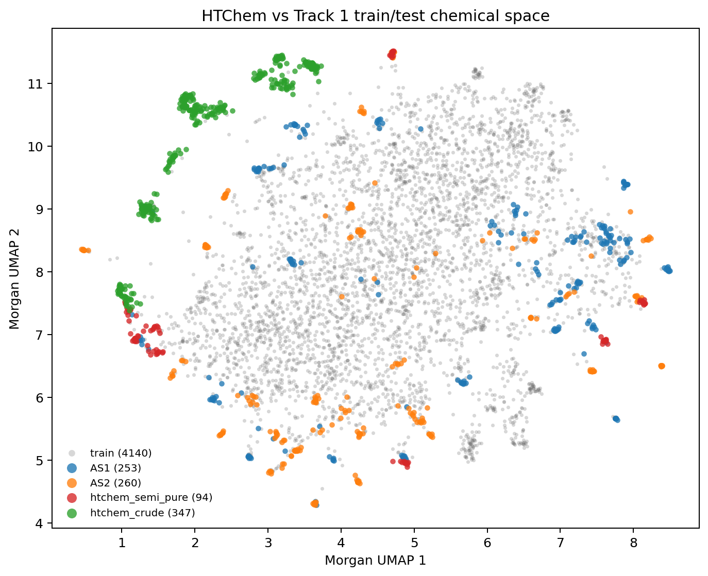

# Phase 2 HTChem Chemical Space

Purpose: check whether HTChem sits near Track 1 train/test compounds or mostly occupies a separate local SAR island.

## Morgan Nearest-Neighbor Summary

| query   | ref    |   n_query |   n_ref |   top1_mean |   top1_median |   top1_p90 |   top1_max |   top5_mean |   top1_ge_0.30 |   top1_ge_0.40 |   top1_ge_0.50 |   top1_ge_0.60 |
|:--------|:-------|----------:|--------:|------------:|--------------:|-----------:|-----------:|------------:|---------------:|---------------:|---------------:|---------------:|
| htchem  | train  |       441 |    4140 |      0.4405 |        0.4026 |     0.6226 |     1.0000 |      0.3434 |            431 |            230 |             86 |             50 |
| htchem  | test   |       441 |     513 |      0.4395 |        0.4203 |     0.6038 |     1.0000 |      0.3786 |            402 |            266 |            125 |             48 |
| htchem  | AS1    |       441 |     253 |      0.4227 |        0.4091 |     0.5862 |     1.0000 |      0.3593 |            389 |            242 |            105 |             36 |
| htchem  | AS2    |       441 |     260 |      0.2704 |        0.2500 |     0.3000 |     0.7761 |      0.2477 |             46 |             26 |             20 |             12 |
| AS1     | htchem |       253 |     441 |      0.3193 |        0.2647 |     0.5303 |     1.0000 |      0.2827 |             87 |             45 |             37 |             13 |
| AS2     | htchem |       260 |     441 |      0.2852 |        0.2571 |     0.3580 |     0.7761 |      0.2595 |             48 |             23 |             20 |             11 |
| test    | htchem |       513 |     441 |      0.3020 |        0.2619 |     0.5139 |     1.0000 |      0.2709 |            135 |             68 |             57 |             24 |

## Scaffold Overlap

| set    |   n_compounds |   n_scaffolds |   overlap_train_scaffolds |   overlap_test_scaffolds |   overlap_htchem_scaffolds |   compounds_with_train_scaffold |   compounds_with_htchem_scaffold |
|:-------|--------------:|--------------:|--------------------------:|-------------------------:|---------------------------:|--------------------------------:|---------------------------------:|
| train  |          4140 |          3670 |                      3670 |                       35 |                         11 |                            4110 |                              161 |
| test   |           513 |           369 |                        35 |                      369 |                          9 |                              97 |                               20 |
| as1    |           253 |           180 |                        18 |                      180 |                          6 |                              56 |                                9 |
| as2    |           260 |           190 |                        17 |                      190 |                          3 |                              41 |                               11 |
| htchem |           441 |           361 |                        11 |                        9 |                        361 |                              43 |                              441 |

## UMAP/KMeans Cluster Overlap

|   cluster |   AS1 |   AS2 |   htchem_crude |   htchem_semi_pure |   train |   htchem_total |   test_total | has_htchem_and_test   | has_htchem_and_train   |
|----------:|------:|------:|---------------:|-------------------:|--------:|---------------:|-------------:|:----------------------|:-----------------------|
|        13 |     0 |     0 |            114 |                  0 |       7 |            114 |            0 | False                 | True                   |
|         5 |     0 |     0 |            113 |                  0 |       3 |            113 |            0 | False                 | True                   |
|        34 |     8 |     0 |             78 |                  0 |       5 |             78 |            8 | True                  | True                   |
|        11 |     1 |    10 |             42 |                 12 |      10 |             54 |           11 | True                  | True                   |
|        32 |     9 |     8 |              0 |                 36 |      46 |             36 |           17 | True                  | True                   |
|        49 |     9 |    10 |              0 |                 23 |      33 |             23 |           19 | True                  | True                   |
|        37 |     8 |     6 |              0 |                 12 |      18 |             12 |           14 | True                  | True                   |
|        40 |     0 |    10 |              0 |                 11 |       9 |             11 |           10 | True                  | True                   |
|        29 |    44 |     9 |              0 |                  0 |      84 |              0 |           53 | False                 | False                  |
|         6 |    10 |    30 |              0 |                  0 |      49 |              0 |           40 | False                 | False                  |
|        19 |     1 |    30 |              0 |                  0 |      94 |              0 |           31 | False                 | False                  |
|        23 |    11 |    20 |              0 |                  0 |       9 |              0 |           31 | False                 | False                  |
|        28 |     9 |    20 |              0 |                  0 |      10 |              0 |           29 | False                 | False                  |
|        16 |    11 |    17 |              0 |                  0 |      55 |              0 |           28 | False                 | False                  |
|        17 |    22 |     4 |              0 |                  0 |      58 |              0 |           26 | False                 | False                  |
|        38 |    15 |     9 |              0 |                  0 |     101 |              0 |           24 | False                 | False                  |
|         3 |    11 |     6 |              0 |                  0 |      81 |              0 |           17 | False                 | False                  |
|         0 |     1 |    15 |              0 |                  0 |     111 |              0 |           16 | False                 | False                  |
|        48 |    10 |     5 |              0 |                  0 |      37 |              0 |           15 | False                 | False                  |
|         9 |     8 |     6 |              0 |                  0 |      99 |              0 |           14 | False                 | False                  |

## HTChem-Test Mixed Cluster Examples

|   cluster | space_label   | molecule_name   |   compound_id |   umap_x |   umap_y |
|----------:|:--------------|:----------------|--------------:|---------:|---------:|
|        11 | AS1           | OADMET-0006414  |          4337 |   1.1395 |   7.3180 |
|        11 | AS2           | OADMET-0006231  |          4514 |   0.4516 |   8.3583 |
|        11 | AS2           | OADMET-0006235  |          4510 |   0.4734 |   8.3428 |
|        11 | AS2           | OADMET-0006428  |          4323 |   0.4612 |   8.3516 |
|        11 | AS2           | OADMET-0006465  |          4287 |   0.5381 |   8.3468 |
|        11 | AS2           | OADMET-0006481  |          4273 |   0.4672 |   8.3581 |
|        11 | AS2           | OADMET-0006485  |          4269 |   0.4801 |   8.3481 |
|        11 | AS2           | OADMET-0006489  |          4265 |   0.4782 |   8.3508 |
|        32 | AS1           | OADMET-0006119  |          4621 |   1.1932 |   6.9404 |
|        32 | AS1           | OADMET-0006161  |          4582 |   1.2502 |   6.9693 |
|        32 | AS1           | OADMET-0006234  |          4511 |   1.3677 |   6.7661 |
|        32 | AS1           | OADMET-0006296  |          4451 |   1.2497 |   6.9064 |
|        32 | AS1           | OADMET-0006304  |          4443 |   1.2037 |   6.9256 |
|        32 | AS1           | OADMET-0006386  |          4362 |   1.2767 |   6.8427 |
|        32 | AS1           | OADMET-0006409  |          4342 |   1.2276 |   6.9079 |
|        32 | AS1           | OADMET-0006531  |          4224 |   1.2790 |   6.9172 |
|        34 | AS1           | OADMET-0006108  |          4632 |   1.2827 |   9.0458 |
|        34 | AS1           | OADMET-0006183  |          4560 |   1.3995 |   8.9758 |
|        34 | AS1           | OADMET-0006228  |          4517 |   1.3291 |   9.0172 |
|        34 | AS1           | OADMET-0006244  |          4501 |   1.3130 |   9.0317 |
|        34 | AS1           | OADMET-0006266  |          4481 |   1.3652 |   9.0145 |
|        34 | AS1           | OADMET-0006270  |          4477 |   1.4217 |   8.9399 |
|        34 | AS1           | OADMET-0006290  |          4457 |   1.3251 |   9.0386 |
|        34 | AS1           | OADMET-0006603  |          4155 |   1.3728 |   8.9996 |
|        37 | AS1           | OADMET-0006158  |          4584 |   4.8505 |   5.0436 |
|        37 | AS1           | OADMET-0006249  |          4496 |   4.8383 |   5.0536 |
|        37 | AS1           | OADMET-0006260  |          4486 |   4.8587 |   5.0365 |
|        37 | AS1           | OADMET-0006298  |          4449 |   4.8792 |   5.0329 |
|        37 | AS1           | OADMET-0006305  |          4442 |   4.8229 |   5.0786 |
|        37 | AS1           | OADMET-0006328  |          4419 |   4.8691 |   5.0656 |
|        37 | AS1           | OADMET-0006582  |          4176 |   4.8544 |   5.0700 |
|        37 | AS1           | OADMET-0006587  |          4171 |   4.8871 |   5.0105 |
|        40 | AS2           | OADMET-0006093  |          4647 |   4.6830 |  11.4674 |
|        40 | AS2           | OADMET-0006097  |          4643 |   4.7222 |  11.5023 |
|        40 | AS2           | OADMET-0006101  |          4639 |   4.6858 |  11.4951 |
|        40 | AS2           | OADMET-0006118  |          4622 |   4.7101 |  11.4992 |
|        40 | AS2           | OADMET-0006348  |          4399 |   4.7067 |  11.4163 |
|        40 | AS2           | OADMET-0006362  |          4385 |   4.6997 |  11.4674 |
|        40 | AS2           | OADMET-0006373  |          4374 |   4.7156 |  11.4907 |
|        40 | AS2           | OADMET-0006466  |          4286 |   4.7280 |  11.4946 |
|        49 | AS1           | OADMET-0006116  |          4624 |   7.3719 |   7.1786 |
|        49 | AS1           | OADMET-0006201  |          4542 |   7.3918 |   7.2207 |
|        49 | AS1           | OADMET-0006222  |          4522 |   7.4601 |   7.1192 |
|        49 | AS1           | OADMET-0006264  |          4483 |   7.4353 |   7.1207 |
|        49 | AS1           | OADMET-0006336  |          4411 |   7.4849 |   7.0792 |
|        49 | AS1           | OADMET-0006351  |          4396 |   7.6162 |   6.8914 |
|        49 | AS1           | OADMET-0006522  |          4232 |   7.4507 |   7.1521 |
|        49 | AS1           | OADMET-0006534  |          4221 |   7.6269 |   6.8781 |

## Read

HTChem has almost no row overlap with Track 1, so this checks chemistry rather than IDs. Use the AS1/AS2-to-HTChem nearest-neighbor counts to decide whether HTChem is likely to help a meaningful blind subset or only a small local region.
